# 算法入门教程

## 目录

- [前言](#前言)
- [第1章 引言](#第1章-引言)
- [第2章 复杂度分析](#第2章-复杂度分析)
- [第3章 数据结构基础](#第3章-数据结构基础)
- [第4章 数组与链表](#第4章-数组与链表)
- [第5章 栈与队列](#第5章-栈与队列)
- [第6章 哈希表](#第6章-哈希表)
- [第7章 树](#第7章-树)
- [第8章 堆](#第8章-堆)
- [第9章 图](#第9章-图)
- [第10章 搜索算法](#第10章-搜索算法)
- [第11章 排序算法](#第11章-排序算法)
- [第12章 高级算法](#第12章-高级算法)

---


# 前言

> **本章图解**：全书内容结构图

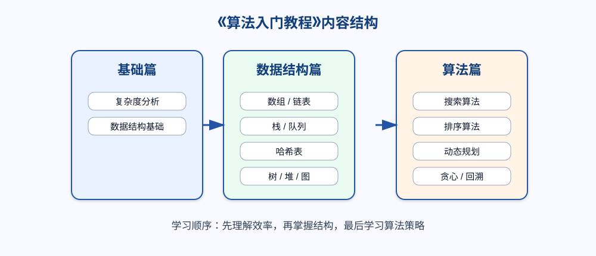


## 关于本书

《算法入门教程》是一本面向初学者的数据结构与算法教程，旨在帮助读者系统性地掌握算法基础知识。

### 本书特色

- **循序渐进**：从基础概念开始，逐步深入复杂算法
- **代码驱动**：所有算法都配有可运行的 Python 代码示例
- **图解说明**：通过图表和示例帮助理解抽象概念
- **实用导向**：结合实际应用场景，强调算法的实用性

### 目标读者

- 编程初学者，希望系统学习算法
- 准备面试的求职者，需要复习算法知识
- 在校学生，希望补充数据结构与算法知识
- 对算法感兴趣的编程爱好者

### 学习建议

1. **动手实践**：运行书中的代码，观察算法执行过程
2. **理解原理**：不要死记硬背，要理解算法的设计思想
3. **循序渐进**：按照章节顺序学习，打好基础
4. **多做练习**：每章后都有练习题，建议认真完成

### 内容结构

本书共分为以下部分：

1. **基础篇**：复杂度分析、数据结构基础
2. **数据结构篇**：数组、链表、栈、队列、哈希表、树、堆、图
3. **算法篇**：搜索算法、排序算法、高级算法（动态规划、贪心、回溯）

### 代码说明

本书所有代码示例均使用 Python 编写，确保代码简洁易懂。建议读者具备基本的 Python 编程基础。

### 反馈与贡献

如果您在学习过程中遇到问题或有改进建议，欢迎提出反馈。

---

**祝学习愉快！**


---


# 第1章 引言

> **本章图解**：算法学习路线图

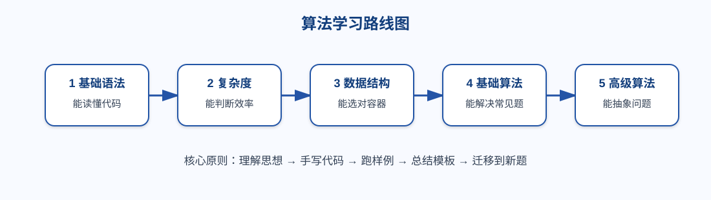


## 什么是算法

算法是解决特定问题的一系列明确步骤。就像菜谱告诉你如何做一道菜一样，算法告诉计算机如何解决一个计算问题。

### 算法的特征

一个好的算法应该具备以下特征：

1. **有穷性**：算法在有限步骤内结束
2. **确定性**：每一步都有明确的定义，没有歧义
3. **输入**：算法有零个或多个输入
4. **输出**：算法产生一个或多个输出
5. **有效性**：每一步都能在有限时间内完成

### 算法的例子

让我们看一个简单的例子：计算 1 到 n 的和。

```python
def sum_to_n(n):
    """计算 1 到 n 的和"""
    total = 0
    for i in range(1, n + 1):
        total += i
    return total

# 使用示例
result = sum_to_n(100)
print(f"1 到 100 的和是：{result}")
```

这个算法清晰地定义了计算步骤，对于任何正整数 n 都能得到正确结果。

## 为什么学习算法

### 1. 提高编程能力

学习算法能够帮助你：
- 编写更高效的代码
- 解决复杂的问题
- 理解程序的运行机制

### 2. 面试必备

在技术面试中，算法题是常见考点：
- 大公司（Google、Facebook、阿里等）都会考察算法
- 算法能力体现程序员的综合素质
- 刷算法题是求职准备的重要环节

### 3. 解决实际问题

许多实际问题都需要算法思维：
- 数据处理和分析
- 系统优化
- 人工智能和机器学习

## 如何学习算法

### 学习路线

建议按照以下路线学习：

1. **基础阶段**（1-2个月）
   - 复杂度分析
   - 基本数据结构
   - 基本算法

2. **进阶阶段**（2-3个月）
   - 高级数据结构
   - 复杂算法
   - 刷题练习

3. **精通阶段**（持续）
   - 深入理解算法原理
   - 解决复杂问题
   - 总结和分享

### 学习方法

1. **理解优先**：先理解算法思想，再记忆代码
2. **动手实践**：亲自实现算法，运行测试
3. **画图辅助**：通过画图理解算法过程
4. **总结归纳**：将相似算法归类比较

### 推荐资源

- **在线平台**：LeetCode、牛客网
- **经典书籍**：《算法导论》、《算法》
- **视频课程**：各大平台的算法课程
- **开源项目**：GitHub 上的算法项目

## 本书的组织结构

### 章节安排

- **第2章**：复杂度分析 - 评估算法效率
- **第3章**：数据结构基础 - 数据的组织方式
- **第4章**：数组与链表 - 线性数据结构
- **第5章**：栈与队列 - 受限的线性结构
- **第6章**：哈希表 - 快速查找的数据结构
- **第7章**：树 - 层次化数据结构
- **第8章**：堆 - 特殊的树结构
- **第9章**：图 - 网络状数据结构
- **第10章**：搜索算法 - 查找数据的方法
- **第11章**：排序算法 - 数据排序的方法
- **第12章**：高级算法 - 动态规划、贪心、回溯

### 代码示例

每章都包含：
- 概念讲解
- 图解说明
- Python 代码实现
- 时间复杂度分析
- 实际应用场景

## 开始你的算法之旅

算法学习是一个循序渐进的过程，不要急于求成。从基础开始，一步一个脚印，相信你一定能够掌握算法的精髓。

让我们开始吧！


---


# 第2章 复杂度分析

> **本章图解**：常见时间复杂度增长趋势图

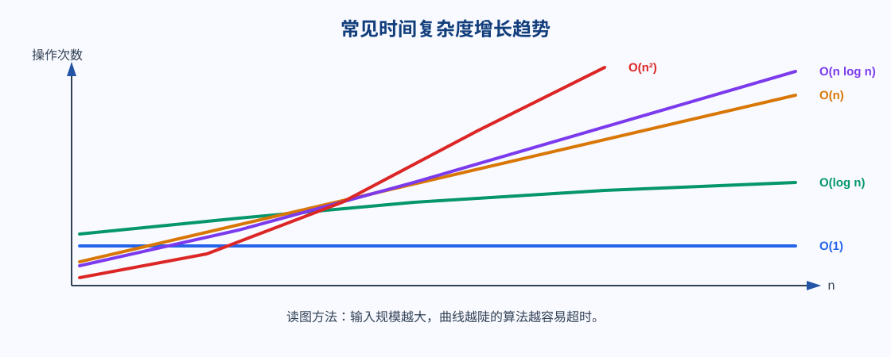


## 为什么需要复杂度分析

在编写算法时，我们需要评估算法的效率。复杂度分析就是一种评估算法性能的方法，它帮助我们：

1. **预测算法性能**：在运行前预估算法的执行效率
2. **比较算法优劣**：选择最适合问题的算法
3. **优化代码**：找出性能瓶颈并改进

复杂度分析主要从两个维度评估算法：
- **时间复杂度**：算法执行时间随输入规模增长的变化趋势
- **空间复杂度**：算法所需存储空间随输入规模增长的变化趋势

## 时间复杂度

### 基本概念

时间复杂度表示算法执行时间与输入规模 n 之间的关系。我们通常使用大 O 表示法来描述时间复杂度。

大 O 表示法关注的是算法的**增长趋势**，而不是具体的执行时间。它忽略了常数项和低阶项，只保留最高阶项。

### 常见时间复杂度

| 复杂度 | 表示 | 特点 | 示例 |
|--------|------|------|------|
| O(1) | 常数时间 | 执行时间不随输入规模变化 | 数组索引访问 |
| O(log n) | 对数时间 | 执行时间随输入规模对数增长 | 二分查找 |
| O(n) | 线性时间 | 执行时间与输入规模成正比 | 线性查找 |
| O(n log n) | 线性对数时间 | 常见于高效排序算法 | 归并排序 |
| O(n²) | 平方时间 | 执行时间与输入规模平方成正比 | 冒泡排序 |
| O(2ⁿ) | 指数时间 | 执行时间随输入规模指数增长 | 递归斐波那契 |
| O(n!) | 阶乘时间 | 执行时间极快增长 | 全排列 |

### 时间复杂度分析示例

#### O(1) - 常数时间

```python
def get_first_element(arr):
    """获取数组第一个元素"""
    if len(arr) > 0:
        return arr[0]
    return None
```

无论数组多大，这个操作都只需要一步，时间复杂度为 O(1)。

#### O(n) - 线性时间

```python
def find_max(arr):
    """查找数组中的最大值"""
    if not arr:
        return None
    
    max_val = arr[0]
    for val in arr:
        if val > max_val:
            max_val = val
    return max_val
```

需要遍历整个数组，时间复杂度为 O(n)。

#### O(n²) - 平方时间

```python
def bubble_sort(arr):
    """冒泡排序"""
    n = len(arr)
    for i in range(n):
        for j in range(0, n - i - 1):
            if arr[j] > arr[j + 1]:
                arr[j], arr[j + 1] = arr[j + 1], arr[j]
    return arr
```

嵌套循环，外层执行 n 次，内层平均执行 n/2 次，时间复杂度为 O(n²)。

#### O(log n) - 对数时间

```python
def binary_search(arr, target):
    """二分查找"""
    left, right = 0, len(arr) - 1
    
    while left <= right:
        mid = (left + right) // 2
        if arr[mid] == target:
            return mid
        elif arr[mid] < target:
            left = mid + 1
        else:
            right = mid - 1
    
    return -1
```

每次查找都将搜索范围减半，时间复杂度为 O(log n)。

### 复杂度计算规则

1. **加法法则**：如果算法由多个顺序执行的步骤组成，总复杂度取最大的那个
   ```python
   def example(n):
       # O(n)
       for i in range(n):
           print(i)
       # O(n²)
       for i in range(n):
           for j in range(n):
               print(i, j)
       # 总复杂度：O(n) + O(n²) = O(n²)
   ```

2. **乘法法则**：如果算法包含嵌套循环，复杂度相乘
   ```python
   def example(n):
       for i in range(n):          # O(n)
           for j in range(n):      # O(n)
               print(i, j)         # O(1)
       # 总复杂度：O(n) × O(n) = O(n²)
   ```

3. **忽略常数**：O(2n) = O(n)，O(3n²) = O(n²)

4. **忽略低阶项**：O(n² + n) = O(n²)，O(n³ + n² + n) = O(n³)

## 空间复杂度

### 基本概念

空间复杂度表示算法执行过程中所需存储空间与输入规模 n 之间的关系。

### 常见空间复杂度

| 复杂度 | 表示 | 特点 | 示例 |
|--------|------|------|------|
| O(1) | 常数空间 | 只使用固定数量的额外空间 | 变量交换 |
| O(n) | 线性空间 | 额外空间与输入规模成正比 | 数组复制 |
| O(n²) | 平方空间 | 额外空间与输入规模平方成正比 | 二维数组 |
| O(log n) | 对数空间 | 递归调用栈的空间 | 二分查找递归 |

### 空间复杂度分析示例

#### O(1) - 常数空间

```python
def swap(a, b):
    """交换两个变量的值"""
    temp = a
    a = b
    b = temp
    return a, b
```

只使用了固定数量的变量，空间复杂度为 O(1)。

#### O(n) - 线性空间

```python
def reverse_array(arr):
    """反转数组"""
    n = len(arr)
    reversed_arr = [0] * n  # 需要额外的 n 个空间
    for i in range(n):
        reversed_arr[i] = arr[n - 1 - i]
    return reversed_arr
```

创建了一个与原数组大小相同的新数组，空间复杂度为 O(n)。

#### O(n) - 递归空间

```python
def factorial(n):
    """递归计算阶乘"""
    if n <= 1:
        return 1
    return n * factorial(n - 1)
```

递归深度为 n，每次调用都需要栈空间，空间复杂度为 O(n)。

## 时间与空间的权衡

在实际应用中，我们经常需要在时间和空间之间进行权衡：

### 以空间换时间

```python
# 方法1：时间复杂度 O(n)，空间复杂度 O(1)
def fibonacci_1(n):
    if n <= 1:
        return n
    a, b = 0, 1
    for _ in range(2, n + 1):
        a, b = b, a + b
    return b

# 方法2：时间复杂度 O(1)，空间复杂度 O(n)
def fibonacci_2(n):
    if n <= 1:
        return n
    fib = [0] * (n + 1)
    fib[1] = 1
    for i in range(2, n + 1):
        fib[i] = fib[i - 1] + fib[i - 2]
    return fib[n]
```

方法1节省空间但需要计算，方法2预先计算存储但占用更多空间。

### 以时间换空间

在内存受限的情况下，我们可以选择牺牲时间来节省空间。

## 复杂度分析的实际应用

### 1. 选择合适的算法

```python
# 小数据量：简单排序
def sort_small_array(arr):
    if len(arr) < 100:
        return bubble_sort(arr)  # O(n²)
    else:
        return merge_sort(arr)   # O(n log n)
```

### 2. 优化代码性能

```python
# 优化前：O(n²)
def find_duplicates_slow(arr):
    duplicates = []
    for i in range(len(arr)):
        for j in range(i + 1, len(arr)):
            if arr[i] == arr[j] and arr[i] not in duplicates:
                duplicates.append(arr[i])
    return duplicates

# 优化后：O(n)
def find_duplicates_fast(arr):
    seen = set()
    duplicates = set()
    for item in arr:
        if item in seen:
            duplicates.add(item)
        else:
            seen.add(item)
    return list(duplicates)
```

### 3. 预估系统性能

通过复杂度分析，我们可以预估系统在不同数据规模下的表现。

## 常见误区

1. **忽略最坏情况**：应该考虑最坏情况下的复杂度
2. **过度优化**：不是所有地方都需要最优复杂度
3. **只关注时间**：空间复杂度同样重要
4. **过早优化**：先确保正确性，再考虑性能

## 练习题

1. 分析以下代码的时间复杂度和空间复杂度：
   ```python
   def mystery_function(n):
       total = 0
       for i in range(n):
           for j in range(i, n):
               total += i + j
       return total
   ```

2. 如何优化以下代码的时间复杂度？
   ```python
   def find_sum_pairs(arr, target):
       pairs = []
       for i in range(len(arr)):
           for j in range(i + 1, len(arr)):
               if arr[i] + arr[j] == target:
                   pairs.append((arr[i], arr[j]))
       return pairs
   ```

3. 在什么情况下会选择 O(n²) 的算法而不是 O(n log n) 的算法？

## 总结

复杂度分析是算法设计和优化的重要工具：

- **时间复杂度**评估算法的执行效率
- **空间复杂度**评估算法的内存使用
- **大 O 表示法**提供了一种标准化的描述方法
- **权衡考虑**在实际应用中平衡时间和空间

掌握复杂度分析能够帮助你：
- 设计更高效的算法
- 做出更好的技术选择
- 编写出更优质的代码


---


# 第3章 数据结构基础

> **本章图解**：数据结构分类图

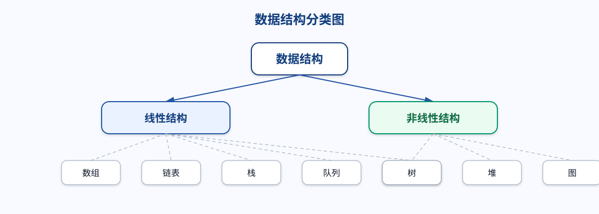


## 什么是数据结构

数据结构是计算机存储、组织数据的方式。数据结构旨在通过特定的结构来提高数据的访问和操作效率。

### 数据结构的重要性

1. **提高效率**：合适的数据结构可以显著提高算法效率
2. **节省内存**：优化数据存储，减少内存占用
3. **简化操作**：使数据操作更加直观和便捷
4. **解决问题**：不同问题需要不同的数据结构

### 数据结构与算法的关系

数据结构和算法是相辅相成的：
- **数据结构**是算法的基础
- **算法**依赖数据结构来实现
- 好的算法需要合适的数据结构支撑

## 数据结构的分类

### 按逻辑结构分类

#### 1. 线性结构

数据元素之间存在一对一的关系：

- **数组**：连续内存存储，随机访问快
- **链表**：非连续存储，插入删除快
- **栈**：后进先出（LIFO）
- **队列**：先进先出（FIFO）

#### 2. 非线性结构

数据元素之间存在一对多或多对多的关系：

- **树**：层次结构，一对多关系
- **图**：网络结构，多对多关系
- **堆**：特殊的树结构

### 按物理结构分类

#### 1. 顺序存储

使用连续的内存空间存储数据：
- 优点：随机访问快，空间利用率高
- 缺点：插入删除慢，需要预先分配内存

#### 2. 链式存储

使用指针连接分散的内存块：
- 优点：插入删除快，内存动态分配
- 缺点：随机访问慢，需要额外指针空间

## 抽象数据类型（ADT）

抽象数据类型定义了数据的操作和行为，而不涉及具体实现。

### ADT 的组成

1. **数据对象**：数据的集合
2. **数据关系**：数据之间的关系
3. **基本操作**：对数据的操作

### 示例：栈的 ADT

```python
class Stack:
    """栈的抽象数据类型"""
    
    def __init__(self):
        """初始化栈"""
        pass
    
    def push(self, item):
        """入栈：将元素压入栈顶"""
        pass
    
    def pop(self):
        """出栈：弹出栈顶元素"""
        pass
    
    def peek(self):
        """查看栈顶元素"""
        pass
    
    def is_empty(self):
        """判断栈是否为空"""
        pass
    
    def size(self):
        """返回栈的大小"""
        pass
```

## 基本数据类型 vs 数据结构

### 基本数据类型

编程语言提供的基础类型：
- 整数（int）
- 浮点数（float）
- 字符串（string）
- 布尔值（boolean）

### 数据结构

基于基本类型构建的复合结构：
- 数组、链表、栈、队列
- 树、图、哈希表
- 由基本类型组合而成

## 数据结构的选择

### 选择考虑因素

1. **操作需求**
   - 频繁查找：选择哈希表或平衡树
   - 频繁插入删除：选择链表
   - 需要排序：选择数组或树

2. **时间复杂度**
   - 查找效率
   - 插入删除效率
   - 遍历效率

3. **空间复杂度**
   - 内存占用
   - 空间利用率

4. **实现复杂度**
   - 开发时间
   - 维护成本

### 选择示例

#### 场景1：需要快速查找

```python
# 使用字典（哈希表）
user_cache = {}
def get_user(user_id):
    if user_id in user_cache:
        return user_cache[user_id]
    # 从数据库查询
    user = query_database(user_id)
    user_cache[user_id] = user
    return user
```

#### 场景2：需要频繁插入删除

```python
# 使用链表
class Node:
    def __init__(self, data):
        self.data = data
        self.next = None

class LinkedList:
    def __init__(self):
        self.head = None
    
    def insert_at_head(self, data):
        new_node = Node(data)
        new_node.next = self.head
        self.head = new_node
```

#### 场景3：需要保持顺序

```python
# 使用数组
sorted_list = [1, 3, 5, 7, 9]
def insert_sorted(arr, value):
    # 二分查找插入位置
    # 插入元素
    pass
```

## 数据结构的操作

### 常见操作

1. **访问**：读取或修改数据
2. **插入**：添加新数据
3. **删除**：移除数据
4. **查找**：搜索特定数据
5. **遍历**：访问所有数据
6. **排序**：按特定顺序排列

### 操作复杂度对比

| 数据结构 | 访问 | 插入 | 删除 | 查找 |
|----------|------|------|------|------|
| 数组 | O(1) | O(n) | O(n) | O(n) |
| 链表 | O(n) | O(1) | O(1) | O(n) |
| 栈 | O(n) | O(1) | O(1) | O(n) |
| 队列 | O(n) | O(1) | O(1) | O(n) |
| 哈希表 | - | O(1) | O(1) | O(1) |
| 二叉搜索树 | O(log n) | O(log n) | O(log n) | O(log n) |

## Python 中的数据结构

### 内置数据结构

```python
# 列表（动态数组）
my_list = [1, 2, 3, 4, 5]

# 字典（哈希表）
my_dict = {'name': 'Alice', 'age': 25}

# 集合（哈希集合）
my_set = {1, 2, 3, 4, 5}

# 元组（不可变数组）
my_tuple = (1, 2, 3, 4, 5)
```

### 自定义数据结构

```python
from collections import deque

# 双端队列
my_deque = deque([1, 2, 3, 4, 5])

# 默认字典
from collections import defaultdict
my_default_dict = defaultdict(int)

# 计数器
from collections import Counter
my_counter = Counter([1, 2, 2, 3, 3, 3])
```

## 数据结构的应用实例

### 应用1：浏览器历史记录（栈）

```python
class BrowserHistory:
    def __init__(self):
        self.back_stack = []
        self.forward_stack = []
        self.current_page = None
    
    def visit(self, url):
        if self.current_page:
            self.back_stack.append(self.current_page)
        self.current_page = url
        self.forward_stack.clear()
    
    def back(self):
        if self.back_stack:
            self.forward_stack.append(self.current_page)
            self.current_page = self.back_stack.pop()
        return self.current_page
    
    def forward(self):
        if self.forward_stack:
            self.back_stack.append(self.current_page)
            self.current_page = self.forward_stack.pop()
        return self.current_page
```

### 应用2：打印队列（队列）

```python
from queue import Queue

class PrintQueue:
    def __init__(self):
        self.queue = Queue()
    
    def add_job(self, document):
        self.queue.put(document)
        print(f"添加打印任务: {document}")
    
    def process_job(self):
        if not self.queue.empty():
            document = self.queue.get()
            print(f"正在打印: {document}")
            return document
        print("打印队列为空")
        return None
```

### 应用3：联系人管理（哈希表）

```python
class ContactManager:
    def __init__(self):
        self.contacts = {}
    
    def add_contact(self, name, phone):
        self.contacts[name] = phone
        print(f"添加联系人: {name} - {phone}")
    
    def get_contact(self, name):
        return self.contacts.get(name, "联系人不存在")
    
    def delete_contact(self, name):
        if name in self.contacts:
            del self.contacts[name]
            print(f"删除联系人: {name}")
        else:
            print("联系人不存在")
```

## 数据结构的设计原则

### 1. 封装性

将数据和操作封装在一起，隐藏实现细节。

```python
class Stack:
    def __init__(self):
        self._items = []  # 使用下划线表示私有
    
    def push(self, item):
        self._items.append(item)
    
    def pop(self):
        if not self.is_empty():
            return self._items.pop()
        raise IndexError("栈为空")
    
    def is_empty(self):
        return len(self._items) == 0
```

### 2. 一致性

保持接口的一致性，便于使用和理解。

### 3. 效率性

选择合适的底层实现，优化操作效率。

### 4. 可扩展性

设计时考虑未来的扩展需求。

## 练习题

1. 为以下场景选择合适的数据结构，并说明理由：
   - 实现一个文本编辑器的撤销功能
   - 管理一个在线游戏的玩家排行榜
   - 实现一个简单的缓存系统

2. 实现一个简单的队列数据结构，支持入队、出队、查看队首元素等操作。

3. 比较数组和链表在不同操作下的性能差异，并给出具体的应用场景。

## 总结

数据结构是算法的基础，选择合适的数据结构至关重要：

- **线性结构**：数组、链表、栈、队列
- **非线性结构**：树、图、堆
- **选择依据**：操作需求、时间复杂度、空间复杂度
- **实际应用**：根据具体场景选择合适的数据结构

掌握数据结构的基础知识，为后续学习具体的数据结构和算法打下坚实基础。


---


# 第4章 数组与链表

> **本章图解**：数组与链表存储差异图

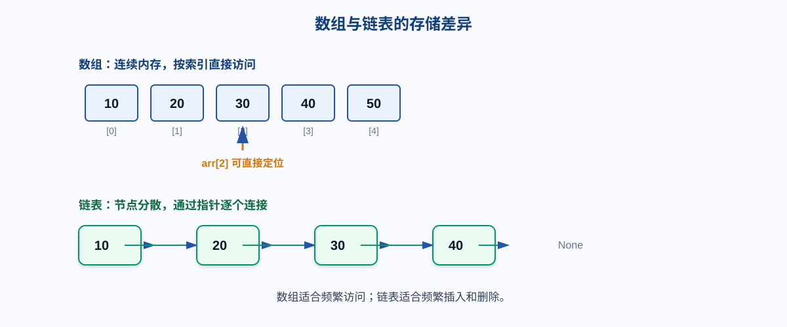


## 数组

### 什么是数组

数组是最基本的数据结构，它是一组相同类型数据的集合，存储在连续的内存空间中。

### 数组的特性

1. **连续内存**：元素在内存中连续存储
2. **固定大小**：创建时需要指定大小（静态数组）
3. **随机访问**：可以通过索引快速访问任意元素
4. **相同类型**：所有元素必须是相同类型

### 数组的基本操作

#### 访问元素

```python
def access_element(arr, index):
    """访问数组中指定索引的元素"""
    if 0 <= index < len(arr):
        return arr[index]
    raise IndexError("索引越界")

# 使用示例
my_array = [10, 20, 30, 40, 50]
print(access_element(my_array, 2))  # 输出: 30
```

时间复杂度：O(1)

#### 插入元素

```python
def insert_element(arr, index, value):
    """在指定位置插入元素"""
    if index < 0 or index > len(arr):
        raise IndexError("索引越界")
    arr.insert(index, value)
    return arr

# 使用示例
my_array = [10, 20, 30, 40, 50]
print(insert_element(my_array, 2, 25))  # 输出: [10, 20, 25, 30, 40, 50]
```

时间复杂度：O(n) - 需要移动后续元素

#### 删除元素

```python
def delete_element(arr, index):
    """删除指定位置的元素"""
    if index < 0 or index >= len(arr):
        raise IndexError("索引越界")
    arr.pop(index)
    return arr

# 使用示例
my_array = [10, 20, 30, 40, 50]
print(delete_element(my_array, 2))  # 输出: [10, 20, 40, 50]
```

时间复杂度：O(n) - 需要移动后续元素

#### 查找元素

```python
def find_element(arr, value):
    """查找元素在数组中的位置"""
    for i, item in enumerate(arr):
        if item == value:
            return i
    return -1  # 未找到

# 使用示例
my_array = [10, 20, 30, 40, 50]
print(find_element(my_array, 30))  # 输出: 2
print(find_element(my_array, 35))  # 输出: -1
```

时间复杂度：O(n) - 线性查找

### 数组的优缺点

#### 优点

1. **快速访问**：O(1) 时间复杂度的随机访问
2. **内存连续**：缓存友好，提高访问效率
3. **简单易用**：实现简单，易于理解

#### 缺点

1. **大小固定**：静态数组大小不可变
2. **插入删除慢**：需要移动元素，时间复杂度 O(n)
3. **内存浪费**：可能分配过多内存

### Python 中的数组

Python 的列表实际上是动态数组：

```python
# Python 列表（动态数组）
my_list = [1, 2, 3, 4, 5]

# 动态扩容
my_list.append(6)  # 自动扩容
print(my_list)  # [1, 2, 3, 4, 5, 6]

# 列表操作
my_list.insert(2, 10)  # 插入
my_list.remove(4)      # 删除
print(my_list[1])      # 访问
```

### 数组的应用场景

1. **需要快速随机访问**：如矩阵运算
2. **数据量相对固定**：如一周的温度数据
3. **需要内存连续存储**：如图像处理

```python
# 应用1：矩阵运算
def matrix_add(matrix1, matrix2):
    """矩阵加法"""
    rows = len(matrix1)
    cols = len(matrix1[0])
    result = [[0 for _ in range(cols)] for _ in range(rows)]
    
    for i in range(rows):
        for j in range(cols):
            result[i][j] = matrix1[i][j] + matrix2[i][j]
    
    return result

# 应用2：滑动窗口
def sliding_window(arr, window_size):
    """滑动窗口最大值"""
    if window_size > len(arr):
        return []
    
    result = []
    for i in range(len(arr) - window_size + 1):
        window = arr[i:i + window_size]
        result.append(max(window))
    
    return result
```

## 链表

### 什么是链表

链表是一种线性数据结构，通过指针将一组分散的内存块连接起来。每个节点包含数据和指向下一个节点的指针。

### 链表的特性

1. **非连续内存**：节点可以分散在内存中
2. **动态大小**：可以动态添加或删除节点
3. **顺序访问**：必须从头节点开始遍历
4. **指针连接**：通过指针连接各个节点

### 链表的类型

#### 单向链表

每个节点只包含指向下一个节点的指针。

```python
class ListNode:
    def __init__(self, data=0):
        self.data = data
        self.next = None

class LinkedList:
    def __init__(self):
        self.head = None
    
    def append(self, data):
        """在链表末尾添加节点"""
        new_node = ListNode(data)
        if not self.head:
            self.head = new_node
            return
        
        current = self.head
        while current.next:
            current = current.next
        current.next = new_node
    
    def display(self):
        """显示链表内容"""
        current = self.head
        while current:
            print(current.data, end=" -> ")
            current = current.next
        print("None")
    
    def find(self, data):
        """查找节点"""
        current = self.head
        while current:
            if current.data == data:
                return current
            current = current.next
        return None
    
    def delete(self, data):
        """删除节点"""
        if not self.head:
            return
        
        if self.head.data == data:
            self.head = self.head.next
            return
        
        current = self.head
        while current.next:
            if current.next.data == data:
                current.next = current.next.next
                return
            current = current.next
```

#### 双向链表

每个节点包含指向前驱节点和后继节点的指针。

```python
class DoublyListNode:
    def __init__(self, data=0):
        self.data = data
        self.prev = None
        self.next = None

class DoublyLinkedList:
    def __init__(self):
        self.head = None
        self.tail = None
    
    def append(self, data):
        """在链表末尾添加节点"""
        new_node = DoublyListNode(data)
        if not self.head:
            self.head = new_node
            self.tail = new_node
            return
        
        self.tail.next = new_node
        new_node.prev = self.tail
        self.tail = new_node
    
    def display_forward(self):
        """正向显示链表"""
        current = self.head
        while current:
            print(current.data, end=" -> ")
            current = current.next
        print("None")
    
    def display_backward(self):
        """反向显示链表"""
        current = self.tail
        while current:
            print(current.data, end=" -> ")
            current = current.prev
        print("None")
```

### 链表的基本操作

#### 访问元素

```python
def access_node(head, index):
    """访问指定位置的节点"""
    current = head
    count = 0
    
    while current:
        if count == index:
            return current.data
        current = current.next
        count += 1
    
    raise IndexError("索引越界")
```

时间复杂度：O(n)

#### 插入节点

```python
def insert_node(head, index, data):
    """在指定位置插入节点"""
    new_node = ListNode(data)
    
    if index == 0:
        new_node.next = head
        return new_node
    
    current = head
    count = 0
    
    while current and count < index - 1:
        current = current.next
        count += 1
    
    if not current:
        raise IndexError("索引越界")
    
    new_node.next = current.next
    current.next = new_node
    
    return head
```

时间复杂度：O(n)

#### 删除节点

```python
def delete_node(head, data):
    """删除指定数据的节点"""
    if not head:
        return None
    
    if head.data == data:
        return head.next
    
    current = head
    while current.next:
        if current.next.data == data:
            current.next = current.next.next
            return head
        current = current.next
    
    return head
```

时间复杂度：O(n)

### 链表的优缺点

#### 优点

1. **动态大小**：可以动态添加或删除节点
2. **插入删除快**：已知位置时插入删除为 O(1)
3. **内存灵活**：不需要连续内存空间

#### 缺点

1. **访问慢**：随机访问需要 O(n) 时间
2. **额外空间**：每个节点需要额外的指针空间
3. **缓存不友好**：非连续存储，缓存命中率低

### 链表的应用场景

1. **频繁插入删除**：如文本编辑器
2. **动态数据集合**：如内存管理
3. **实现其他数据结构**：如栈、队列、图

```python
# 应用1：实现栈
class LinkedListStack:
    def __init__(self):
        self.top = None
    
    def push(self, data):
        new_node = ListNode(data)
        new_node.next = self.top
        self.top = new_node
    
    def pop(self):
        if not self.top:
            raise IndexError("栈为空")
        data = self.top.data
        self.top = self.top.next
        return data
    
    def is_empty(self):
        return self.top is None

# 应用2：实现队列
class LinkedListQueue:
    def __init__(self):
        self.front = None
        self.rear = None
    
    def enqueue(self, data):
        new_node = ListNode(data)
        if not self.rear:
            self.front = new_node
            self.rear = new_node
            return
        self.rear.next = new_node
        self.rear = new_node
    
    def dequeue(self):
        if not self.front:
            raise IndexError("队列为空")
        data = self.front.data
        self.front = self.front.next
        if not self.front:
            self.rear = None
        return data
```

## 数组 vs 链表

### 性能对比

| 操作 | 数组 | 链表 |
|------|------|------|
| 随机访问 | O(1) | O(n) |
| 头部插入 | O(n) | O(1) |
| 尾部插入 | O(1) | O(n) |
| 中间插入 | O(n) | O(n) |
| 头部删除 | O(n) | O(1) |
| 尾部删除 | O(1) | O(n) |
| 中间删除 | O(n) | O(n) |
| 空间效率 | 高 | 较低（需要指针） |

### 选择建议

#### 选择数组的情况

1. 需要频繁随机访问
2. 数据量相对固定
3. 对内存空间敏感
4. 需要缓存友好的访问模式

#### 选择链表的情况

1. 频繁在头部插入删除
2. 数据量动态变化
3. 不需要随机访问
4. 内存空间分散

### 实际应用示例

#### 示例1：LRU缓存（双向链表 + 哈希表）

```python
class LRUCache:
    def __init__(self, capacity):
        self.capacity = capacity
        self.cache = {}
        self.head = DoublyListNode()
        self.tail = DoublyListNode()
        self.head.next = self.tail
        self.tail.prev = self.head
    
    def get(self, key):
        if key in self.cache:
            node = self.cache[key]
            self._remove(node)
            self._add(node)
            return node.value
        return -1
    
    def put(self, key, value):
        if key in self.cache:
            self._remove(self.cache[key])
        
        node = DoublyListNode(key, value)
        self.cache[key] = node
        self._add(node)
        
        if len(self.cache) > self.capacity:
            old_node = self.head.next
            self._remove(old_node)
            del self.cache[old_node.key]
    
    def _remove(self, node):
        prev_node = node.prev
        next_node = node.next
        prev_node.next = next_node
        next_node.prev = prev_node
    
    def _add(self, node):
        prev_node = self.tail.prev
        prev_node.next = node
        node.prev = prev_node
        node.next = self.tail
        self.tail.prev = node
```

#### 示例2：合并有序链表

```python
def merge_sorted_lists(l1, l2):
    """合并两个有序链表"""
    dummy = ListNode()
    current = dummy
    
    while l1 and l2:
        if l1.data <= l2.data:
            current.next = l1
            l1 = l1.next
        else:
            current.next = l2
            l2 = l2.next
        current = current.next
    
    current.next = l1 if l1 else l2
    return dummy.next
```

## 练习题

1. 实现一个函数，检测链表中是否有环。
2. 实现一个函数，反转链表。
3. 比较数组和链表在以下场景中的性能：
   - 频繁在中间插入删除
   - 需要按索引访问
   - 数据量动态变化很大

## 总结

数组和链表是最基础的线性数据结构：

- **数组**：连续内存，快速访问，适合静态数据
- **链表**：分散内存，灵活插入，适合动态数据
- **选择依据**：根据操作需求和性能要求选择
- **实际应用**：两者都有广泛的应用场景

掌握数组和链表的特性及操作，为学习更复杂的数据结构打下基础。


---


# 第5章 栈与队列

> **本章图解**：栈与队列操作方向图

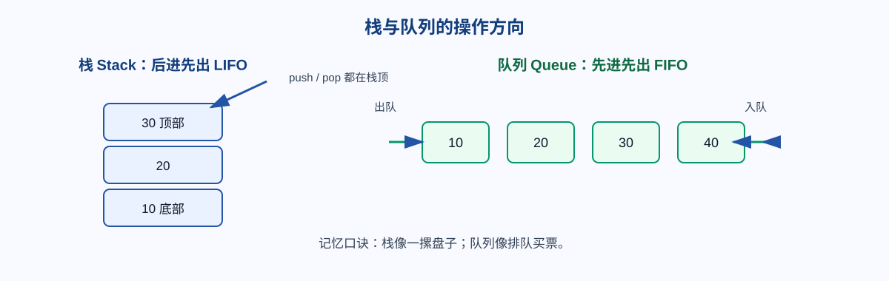


## 栈

### 什么是栈

栈是一种**后进先出**（LIFO, Last In First Out）的线性数据结构。就像一摞盘子，你只能从最上面放盘子或取盘子。

### 栈的特性

1. **后进先出**：最后进入的元素最先被取出
2. **受限操作**：只能在栈顶进行插入和删除
3. **单端操作**：所有操作都在栈顶进行

### 栈的基本操作

#### 入栈（Push）

将元素压入栈顶。

```python
def push(stack, item):
    """入栈操作"""
    stack.append(item)
    return stack

# 使用示例
my_stack = []
push(my_stack, 10)
push(my_stack, 20)
push(my_stack, 30)
print(my_stack)  # [10, 20, 30]
```

时间复杂度：O(1)

#### 出栈（Pop）

从栈顶弹出元素。

```python
def pop(stack):
    """出栈操作"""
    if not stack:
        raise IndexError("栈为空")
    return stack.pop()

# 使用示例
my_stack = [10, 20, 30]
print(pop(my_stack))  # 30
print(pop(my_stack))  # 20
print(my_stack)       # [10]
```

时间复杂度：O(1)

#### 查看栈顶（Peek）

查看栈顶元素但不弹出。

```python
def peek(stack):
    """查看栈顶元素"""
    if not stack:
        raise IndexError("栈为空")
    return stack[-1]

# 使用示例
my_stack = [10, 20, 30]
print(peek(my_stack))  # 30
print(my_stack)        # [10, 20, 30]
```

时间复杂度：O(1)

#### 判断栈空（isEmpty）

检查栈是否为空。

```python
def is_empty(stack):
    """判断栈是否为空"""
    return len(stack) == 0

# 使用示例
my_stack = []
print(is_empty(my_stack))  # True
my_stack.append(10)
print(is_empty(my_stack))  # False
```

时间复杂度：O(1)

### 栈的实现

#### 使用列表实现

```python
class Stack:
    def __init__(self):
        self.items = []
    
    def push(self, item):
        """入栈"""
        self.items.append(item)
    
    def pop(self):
        """出栈"""
        if not self.is_empty():
            return self.items.pop()
        raise IndexError("栈为空")
    
    def peek(self):
        """查看栈顶"""
        if not self.is_empty():
            return self.items[-1]
        raise IndexError("栈为空")
    
    def is_empty(self):
        """判断栈空"""
        return len(self.items) == 0
    
    def size(self):
        """栈的大小"""
        return len(self.items)
    
    def display(self):
        """显示栈内容"""
        print("栈内容（从底到顶）：", self.items)
```

#### 使用链表实现

```python
class StackNode:
    def __init__(self, data):
        self.data = data
        self.next = None

class LinkedStack:
    def __init__(self):
        self.top = None
        self.size = 0
    
    def push(self, item):
        """入栈"""
        new_node = StackNode(item)
        new_node.next = self.top
        self.top = new_node
        self.size += 1
    
    def pop(self):
        """出栈"""
        if self.is_empty():
            raise IndexError("栈为空")
        
        data = self.top.data
        self.top = self.top.next
        self.size -= 1
        return data
    
    def peek(self):
        """查看栈顶"""
        if self.is_empty():
            raise IndexError("栈为空")
        return self.top.data
    
    def is_empty(self):
        """判断栈空"""
        return self.top is None
    
    def get_size(self):
        """栈的大小"""
        return self.size
```

### 栈的应用

#### 应用1：括号匹配

```python
def is_valid_parentheses(s):
    """检查括号是否匹配"""
    stack = []
    mapping = {')': '(', '}': '{', ']': '['}
    
    for char in s:
        if char in mapping.values():
            stack.append(char)
        elif char in mapping.keys():
            if not stack or stack.pop() != mapping[char]:
                return False
        else:
            continue
    
    return not stack

# 使用示例
print(is_valid_parentheses("()"))        # True
print(is_valid_parentheses("()[]{}"))    # True
print(is_valid_parentheses("(]"))        # False
print(is_valid_parentheses("([)]"))      # False
print(is_valid_parentheses("{[]}"))      # True
```

#### 应用2：表达式求值

```python
def evaluate_expression(expression):
    """计算后缀表达式"""
    stack = []
    tokens = expression.split()
    
    for token in tokens:
        if token.isdigit():
            stack.append(int(token))
        else:
            b = stack.pop()
            a = stack.pop()
            
            if token == '+':
                stack.append(a + b)
            elif token == '-':
                stack.append(a - b)
            elif token == '*':
                stack.append(a * b)
            elif token == '/':
                stack.append(a // b)
    
    return stack[0] if stack else 0

# 使用示例
print(evaluate_expression("3 4 + 2 *"))  # (3 + 4) * 2 = 14
print(evaluate_expression("5 1 2 + 4 * + 3 -"))  # 14
```

#### 应用3：函数调用栈

```python
def factorial(n):
    """递归计算阶乘"""
    if n <= 1:
        return 1
    return n * factorial(n - 1)

# 模拟函数调用栈
def factorial_iterative(n):
    """使用栈模拟递归"""
    stack = []
    result = 1
    
    # 将所有参数压入栈
    for i in range(n, 0, -1):
        stack.append(i)
    
    # 从栈中取出并计算
    while stack:
        result *= stack.pop()
    
    return result

print(factorial(5))          # 120
print(factorial_iterative(5))  # 120
```

#### 应用4：浏览器历史记录

```python
class BrowserHistory:
    def __init__(self):
        self.back_stack = []
        self.forward_stack = []
        self.current_page = None
    
    def visit(self, url):
        """访问新页面"""
        if self.current_page:
            self.back_stack.append(self.current_page)
        self.current_page = url
        self.forward_stack.clear()
        print(f"访问: {url}")
    
    def back(self):
        """后退"""
        if self.back_stack:
            self.forward_stack.append(self.current_page)
            self.current_page = self.back_stack.pop()
            print(f"后退到: {self.current_page}")
        else:
            print("没有更多历史记录")
        return self.current_page
    
    def forward(self):
        """前进"""
        if self.forward_stack:
            self.back_stack.append(self.current_page)
            self.current_page = self.forward_stack.pop()
            print(f"前进到: {self.current_page}")
        else:
            print("没有更多前进记录")
        return self.current_page

# 使用示例
browser = BrowserHistory()
browser.visit("google.com")
browser.visit("facebook.com")
browser.visit("twitter.com")
browser.back()      # 后退到 facebook.com
browser.back()      # 后退到 google.com
browser.forward()   # 前进到 facebook.com
```

## 队列

### 什么是队列

队列是一种**先进先出**（FIFO, First In First Out）的线性数据结构。就像排队买票，先来的人先买票。

### 队列的特性

1. **先进先出**：最先进入的元素最先被取出
2. **受限操作**：只能在队尾插入，队头删除
3. **双端操作**：插入和删除在不同端进行

### 队列的基本操作

#### 入队（Enqueue）

在队尾添加元素。

```python
def enqueue(queue, item):
    """入队操作"""
    queue.append(item)
    return queue

# 使用示例
my_queue = []
enqueue(my_queue, 10)
enqueue(my_queue, 20)
enqueue(my_queue, 30)
print(my_queue)  # [10, 20, 30]
```

时间复杂度：O(1)

#### 出队（Dequeue）

从队头移除元素。

```python
def dequeue(queue):
    """出队操作"""
    if not queue:
        raise IndexError("队列为空")
    return queue.pop(0)

# 使用示例
my_queue = [10, 20, 30]
print(dequeue(my_queue))  # 10
print(dequeue(my_queue))  # 20
print(my_queue)           # [30]
```

时间复杂度：O(n) - 使用列表实现时

#### 查看队首（Front）

查看队头元素但不移除。

```python
def front(queue):
    """查看队首元素"""
    if not queue:
        raise IndexError("队列为空")
    return queue[0]

# 使用示例
my_queue = [10, 20, 30]
print(front(my_queue))  # 10
print(my_queue)         # [10, 20, 30]
```

时间复杂度：O(1)

#### 判断队空（isEmpty）

检查队列是否为空。

```python
def is_empty(queue):
    """判断队列是否为空"""
    return len(queue) == 0

# 使用示例
my_queue = []
print(is_empty(my_queue))  # True
my_queue.append(10)
print(is_empty(my_queue))  # False
```

时间复杂度：O(1)

### 队列的实现

#### 使用列表实现

```python
class Queue:
    def __init__(self):
        self.items = []
    
    def enqueue(self, item):
        """入队"""
        self.items.append(item)
    
    def dequeue(self):
        """出队"""
        if not self.is_empty():
            return self.items.pop(0)
        raise IndexError("队列为空")
    
    def front(self):
        """查看队首"""
        if not self.is_empty():
            return self.items[0]
        raise IndexError("队列为空")
    
    def is_empty(self):
        """判断队空"""
        return len(self.items) == 0
    
    def size(self):
        """队列大小"""
        return len(self.items)
    
    def display(self):
        """显示队列内容"""
        print("队列内容（从队首到队尾）：", self.items)
```

#### 使用链表实现

```python
class QueueNode:
    def __init__(self, data):
        self.data = data
        self.next = None

class LinkedQueue:
    def __init__(self):
        self.front = None
        self.rear = None
        self.size = 0
    
    def enqueue(self, item):
        """入队"""
        new_node = QueueNode(item)
        
        if self.is_empty():
            self.front = new_node
            self.rear = new_node
        else:
            self.rear.next = new_node
            self.rear = new_node
        
        self.size += 1
    
    def dequeue(self):
        """出队"""
        if self.is_empty():
            raise IndexError("队列为空")
        
        data = self.front.data
        self.front = self.front.next
        
        if self.front is None:
            self.rear = None
        
        self.size -= 1
        return data
    
    def get_front(self):
        """查看队首"""
        if self.is_empty():
            raise IndexError("队列为空")
        return self.front.data
    
    def is_empty(self):
        """判断队空"""
        return self.front is None
    
    def get_size(self):
        """队列大小"""
        return self.size
```

#### 使用collections.deque实现

```python
from collections import deque

class EfficientQueue:
    def __init__(self):
        self.items = deque()
    
    def enqueue(self, item):
        """入队 - O(1)"""
        self.items.append(item)
    
    def dequeue(self):
        """出队 - O(1)"""
        if not self.is_empty():
            return self.items.popleft()
        raise IndexError("队列为空")
    
    def front(self):
        """查看队首 - O(1)"""
        if not self.is_empty():
            return self.items[0]
        raise IndexError("队列为空")
    
    def is_empty(self):
        """判断队空"""
        return len(self.items) == 0
    
    def size(self):
        """队列大小"""
        return len(self.items)
```

### 队列的应用

#### 应用1：打印机任务队列

```python
import time
import random

class PrintQueue:
    def __init__(self):
        self.queue = EfficientQueue()
    
    def add_job(self, document):
        """添加打印任务"""
        self.queue.enqueue(document)
        print(f"添加打印任务: {document}")
    
    def process_job(self):
        """处理打印任务"""
        if not self.queue.is_empty():
            document = self.queue.dequeue()
            print(f"正在打印: {document}")
            time.sleep(random.uniform(0.5, 1.5))  # 模拟打印时间
            print(f"打印完成: {document}")
        else:
            print("打印队列为空")
    
    def show_queue(self):
        """显示当前队列"""
        print(f"当前队列中有 {self.queue.size()} 个任务")

# 使用示例
printer = PrintQueue()
printer.add_job("文档1")
printer.add_job("文档2")
printer.add_job("文档3")
printer.show_queue()

while not printer.queue.is_empty():
    printer.process_job()
```

#### 应用2：任务调度器

```python
class TaskScheduler:
    def __init__(self):
        self.task_queue = EfficientQueue()
    
    def add_task(self, task_name, priority):
        """添加任务"""
        task = {'name': task_name, 'priority': priority}
        self.task_queue.enqueue(task)
        print(f"添加任务: {task_name} (优先级: {priority})")
    
    def execute_task(self):
        """执行任务"""
        if not self.task_queue.is_empty():
            task = self.task_queue.dequeue()
            print(f"执行任务: {task['name']} (优先级: {task['priority']})")
            return task
        else:
            print("没有待执行任务")
            return None
    
    def process_all(self):
        """处理所有任务"""
        while not self.task_queue.is_empty():
            self.execute_task()

# 使用示例
scheduler = TaskScheduler()
scheduler.add_task("备份数据", 1)
scheduler.add_task("发送邮件", 2)
scheduler.add_task("清理缓存", 3)
scheduler.process_all()
```

#### 应用3：广度优先搜索（BFS）

```python
from collections import deque

def bfs(graph, start):
    """广度优先搜索"""
    visited = set()
    queue = deque([start])
    result = []
    
    while queue:
        vertex = queue.popleft()
        if vertex not in visited:
            visited.add(vertex)
            result.append(vertex)
            
            # 添加未访问的邻居
            for neighbor in graph[vertex]:
                if neighbor not in visited:
                    queue.append(neighbor)
    
    return result

# 使用示例
graph = {
    'A': ['B', 'C'],
    'B': ['A', 'D', 'E'],
    'C': ['A', 'F'],
    'D': ['B'],
    'E': ['B', 'F'],
    'F': ['C', 'E']
}

print(bfs(graph, 'A'))  # ['A', 'B', 'C', 'D', 'E', 'F']
```

#### 应用4：滑动窗口最大值

```python
from collections import deque

def max_sliding_window(nums, k):
    """滑动窗口最大值"""
    if not nums or k <= 0:
        return []
    
    result = []
    deque_window = deque()  # 存储索引
    
    for i in range(len(nums)):
        # 移除超出窗口的元素
        while deque_window and deque_window[0] <= i - k:
            deque_window.popleft()
        
        # 移除比当前元素小的元素
        while deque_window and nums[deque_window[-1]] < nums[i]:
            deque_window.pop()
        
        deque_window.append(i)
        
        # 记录最大值
        if i >= k - 1:
            result.append(nums[deque_window[0]])
    
    return result

# 使用示例
print(max_sliding_window([1,3,-1,-3,5,3,6,7], 3))  # [3,3,5,5,6,7]
```

## 双端队列

### 什么是双端队列

双端队列（Deque, Double-Ended Queue）允许在两端进行插入和删除操作。

### 双端队列的实现

```python
from collections import deque

class Deque:
    def __init__(self):
        self.items = deque()
    
    def add_front(self, item):
        """在前端添加"""
        self.items.appendleft(item)
    
    def add_rear(self, item):
        """在后端添加"""
        self.items.append(item)
    
    def remove_front(self):
        """从前端移除"""
        if not self.is_empty():
            return self.items.popleft()
        raise IndexError("双端队列为空")
    
    def remove_rear(self):
        """从后端移除"""
        if not self.is_empty():
            return self.items.pop()
        raise IndexError("双端队列为空")
    
    def is_empty(self):
        """判断是否为空"""
        return len(self.items) == 0
    
    def size(self):
        """返回大小"""
        return len(self.items)
```

### 双端队列的应用

#### 应用：回文检查

```python
def is_palindrome(s):
    """检查是否为回文"""
    deque_str = Deque()
    
    for char in s:
        deque_str.add_rear(char)
    
    while deque_str.size() > 1:
        front = deque_str.remove_front()
        rear = deque_str.remove_rear()
        
        if front != rear:
            return False
    
    return True

# 使用示例
print(is_palindrome("racecar"))  # True
print(is_palindrome("hello"))    # False
print(is_palindrome("a"))        # True
```

## 栈 vs 队列

### 对比总结

| 特性 | 栈 | 队列 |
|------|------|------|
| 原则 | 后进先出 (LIFO) | 先进先出 (FIFO) |
| 插入端 | 栈顶 | 队尾 |
| 删除端 | 栈顶 | 队头 |
| 主要操作 | push, pop | enqueue, dequeue |
| 典型应用 | 函数调用、括号匹配 | 任务调度、BFS |

### 选择建议

#### 选择栈的情况

1. 需要后进先出的顺序
2. 需要回溯功能
3. 函数调用和递归
4. 表达式求值

#### 选择队列的情况

1. 需要先进先出的顺序
2. 任务调度
3. 广度优先搜索
4. 缓冲区管理

## 练习题

1. 使用栈实现队列，并分析其时间复杂度。
2. 使用队列实现栈，并分析其时间复杂度。
3. 实现一个能够返回栈中最小元素的栈，要求时间复杂度为 O(1)。
4. 设计一个循环队列，并实现其基本操作。

## 总结

栈和队列是重要的受限线性数据结构：

- **栈**：后进先出，适合需要回溯的场景
- **队列**：先进先出，适合需要按顺序处理的场景
- **实现方式**：可以用数组或链表实现
- **广泛应用**：在系统设计和算法中有重要应用

掌握栈和队列的特性及应用，为解决实际问题提供有力工具。


---


# 第6章 哈希表

> **本章图解**：哈希表链地址法冲突处理图

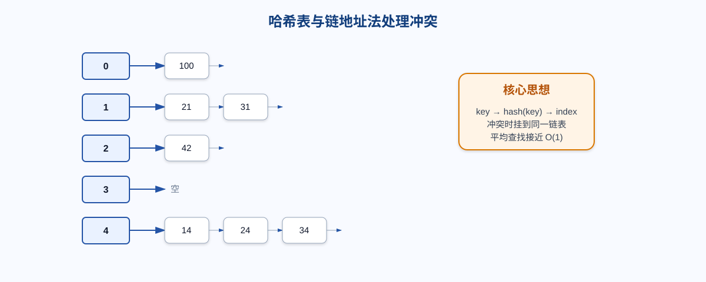


## 什么是哈希表

哈希表（Hash Table）是一种基于键值对（Key-Value）存储的数据结构，通过哈希函数将键映射到存储位置，实现快速的数据查找、插入和删除。

### 哈希表的特性

1. **快速查找**：平均时间复杂度为 O(1)
2. **键值对存储**：通过键直接访问对应的值
3. **无序存储**：数据在表中没有特定的顺序
4. **唯一键**：每个键必须是唯一的

## 哈希函数

### 哈希函数的作用

哈希函数将输入的键转换为数组索引，决定数据在哈希表中的存储位置。

### 理想的哈希函数

1. **确定性**：相同的输入总是产生相同的输出
2. **均匀分布**：将键均匀分布到所有可能的索引
3. **高效计算**：计算速度快
4. **低冲突率**：尽量减少哈希冲突

### 简单的哈希函数

```python
def simple_hash(key, size):
    """简单的哈希函数"""
    if isinstance(key, int):
        return key % size
    elif isinstance(key, str):
        hash_value = 0
        for char in key:
            hash_value += ord(char)
        return hash_value % size
    else:
        return hash(key) % size

# 使用示例
print(simple_hash(42, 10))      # 2
print(simple_hash("hello", 10))  # 取决于字符串的哈希值
print(simple_hash(100, 10))     # 0
```

## 哈希冲突

### 什么是哈希冲突

当两个不同的键通过哈希函数映射到相同的索引时，就发生了哈希冲突。

### 冲突解决方法

#### 1. 链地址法（Separate Chaining）

每个哈希表位置维护一个链表，冲突的元素都存储在同一个链表中。

```python
class HashTableChaining:
    def __init__(self, size=10):
        self.size = size
        self.table = [[] for _ in range(size)]
    
    def _hash(self, key):
        return hash(key) % self.size
    
    def put(self, key, value):
        """插入键值对"""
        index = self._hash(key)
        
        # 检查键是否已存在
        for i, (k, v) in enumerate(self.table[index]):
            if k == key:
                self.table[index][i] = (key, value)
                return
        
        # 键不存在，添加新键值对
        self.table[index].append((key, value))
    
    def get(self, key):
        """获取键对应的值"""
        index = self._hash(key)
        
        for k, v in self.table[index]:
            if k == key:
                return v
        
        raise KeyError(f"键 '{key}' 不存在")
    
    def remove(self, key):
        """删除键值对"""
        index = self._hash(key)
        
        for i, (k, v) in enumerate(self.table[index]):
            if k == key:
                self.table[index].pop(i)
                return
        
        raise KeyError(f"键 '{key}' 不存在")
    
    def display(self):
        """显示哈希表内容"""
        for i, bucket in enumerate(self.table):
            print(f"索引 {i}: {bucket}")
```

#### 2. 开放寻址法（Open Addressing）

当发生冲突时，寻找下一个可用的位置。

```python
class HashTableOpenAddressing:
    def __init__(self, size=10):
        self.size = size
        self.keys = [None] * size
        self.values = [None] * size
    
    def _hash(self, key):
        return hash(key) % self.size
    
    def _probe(self, key):
        """线性探测"""
        index = self._hash(key)
        i = 0
        while self.keys[index] is not None and self.keys[index] != key:
            index = (index + 1) % self.size
            i += 1
            if i >= self.size:
                raise Exception("哈希表已满")
        return index
    
    def put(self, key, value):
        """插入键值对"""
        index = self._probe(key)
        self.keys[index] = key
        self.values[index] = value
    
    def get(self, key):
        """获取键对应的值"""
        index = self._probe(key)
        if self.keys[index] == key:
            return self.values[index]
        raise KeyError(f"键 '{key}' 不存在")
    
    def remove(self, key):
        """删除键值对"""
        index = self._probe(key)
        if self.keys[index] == key:
            self.keys[index] = None
            self.values[index] = None
        else:
            raise KeyError(f"键 '{key}' 不存在")
```

## 哈希表的基本操作

### 插入（Put）

```python
def put(hash_table, key, value):
    """插入键值对"""
    index = hash_function(key, hash_table.size)
    hash_table.table[index] = (key, value)
```

平均时间复杂度：O(1)

### 查找（Get）

```python
def get(hash_table, key):
    """获取键对应的值"""
    index = hash_function(key, hash_table.size)
    if hash_table.table[index] and hash_table.table[index][0] == key:
        return hash_table.table[index][1]
    return None
```

平均时间复杂度：O(1)

### 删除（Remove）

```python
def remove(hash_table, key):
    """删除键值对"""
    index = hash_function(key, hash_table.size)
    if hash_table.table[index] and hash_table.table[index][0] == key:
        hash_table.table[index] = None
        return True
    return False
```

平均时间复杂度：O(1)

## Python 中的哈希表

### 字典（Dictionary）

Python 的字典就是哈希表的实现：

```python
# 创建字典
my_dict = {}

# 插入键值对
my_dict['name'] = 'Alice'
my_dict['age'] = 25
my_dict['city'] = 'Beijing'

# 查找值
print(my_dict['name'])  # Alice
print(my_dict.get('age'))  # 25

# 删除键值对
del my_dict['city']

# 检查键是否存在
if 'name' in my_dict:
    print("name 存在")

# 获取所有键和值
print(my_dict.keys())   # dict_keys(['name', 'age'])
print(my_dict.values()) # dict_values(['Alice', 25])
print(my_dict.items())  # dict_items([('name', 'Alice'), ('age', 25)])
```

### 集合（Set）

集合是只存储键的哈希表：

```python
# 创建集合
my_set = set()

# 添加元素
my_set.add(1)
my_set.add(2)
my_set.add(3)

# 检查元素是否存在
if 2 in my_set:
    print("2 存在")

# 删除元素
my_set.remove(2)

# 集合操作
set1 = {1, 2, 3}
set2 = {3, 4, 5}

print(set1 | set2)  # 并集: {1, 2, 3, 4, 5}
print(set1 & set2)  # 交集: {3}
print(set1 - set2)  # 差集: {1, 2}
```

## 哈希表的应用

### 应用1：缓存系统

```python
class SimpleCache:
    def __init__(self, capacity=100):
        self.capacity = capacity
        self.cache = {}
    
    def get(self, key):
        """获取缓存值"""
        if key in self.cache:
            return self.cache[key]
        return None
    
    def put(self, key, value):
        """设置缓存值"""
        if len(self.cache) >= self.capacity:
            # 简单的缓存淘汰策略：删除第一个键
            first_key = next(iter(self.cache))
            del self.cache[first_key]
        
        self.cache[key] = value
    
    def clear(self):
        """清空缓存"""
        self.cache.clear()

# 使用示例
cache = SimpleCache(capacity=3)
cache.put('user1', 'Alice')
cache.put('user2', 'Bob')
cache.put('user3', 'Charlie')

print(cache.get('user1'))  # Alice
cache.put('user4', 'David')  # 淘汰 user1
print(cache.get('user1'))  # None
```

### 应用2：计数器

```python
from collections import Counter

def count_frequency(items):
    """统计元素频率"""
    return Counter(items)

# 使用示例
words = ['apple', 'banana', 'apple', 'orange', 'banana', 'apple']
frequency = count_frequency(words)
print(frequency)  # Counter({'apple': 3, 'banana': 2, 'orange': 1})

# 找出出现频率最高的元素
print(frequency.most_common(2))  # [('apple', 3), ('banana', 2)]
```

### 应用3：去重

```python
def remove_duplicates(items):
    """去除重复元素"""
    return list(set(items))

# 使用示例
numbers = [1, 2, 2, 3, 4, 4, 5, 5, 5]
unique_numbers = remove_duplicates(numbers)
print(unique_numbers)  # [1, 2, 3, 4, 5]
```

### 应用4：两数之和

```python
def two_sum(nums, target):
    """找出两数之和等于目标值的索引"""
    num_dict = {}
    
    for i, num in enumerate(nums):
        complement = target - num
        
        if complement in num_dict:
            return [num_dict[complement], i]
        
        num_dict[num] = i
    
    return []

# 使用示例
nums = [2, 7, 11, 15]
target = 9
print(two_sum(nums, target))  # [0, 1]
```

### 应用5：分组

```python
def group_anagrams(strs):
    """将字母异位词分组"""
    groups = {}
    
    for s in strs:
        # 排序字符串作为键
        key = ''.join(sorted(s))
        
        if key not in groups:
            groups[key] = []
        
        groups[key].append(s)
    
    return list(groups.values())

# 使用示例
words = ["eat", "tea", "tan", "ate", "nat", "bat"]
print(group_anagrams(words))
# [['eat', 'tea', 'ate'], ['tan', 'nat'], ['bat']]
```

## 哈希表的性能分析

### 时间复杂度

| 操作 | 平均情况 | 最坏情况 |
|------|----------|----------|
| 插入 | O(1) | O(n) |
| 查找 | O(1) | O(n) |
| 删除 | O(1) | O(n) |

### 影响性能的因素

1. **哈希函数质量**：好的哈希函数能减少冲突
2. **负载因子**：元素数量与哈希表大小的比值
3. **冲突解决策略**：不同的冲突解决方法性能不同
4. **数据分布**：数据的分布特征影响哈希效果

### 负载因子

```python
class LoadFactorHashTable:
    def __init__(self, initial_size=10, load_factor=0.75):
        self.size = initial_size
        self.load_factor = load_factor
        self.count = 0
        self.table = [[] for _ in range(self.size)]
    
    def _hash(self, key):
        return hash(key) % self.size
    
    def _resize(self):
        """调整哈希表大小"""
        old_table = self.table
        self.size *= 2
        self.table = [[] for _ in range(self.size)]
        self.count = 0
        
        for bucket in old_table:
            for key, value in bucket:
                self.put(key, value)
    
    def put(self, key, value):
        """插入键值对"""
        # 检查是否需要扩容
        if self.count / self.size >= self.load_factor:
            self._resize()
        
        index = self._hash(key)
        
        for i, (k, v) in enumerate(self.table[index]):
            if k == key:
                self.table[index][i] = (key, value)
                return
        
        self.table[index].append((key, value))
        self.count += 1
```

## 哈希表的优缺点

### 优点

1. **快速访问**：平均 O(1) 的查找、插入、删除
2. **灵活的键类型**：可以使用各种可哈希类型作为键
3. **动态大小**：可以根据需要动态调整大小
4. **简单易用**：API 简单直观

### 缺点

1. **无序性**：不保持元素的插入顺序
2. **冲突处理**：冲突处理可能影响性能
3. **空间开销**：需要额外的空间来避免冲突
4. **哈希函数依赖**：性能依赖于哈希函数的质量

## 哈希表 vs 其他数据结构

### 与数组对比

| 特性 | 哈希表 | 数组 |
|------|--------|------|
| 查找 | O(1) | O(n) |
| 插入 | O(1) | O(n) |
| 删除 | O(1) | O(n) |
| 有序性 | 无 | 有 |
| 内存 | 较高 | 较低 |

### 与树对比

| 特性 | 哈希表 | 平衡树 |
|------|--------|--------|
| 查找 | O(1) | O(log n) |
| 插入 | O(1) | O(log n) |
| 删除 | O(1) | O(log n) |
| 有序性 | 无 | 有 |
| 范围查询 | 不支持 | 支持 |

## 练习题

1. 实现一个 LRU（最近最少使用）缓存，使用哈希表和双向链表。
2. 设计一个哈希函数，能够将字符串均匀分布到指定大小的哈希表中。
3. 实现一个支持增量统计的计数器，能够快速增加和查询计数。
4. 比较链地址法和开放寻址法在不同场景下的性能差异。

## 总结

哈希表是一种高效的键值对存储结构：

- **核心原理**：通过哈希函数将键映射到存储位置
- **快速操作**：平均 O(1) 的时间复杂度
- **冲突处理**：链地址法和开放寻址法
- **广泛应用**：缓存、计数、去重、查找等

哈希表在实际开发中应用广泛，是程序员必须掌握的重要数据结构之一。


---


# 第7章 树

> **本章图解**：二叉树遍历顺序图

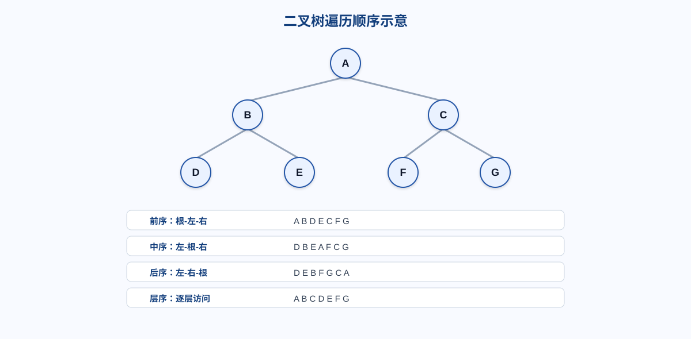


## 什么是树

树是一种非线性数据结构，由节点和边组成，具有层次结构。树结构模拟了现实中的层次关系，如文件系统、组织架构等。

### 树的基本特性

1. **层次结构**：节点之间存在父子关系
2. **唯一根节点**：每个树有且仅有一个根节点
3. **无环结构**：节点之间不存在环路
4. **递归定义**：子树也是树结构

### 树的基本概念

- **根节点**：树的顶层节点，没有父节点
- **叶子节点**：没有子节点的节点
- **内部节点**：既有父节点又有子节点的节点
- **父节点**：直接连接到下层节点的节点
- **子节点**：直接连接到上层节点的节点
- **兄弟节点**：具有相同父节点的节点
- **节点深度**：从根节点到该节点的边数
- **节点高度**：从该节点到最远叶子节点的边数
- **树的高度**：根节点的高度
- **树的度**：节点中最大的子节点数

## 二叉树

### 什么是二叉树

二叉树是每个节点最多有两个子节点的树结构，分别称为左子节点和右子节点。

### 二叉树的特性

1. **每个节点最多有两个子节点**
2. **子节点有左右之分**
3. **第 i 层最多有 2^(i-1) 个节点**
4. **高度为 h 的二叉树最多有 2^h - 1 个节点**

### 二叉树的实现

```python
class TreeNode:
    def __init__(self, val=0):
        self.val = val
        self.left = None
        self.right = None

class BinaryTree:
    def __init__(self):
        self.root = None
    
    def insert(self, val):
        """插入节点（按层次插入）"""
        if not self.root:
            self.root = TreeNode(val)
            return
        
        queue = [self.root]
        while queue:
            node = queue.pop(0)
            
            if not node.left:
                node.left = TreeNode(val)
                return
            else:
                queue.append(node.left)
            
            if not node.right:
                node.right = TreeNode(val)
                return
            else:
                queue.append(node.right)
```

### 二叉树的遍历

#### 前序遍历（根-左-右）

```python
def preorder_traversal(root):
    """前序遍历：根 -> 左 -> 右"""
    if not root:
        return []
    
    result = []
    stack = [root]
    
    while stack:
        node = stack.pop()
        result.append(node.val)
        
        # 先压入右子节点，再压入左子节点
        if node.right:
            stack.append(node.right)
        if node.left:
            stack.append(node.left)
    
    return result

# 递归版本
def preorder_recursive(root):
    """前序遍历递归版本"""
    if not root:
        return []
    
    return [root.val] + preorder_recursive(root.left) + preorder_recursive(root.right)
```

#### 中序遍历（左-根-右）

```python
def inorder_traversal(root):
    """中序遍历：左 -> 根 -> 右"""
    if not root:
        return []
    
    result = []
    stack = []
    current = root
    
    while current or stack:
        # 遍历到最左边的节点
        while current:
            stack.append(current)
            current = current.left
        
        current = stack.pop()
        result.append(current.val)
        current = current.right
    
    return result

# 递归版本
def inorder_recursive(root):
    """中序遍历递归版本"""
    if not root:
        return []
    
    return inorder_recursive(root.left) + [root.val] + inorder_recursive(root.right)
```

#### 后序遍历（左-右-根）

```python
def postorder_traversal(root):
    """后序遍历：左 -> 右 -> 根"""
    if not root:
        return []
    
    result = []
    stack = [root]
    
    while stack:
        node = stack.pop()
        result.append(node.val)
        
        if node.left:
            stack.append(node.left)
        if node.right:
            stack.append(node.right)
    
    return result[::-1]

# 递归版本
def postorder_recursive(root):
    """后序遍历递归版本"""
    if not root:
        return []
    
    return postorder_recursive(root.left) + postorder_recursive(root.right) + [root.val]
```

#### 层次遍历（广度优先）

```python
from collections import deque

def level_order_traversal(root):
    """层次遍历（广度优先）"""
    if not root:
        return []
    
    result = []
    queue = deque([root])
    
    while queue:
        level_size = len(queue)
        level_nodes = []
        
        for _ in range(level_size):
            node = queue.popleft()
            level_nodes.append(node.val)
            
            if node.left:
                queue.append(node.left)
            if node.right:
                queue.append(node.right)
        
        result.append(level_nodes)
    
    return result
```

## 二叉搜索树

### 什么是二叉搜索树

二叉搜索树（BST）是一种特殊的二叉树，对于每个节点：
- 左子树的所有节点值都小于该节点值
- 右子树的所有节点值都大于该节点值
- 左右子树也都是二叉搜索树

### 二叉搜索树的实现

```python
class BSTNode:
    def __init__(self, val=0):
        self.val = val
        self.left = None
        self.right = None

class BinarySearchTree:
    def __init__(self):
        self.root = None
    
    def insert(self, val):
        """插入节点"""
        if not self.root:
            self.root = BSTNode(val)
            return
        
        self._insert_recursive(self.root, val)
    
    def _insert_recursive(self, node, val):
        """递归插入"""
        if val < node.val:
            if node.left is None:
                node.left = BSTNode(val)
            else:
                self._insert_recursive(node.left, val)
        else:
            if node.right is None:
                node.right = BSTNode(val)
            else:
                self._insert_recursive(node.right, val)
    
    def search(self, val):
        """查找节点"""
        return self._search_recursive(self.root, val)
    
    def _search_recursive(self, node, val):
        """递归查找"""
        if not node or node.val == val:
            return node
        
        if val < node.val:
            return self._search_recursive(node.left, val)
        else:
            return self._search_recursive(node.right, val)
    
    def delete(self, val):
        """删除节点"""
        self.root = self._delete_recursive(self.root, val)
    
    def _delete_recursive(self, node, val):
        """递归删除"""
        if not node:
            return None
        
        if val < node.val:
            node.left = self._delete_recursive(node.left, val)
        elif val > node.val:
            node.right = self._delete_recursive(node.right, val)
        else:
            # 找到要删除的节点
            # 情况1：叶子节点
            if not node.left and not node.right:
                return None
            # 情况2：只有一个子节点
            elif not node.left:
                return node.right
            elif not node.right:
                return node.left
            # 情况3：有两个子节点
            else:
                # 找到右子树的最小值节点
                min_node = self._find_min(node.right)
                node.val = min_node.val
                node.right = self._delete_recursive(node.right, min_node.val)
        
        return node
    
    def _find_min(self, node):
        """找到最小值节点"""
        while node.left:
            node = node.left
        return node
```

### 二叉搜索树的操作复杂度

| 操作 | 平均情况 | 最坏情况 |
|------|----------|----------|
| 查找 | O(log n) | O(n) |
| 插入 | O(log n) | O(n) |
| 删除 | O(log n) | O(n) |

## 平衡二叉树

### 为什么需要平衡二叉树

普通二叉搜索树在最坏情况下会退化为链表，导致操作复杂度变为 O(n)。平衡二叉树通过保持树的平衡来确保操作效率。

### AVL树

AVL树是一种自平衡二叉搜索树，对于每个节点，其左右子树的高度差不超过1。

```python
class AVLNode:
    def __init__(self, val=0):
        self.val = val
        self.left = None
        self.right = None
        self.height = 1

class AVLTree:
    def __init__(self):
        self.root = None
    
    def height(self, node):
        """获取节点高度"""
        if not node:
            return 0
        return node.height
    
    def balance_factor(self, node):
        """计算平衡因子"""
        if not node:
            return 0
        return self.height(node.left) - self.height(node.right)
    
    def right_rotate(self, y):
        """右旋转"""
        x = y.left
        T2 = x.right
        
        x.right = y
        y.left = T2
        
        y.height = max(self.height(y.left), self.height(y.right)) + 1
        x.height = max(self.height(x.left), self.height(x.right)) + 1
        
        return x
    
    def left_rotate(self, x):
        """左旋转"""
        y = x.right
        T2 = y.left
        
        y.left = x
        x.right = T2
        
        x.height = max(self.height(x.left), self.height(x.right)) + 1
        y.height = max(self.height(y.left), self.height(y.right)) + 1
        
        return y
    
    def insert(self, val):
        """插入节点"""
        self.root = self._insert(self.root, val)
    
    def _insert(self, node, val):
        """递归插入并平衡"""
        if not node:
            return AVLNode(val)
        
        if val < node.val:
            node.left = self._insert(node.left, val)
        else:
            node.right = self._insert(node.right, val)
        
        node.height = max(self.height(node.left), self.height(node.right)) + 1
        
        balance = self.balance_factor(node)
        
        # 左左情况
        if balance > 1 and val < node.left.val:
            return self.right_rotate(node)
        
        # 右右情况
        if balance < -1 and val > node.right.val:
            return self.left_rotate(node)
        
        # 左右情况
        if balance > 1 and val > node.left.val:
            node.left = self.left_rotate(node.left)
            return self.right_rotate(node)
        
        # 右左情况
        if balance < -1 and val < node.right.val:
            node.right = self.right_rotate(node.right)
            return self.left_rotate(node)
        
        return node
```

## 树的应用

### 应用1：表达式树

```python
class ExpressionTree:
    def __init__(self):
        self.root = None
    
    def build(self, postfix):
        """根据后缀表达式构建表达式树"""
        stack = []
        
        for token in postfix:
            if token.isdigit():
                stack.append(TreeNode(int(token)))
            else:
                node = TreeNode(token)
                node.right = stack.pop()
                node.left = stack.pop()
                stack.append(node)
        
        self.root = stack.pop()
    
    def evaluate(self):
        """计算表达式树的值"""
        return self._evaluate(self.root)
    
    def _evaluate(self, node):
        """递归计算"""
        if not node:
            return 0
        
        if not node.left and not node.right:
            return int(node.val)
        
        left_val = self._evaluate(node.left)
        right_val = self._evaluate(node.right)
        
        if node.val == '+':
            return left_val + right_val
        elif node.val == '-':
            return left_val - right_val
        elif node.val == '*':
            return left_val * right_val
        elif node.val == '/':
            return left_val // right_val
    
    def inorder(self):
        """中序遍历（带括号）"""
        return self._inorder(self.root)
    
    def _inorder(self, node):
        """递归中序遍历"""
        if not node:
            return ""
        
        if not node.left and not node.right:
            return str(node.val)
        
        left = self._inorder(node.left)
        right = self._inorder(node.right)
        
        return f"({left}{node.val}{right})"

# 使用示例
expr_tree = ExpressionTree()
expr_tree.build(["3", "4", "+", "2", "*"])
print(expr_tree.inorder())    # ((3+4)*2)
print(expr_tree.evaluate())   # 14
```

### 应用2：文件系统

```python
class FileNode:
    def __init__(self, name, is_file=False, size=0):
        self.name = name
        self.is_file = is_file
        self.size = size
        self.children = {}  # 子文件或文件夹

class FileSystem:
    def __init__(self):
        self.root = FileNode("", is_file=False)
    
    def create_path(self, path, value=0):
        """创建文件路径"""
        components = path.split('/')
        node = self.root
        
        for i, component in enumerate(components[:-1]):
            if component not in node.children:
                return False
            node = node.children[component]
        
        file_name = components[-1]
        if file_name in node.children:
            return False
        
        is_file = i == len(components) - 2
        node.children[file_name] = FileNode(file_name, is_file, value)
        return True
    
    def get(self, path):
        """获取文件大小"""
        components = path.split('/')
        node = self.root
        
        for component in components:
            if component not in node.children:
                return -1
            node = node.children[component]
        
        return node.size if node.is_file else -1

# 使用示例
fs = FileSystem()
fs.create_path("/a", 1)
print(fs.get("/a"))  # 1
```

### 应用3：字典树（Trie）

```python
class TrieNode:
    def __init__(self):
        self.children = {}
        self.is_end = False

class Trie:
    def __init__(self):
        self.root = TrieNode()
    
    def insert(self, word):
        """插入单词"""
        node = self.root
        for char in word:
            if char not in node.children:
                node.children[char] = TrieNode()
            node = node.children[char]
        node.is_end = True
    
    def search(self, word):
        """搜索单词"""
        node = self.root
        for char in word:
            if char not in node.children:
                return False
            node = node.children[char]
        return node.is_end
    
    def starts_with(self, prefix):
        """检查是否有前缀"""
        node = self.root
        for char in prefix:
            if char not in node.children:
                return False
            node = node.children[char]
        return True

# 使用示例
trie = Trie()
trie.insert("apple")
print(trie.search("apple"))   # True
print(trie.search("app"))     # False
print(trie.starts_with("app"))  # True
```

### 应用4：霍夫曼编码

```python
import heapq
from collections import Counter

class HuffmanNode:
    def __init__(self, char=None, freq=0, left=None, right=None):
        self.char = char
        self.freq = freq
        self.left = left
        self.right = right
    
    def __lt__(self, other):
        return self.freq < other.freq

def build_huffman_tree(text):
    """构建霍夫曼树"""
    if not text:
        return None
    
    # 统计字符频率
    freq = Counter(text)
    
    # 创建优先队列
    heap = [HuffmanNode(char, freq) for char, freq in freq.items()]
    heapq.heapify(heap)
    
    # 构建霍夫曼树
    while len(heap) > 1:
        left = heapq.heappop(heap)
        right = heapq.heappop(heap)
        merged = HuffmanNode(freq=left.freq + right.freq, left=left, right=right)
        heapq.heappush(heap, merged)
    
    return heap[0]

def generate_codes(node, current_code="", code_map=None):
    """生成霍夫曼编码"""
    if code_map is None:
        code_map = {}
    
    if node is None:
        return code_map
    
    if node.char is not None:
        code_map[node.char] = current_code
        return code_map
    
    generate_codes(node.left, current_code + "0", code_map)
    generate_codes(node.right, current_code + "1", code_map)
    
    return code_map

# 使用示例
text = "hello world"
huffman_tree = build_huffman_tree(text)
huffman_codes = generate_codes(huffman_tree)
print(huffman_codes)
```

## 树的常见问题

### 问题1：二叉树的最大深度

```python
def max_depth(root):
    """计算二叉树的最大深度"""
    if not root:
        return 0
    
    left_depth = max_depth(root.left)
    right_depth = max_depth(root.right)
    
    return max(left_depth, right_depth) + 1
```

### 问题2：判断是否为平衡二叉树

```python
def is_balanced(root):
    """判断是否为平衡二叉树"""
    def check_balance(node):
        if not node:
            return 0
        
        left_height = check_balance(node.left)
        if left_height == -1:
            return -1
        
        right_height = check_balance(node.right)
        if right_height == -1:
            return -1
        
        if abs(left_height - right_height) > 1:
            return -1
        
        return max(left_height, right_height) + 1
    
    return check_balance(root) != -1
```

### 问题3：二叉树的最近公共祖先

```python
def lowest_common_ancestor(root, p, q):
    """查找最近公共祖先"""
    if not root or root == p or root == q:
        return root
    
    left = lowest_common_ancestor(root.left, p, q)
    right = lowest_common_ancestor(root.right, p, q)
    
    if left and right:
        return root
    
    return left if left else right
```

### 问题4：将有序数组转换为二叉搜索树

```python
def sorted_array_to_bst(nums):
    """将有序数组转换为平衡二叉搜索树"""
    def convert(left, right):
        if left > right:
            return None
        
        mid = (left + right) // 2
        node = TreeNode(nums[mid])
        node.left = convert(left, mid - 1)
        node.right = convert(mid + 1, right)
        
        return node
    
    return convert(0, len(nums) - 1)
```

## 练习题

1. 实现一个函数，计算二叉树的直径（任意两个节点之间的最长路径）。
2. 给定二叉树的前序遍历和中序遍历，重构该二叉树。
3. 实现一个函数，判断二叉树是否对称。
4. 设计一个算法，找出二叉树中第 k 小的元素。

## 总结

树是一种重要的非线性数据结构：

- **基本结构**：层次结构，根节点、叶子节点、子树
- **二叉树**：每个节点最多两个子节点
- **二叉搜索树**：左小右大，支持高效查找
- **平衡树**：保持平衡，确保操作效率
- **广泛应用**：文件系统、表达式求值、字典树等

掌握树的各种遍历方法和操作，为解决复杂问题提供有力工具。


---


# 第8章 堆

> **本章图解**：堆的数组表示与树形结构图

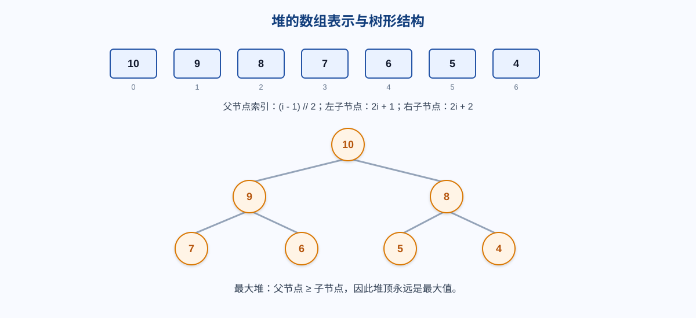


## 什么是堆

堆是一种特殊的树形数据结构，满足堆性质。堆通常使用完全二叉树来实现，并且可以用数组高效存储。

### 堆的特性

1. **完全二叉树**：除了最后一层，其他层都被完全填满
2. **堆性质**：父节点与子节点之间满足特定关系
3. **数组存储**：可以用数组高效存储和访问

### 堆的类型

#### 最大堆（Max Heap）

- 每个节点的值都大于或等于其子节点的值
- 根节点是最大值

#### 最小堆（Min Heap）

- 每个节点的值都小于或等于其子节点的值
- 根节点是最小值

## 堆的数组表示

堆可以用数组来表示，对于索引为 i 的节点：
- 父节点索引：(i - 1) // 2
- 左子节点索引：2 * i + 1
- 右子节点索引：2 * i + 2

```
数组: [10, 9, 8, 7, 6, 5, 4]
堆结构:
        10
       /  \
      9    8
     / \  / \
    7  6 5  4
```

## 堆的基本操作

### 堆化（Heapify）

将一个无序数组调整为堆结构。

```python
def heapify(arr, n, i):
    """堆化操作（最大堆）"""
    largest = i
    left = 2 * i + 1
    right = 2 * i + 2
    
    # 检查左子节点是否大于当前最大值
    if left < n and arr[left] > arr[largest]:
        largest = left
    
    # 检查右子节点是否大于当前最大值
    if right < n and arr[right] > arr[largest]:
        largest = right
    
    # 如果最大值不是当前节点，交换并继续堆化
    if largest != i:
        arr[i], arr[largest] = arr[largest], arr[i]
        heapify(arr, n, largest)
```

### 构建堆

```python
def build_heap(arr):
    """构建最大堆"""
    n = len(arr)
    
    # 从最后一个非叶子节点开始堆化
    for i in range(n // 2 - 1, -1, -1):
        heapify(arr, n, i)
    
    return arr

# 使用示例
arr = [4, 10, 3, 5, 1]
build_heap(arr)
print(arr)  # [10, 5, 3, 4, 1]
```

### 插入元素

```python
def heap_insert(heap, item):
    """向堆中插入元素"""
    heap.append(item)
    i = len(heap) - 1
    
    # 向上调整
    while i > 0:
        parent = (i - 1) // 2
        if heap[parent] < heap[i]:  # 最大堆
            heap[parent], heap[i] = heap[i], heap[parent]
            i = parent
        else:
            break
    
    return heap

# 使用示例
heap = [10, 5, 3, 4, 1]
heap_insert(heap, 8)
print(heap)  # [10, 8, 3, 4, 1, 5]
```

### 提取最大值（最大堆）

```python
def heap_extract_max(heap):
    """提取最大值"""
    if not heap:
        raise IndexError("堆为空")
    
    if len(heap) == 1:
        return heap.pop()
    
    max_val = heap[0]
    heap[0] = heap.pop()
    
    # 向下调整
    i = 0
    n = len(heap)
    
    while True:
        left = 2 * i + 1
        right = 2 * i + 2
        largest = i
        
        if left < n and heap[left] > heap[largest]:
            largest = left
        
        if right < n and heap[right] > heap[largest]:
            largest = right
        
        if largest != i:
            heap[i], heap[largest] = heap[largest], heap[i]
            i = largest
        else:
            break
    
    return max_val

# 使用示例
heap = [10, 8, 3, 4, 1, 5]
print(heap_extract_max(heap))  # 10
print(heap)  # [8, 5, 3, 4, 1]
```

## 堆的实现

### 最大堆实现

```python
class MaxHeap:
    def __init__(self):
        self.heap = []
    
    def parent(self, i):
        """获取父节点索引"""
        return (i - 1) // 2
    
    def left_child(self, i):
        """获取左子节点索引"""
        return 2 * i + 1
    
    def right_child(self, i):
        """获取右子节点索引"""
        return 2 * i + 2
    
    def insert(self, val):
        """插入元素"""
        self.heap.append(val)
        self._sift_up(len(self.heap) - 1)
    
    def _sift_up(self, i):
        """向上调整"""
        while i > 0 and self.heap[self.parent(i)] < self.heap[i]:
            self.heap[self.parent(i)], self.heap[i] = self.heap[i], self.heap[self.parent(i)]
            i = self.parent(i)
    
    def extract_max(self):
        """提取最大值"""
        if not self.heap:
            raise IndexError("堆为空")
        
        if len(self.heap) == 1:
            return self.heap.pop()
        
        max_val = self.heap[0]
        self.heap[0] = self.heap.pop()
        self._sift_down(0)
        
        return max_val
    
    def _sift_down(self, i):
        """向下调整"""
        n = len(self.heap)
        
        while True:
            left = self.left_child(i)
            right = self.right_child(i)
            largest = i
            
            if left < n and self.heap[left] > self.heap[largest]:
                largest = left
            
            if right < n and self.heap[right] > self.heap[largest]:
                largest = right
            
            if largest != i:
                self.heap[i], self.heap[largest] = self.heap[largest], self.heap[i]
                i = largest
            else:
                break
    
    def peek(self):
        """查看最大值"""
        if not self.heap:
            raise IndexError("堆为空")
        return self.heap[0]
    
    def size(self):
        """堆的大小"""
        return len(self.heap)
    
    def is_empty(self):
        """判断堆是否为空"""
        return len(self.heap) == 0
```

### 最小堆实现

```python
class MinHeap:
    def __init__(self):
        self.heap = []
    
    def parent(self, i):
        """获取父节点索引"""
        return (i - 1) // 2
    
    def left_child(self, i):
        """获取左子节点索引"""
        return 2 * i + 1
    
    def right_child(self, i):
        """获取右子节点索引"""
        return 2 * i + 2
    
    def insert(self, val):
        """插入元素"""
        self.heap.append(val)
        self._sift_up(len(self.heap) - 1)
    
    def _sift_up(self, i):
        """向上调整"""
        while i > 0 and self.heap[self.parent(i)] > self.heap[i]:
            self.heap[self.parent(i)], self.heap[i] = self.heap[i], self.heap[self.parent(i)]
            i = self.parent(i)
    
    def extract_min(self):
        """提取最小值"""
        if not self.heap:
            raise IndexError("堆为空")
        
        if len(self.heap) == 1:
            return self.heap.pop()
        
        min_val = self.heap[0]
        self.heap[0] = self.heap.pop()
        self._sift_down(0)
        
        return min_val
    
    def _sift_down(self, i):
        """向下调整"""
        n = len(self.heap)
        
        while True:
            left = self.left_child(i)
            right = self.right_child(i)
            smallest = i
            
            if left < n and self.heap[left] < self.heap[smallest]:
                smallest = left
            
            if right < n and self.heap[right] < self.heap[smallest]:
                smallest = right
            
            if smallest != i:
                self.heap[i], self.heap[smallest] = self.heap[smallest], self.heap[i]
                i = smallest
            else:
                break
    
    def peek(self):
        """查看最小值"""
        if not self.heap:
            raise IndexError("堆为空")
        return self.heap[0]
    
    def size(self):
        """堆的大小"""
        return len(self.heap)
    
    def is_empty(self):
        """判断堆是否为空"""
        return len(self.heap) == 0
```

## Python 中的堆

Python 的 `heapq` 模块提供了堆操作：

```python
import heapq

# 创建堆
heap = []
heapq.heappush(heap, 3)
heapq.heappush(heap, 1)
heapq.heappush(heap, 4)
heapq.heappush(heap, 2)
print(heap)  # [1, 2, 4, 3] - 最小堆

# 弹出最小值
print(heapq.heappop(heap))  # 1
print(heap)  # [2, 3, 4]

# 查看最小值
print(heap[0])  # 2

# 将列表转换为堆
arr = [5, 3, 8, 1, 2]
heapq.heapify(arr)
print(arr)  # [1, 2, 8, 5, 3]

# 弹出 n 个最小值
print(heapq.nsmallest(2, arr))  # [1, 2]

# 弹出 n 个最大值
print(heapq.nlargest(2, arr))  # [8, 5]
```

## 堆的应用

### 应用1：堆排序

```python
def heap_sort(arr):
    """堆排序"""
    n = len(arr)
    
    # 构建最大堆
    for i in range(n // 2 - 1, -1, -1):
        heapify(arr, n, i)
    
    # 逐个提取元素
    for i in range(n - 1, 0, -1):
        arr[0], arr[i] = arr[i], arr[0]
        heapify(arr, i, 0)
    
    return arr

# 使用示例
arr = [12, 11, 13, 5, 6, 7]
print(heap_sort(arr))  # [5, 6, 7, 11, 12, 13]
```

### 应用2：优先队列

```python
class PriorityQueue:
    def __init__(self):
        self.heap = MinHeap()
    
    def enqueue(self, item, priority):
        """入队（带优先级）"""
        self.heap.insert((priority, item))
    
    def dequeue(self):
        """出队（优先级最高的）"""
        if self.heap.is_empty():
            raise IndexError("队列为空")
        return self.heap.extract_min()[1]
    
    def peek(self):
        """查看队首元素"""
        if self.heap.is_empty():
            raise IndexError("队列为空")
        return self.heap.peek()[1]
    
    def is_empty(self):
        """判断队列是否为空"""
        return self.heap.is_empty()

# 使用示例
pq = PriorityQueue()
pq.enqueue("任务1", 3)
pq.enqueue("任务2", 1)
pq.enqueue("任务3", 2)

print(pq.dequeue())  # 任务2（优先级最高）
print(pq.dequeue())  # 任务3
print(pq.dequeue())  # 任务1
```

### 应用3：Top K 问题

```python
import heapq

def top_k_elements(arr, k):
    """找出数组中最大的 k 个元素"""
    if k <= 0:
        return []
    if k >= len(arr):
        return arr
    
    # 使用最小堆保持 k 个最大元素
    heap = arr[:k]
    heapq.heapify(heap)
    
    for num in arr[k:]:
        if num > heap[0]:
            heapq.heappop(heap)
            heapq.heappush(heap, num)
    
    return sorted(heap, reverse=True)

# 使用示例
arr = [3, 2, 1, 5, 6, 4]
k = 3
print(top_k_elements(arr, k))  # [6, 5, 4]
```

### 应用4：合并有序数组

```python
import heapq

def merge_sorted_arrays(arrays):
    """合并多个有序数组"""
    heap = []
    result = []
    
    # 将每个数组的第一个元素放入堆中
    for i, arr in enumerate(arrays):
        if arr:
            heapq.heappush(heap, (arr[0], i, 0))
    
    while heap:
        val, array_idx, element_idx = heapq.heappop(heap)
        result.append(val)
        
        # 将同一数组的下一个元素放入堆中
        if element_idx + 1 < len(arrays[array_idx]):
            next_val = arrays[array_idx][element_idx + 1]
            heapq.heappush(heap, (next_val, array_idx, element_idx + 1))
    
    return result

# 使用示例
arrays = [
    [1, 4, 5],
    [1, 3, 4],
    [2, 6]
]
print(merge_sorted_arrays(arrays))  # [1, 1, 2, 3, 4, 4, 5, 6]
```

### 应用5：中位数维护

```python
import heapq

class MedianFinder:
    def __init__(self):
        self.max_heap = []  # 存储较小的一半（最大堆）
        self.min_heap = []  # 存储较大的一半（最小堆）
    
    def add_num(self, num):
        """添加数字"""
        # 先放入最大堆
        heapq.heappush(self.max_heap, -num)
        
        # 确保最大堆的最大值 <= 最小堆的最小值
        if self.min_heap and -self.max_heap[0] > self.min_heap[0]:
            val = -heapq.heappop(self.max_heap)
            heapq.heappush(self.min_heap, val)
        
        # 平衡两个堆的大小
        if len(self.max_heap) > len(self.min_heap) + 1:
            val = -heapq.heappop(self.max_heap)
            heapq.heappush(self.min_heap, val)
        elif len(self.min_heap) > len(self.max_heap):
            val = heapq.heappop(self.min_heap)
            heapq.heappush(self.max_heap, -val)
    
    def find_median(self):
        """查找中位数"""
        if not self.max_heap and not self.min_heap:
            raise ValueError("没有数据")
        
        if len(self.max_heap) == len(self.min_heap):
            return (-self.max_heap[0] + self.min_heap[0]) / 2
        else:
            return -self.max_heap[0]

# 使用示例
mf = MedianFinder()
mf.add_num(1)
mf.add_num(2)
print(mf.find_median())  # 1.5
mf.add_num(3)
print(mf.find_median())  # 2
```

## 堆的复杂度分析

| 操作 | 时间复杂度 | 空间复杂度 |
|------|------------|------------|
| 构建堆 | O(n) | O(1) |
| 插入 | O(log n) | O(1) |
| 提取极值 | O(log n) | O(1) |
| 查看极值 | O(1) | O(1) |
| 堆排序 | O(n log n) | O(1) |

## 堆 vs 其他数据结构

### 与数组对比

| 特性 | 堆 | 数组 |
|------|------|------|
| 查找极值 | O(1) | O(n) |
| 插入 | O(log n) | O(1) |
| 删除极值 | O(log n) | O(n) |
| 有序性 | 部分有序 | 完全有序/无序 |

### 与平衡树对比

| 特性 | 堆 | 平衡树 |
|------|------|--------|
| 查找极值 | O(1) | O(log n) |
| 插入 | O(log n) | O(log n) |
| 删除极值 | O(log n) | O(log n) |
| 查找任意值 | O(n) | O(log n) |
| 范围查询 | 不支持 | O(log n) |

## 堆的优缺点

### 优点

1. **快速获取极值**：O(1) 时间获取最大值或最小值
2. **高效插入删除**：O(log n) 时间插入和删除
3. **空间效率高**：使用数组存储，空间利用率高
4. **实现简单**：相对容易实现和理解

### 缺点

1. **查找效率低**：查找特定元素需要 O(n) 时间
2. **不支持范围查询**：无法高效进行范围查询
3. **顺序访问差**：无法按顺序遍历所有元素

## 练习题

1. 实现一个函数，判断一个数组是否为有效的堆结构。
2. 设计一个数据结构，支持插入、删除和获取随机元素，所有操作平均 O(1) 时间复杂度。
3. 实现一个函数，找出数组中第 k 大的元素。
4. 设计一个滑动窗口最大值算法，使用堆来优化性能。

## 总结

堆是一种重要的树形数据结构：

- **核心特性**：完全二叉树，满足堆性质
- **高效操作**：O(1) 获取极值，O(log n) 插入删除
- **数组存储**：可以用数组高效存储和访问
- **广泛应用**：堆排序、优先队列、Top K 问题等

堆在实际开发中应用广泛，特别是在需要频繁获取极值的场景中表现优异。


---


# 第9章 图

> **本章图解**：图的邻接矩阵与邻接表示意图

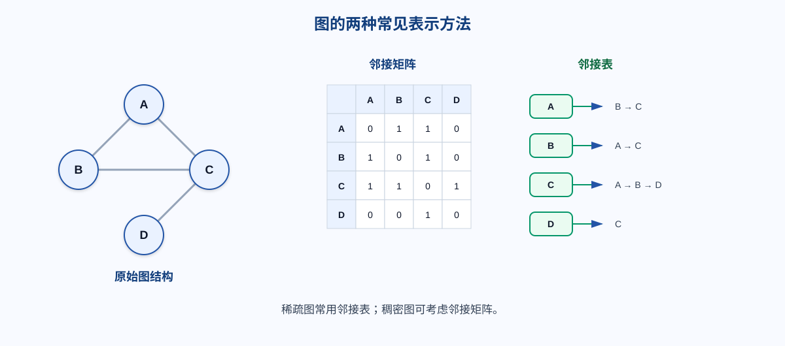


## 什么是图

图是一种非线性数据结构，由顶点（Vertex）和边（Edge）组成,用于表示对象之间的关系。图广泛应用于社交网络、地图导航、网络拓扑等领域。

### 图的基本概念

- **顶点（Vertex）**：图中的节点
- **边（Edge）**：连接顶点的线
- **度（Degree）**：与顶点相连的边的数量
- **路径（Path）**：顶点之间的连接序列
- **环（Cycle）**：起点和终点相同的路径
- **连通图**：任意两个顶点之间都有路径
- **权重（Weight）**：边上的数值，表示距离、成本等

### 图的分类

#### 按边的方向分类

1. **无向图**：边没有方向
2. **有向图**：边有方向

#### 按边的权重分类

1. **无权图**：边没有权重
2. **有权图**：边有权重

#### 按边的数量分类

1. **稀疏图**：边的数量远小于顶点数量的平方
2. **稠密图**：边的数量接近顶点数量的平方

## 图的表示方法

### 邻接矩阵

使用二维矩阵表示图，矩阵中的元素表示顶点之间是否有边。

```python
class GraphMatrix:
    def __init__(self, num_vertices, directed=False):
        self.num_vertices = num_vertices
        self.directed = directed
        self.matrix = [[0] * num_vertices for _ in range(num_vertices)]
    
    def add_edge(self, u, v, weight=1):
        """添加边"""
        if 0 <= u < self.num_vertices and 0 <= v < self.num_vertices:
            self.matrix[u][v] = weight
            if not self.directed:
                self.matrix[v][u] = weight
    
    def remove_edge(self, u, v):
        """删除边"""
        if 0 <= u < self.num_vertices and 0 <= v < self.num_vertices:
            self.matrix[u][v] = 0
            if not self.directed:
                self.matrix[v][u] = 0
    
    def has_edge(self, u, v):
        """检查边是否存在"""
        if 0 <= u < self.num_vertices and 0 <= v < self.num_vertices:
            return self.matrix[u][v] != 0
        return False
    
    def get_neighbors(self, v):
        """获取顶点的邻居"""
        if 0 <= v < self.num_vertices:
            neighbors = []
            for i in range(self.num_vertices):
                if self.matrix[v][i] != 0:
                    neighbors.append(i)
            return neighbors
        return []
    
    def display(self):
        """显示邻接矩阵"""
        for row in self.matrix:
            print(row)

# 使用示例
graph = GraphMatrix(4)
graph.add_edge(0, 1)
graph.add_edge(0, 2)
graph.add_edge(1, 2)
graph.add_edge(2, 3)
graph.display()
```

### 邻接表

使用字典或列表表示图，每个顶点存储其相邻的顶点。

```python
class GraphAdjList:
    def __init__(self, directed=False):
        self.graph = {}
        self.directed = directed
    
    def add_vertex(self, vertex):
        """添加顶点"""
        if vertex not in self.graph:
            self.graph[vertex] = []
    
    def add_edge(self, u, v, weight=1):
        """添加边"""
        if u not in self.graph:
            self.add_vertex(u)
        if v not in self.graph:
            self.add_vertex(v)
        
        self.graph[u].append((v, weight))
        if not self.directed:
            self.graph[v].append((u, weight))
    
    def remove_edge(self, u, v):
        """删除边"""
        if u in self.graph and v in self.graph:
            self.graph[u] = [(neighbor, weight) for neighbor, weight in self.graph[u] if neighbor != v]
            if not self.directed:
                self.graph[v] = [(neighbor, weight) for neighbor, weight in self.graph[v] if neighbor != u]
    
    def has_edge(self, u, v):
        """检查边是否存在"""
        if u in self.graph:
            for neighbor, _ in self.graph[u]:
                if neighbor == v:
                    return True
        return False
    
    def get_neighbors(self, v):
        """获取顶点的邻居"""
        if v in self.graph:
            return [neighbor for neighbor, _ in self.graph[v]]
        return []
    
    def display(self):
        """显示邻接表"""
        for vertex in self.graph:
            print(f"{vertex}: {self.graph[vertex]}")

# 使用示例
graph = GraphAdjList()
graph.add_edge(0, 1)
graph.add_edge(0, 2)
graph.add_edge(1, 2)
graph.add_edge(2, 3)
graph.display()
```

## 图的遍历

### 深度优先搜索（DFS）

从起始顶点开始，沿着一条路径尽可能深入，无法继续时回溯。

```python
def dfs(graph, start, visited=None):
    """深度优先搜索"""
    if visited is None:
        visited = set()
    
    visited.add(start)
    print(start, end=" ")
    
    for neighbor in graph.get_neighbors(start):
        if neighbor not in visited:
            dfs(graph, neighbor, visited)
    
    return visited

# 迭代版本
def dfs_iterative(graph, start):
    """深度优先搜索迭代版本"""
    visited = set()
    stack = [start]
    
    while stack:
        vertex = stack.pop()
        if vertex not in visited:
            visited.add(vertex)
            print(vertex, end=" ")
            
            # 将邻居按相反顺序压入栈，保证顺序正确
            for neighbor in reversed(graph.get_neighbors(vertex)):
                if neighbor not in visited:
                    stack.append(neighbor)
    
    return visited
```

### 广度优先搜索（BFS）

从起始顶点开始，先访问所有相邻顶点，再访问相邻顶点的相邻顶点。

```python
from collections import deque

def bfs(graph, start):
    """广度优先搜索"""
    visited = set()
    queue = deque([start])
    visited.add(start)
    
    while queue:
        vertex = queue.popleft()
        print(vertex, end=" ")
        
        for neighbor in graph.get_neighbors(vertex):
            if neighbor not in visited:
                visited.add(neighbor)
                queue.append(neighbor)
    
    return visited
```

## 最短路径算法

### Dijkstra算法

用于计算图中从一个顶点到其他所有顶点的最短路径（适用于非负权重图）。

```python
import heapq

def dijkstra(graph, start):
    """Dijkstra最短路径算法"""
    distances = {vertex: float('infinity') for vertex in graph.graph}
    distances[start] = 0
    
    priority_queue = [(0, start)]
    visited = set()
    
    while priority_queue:
        current_distance, current_vertex = heapq.heappop(priority_queue)
        
        if current_vertex in visited:
            continue
        
        visited.add(current_vertex)
        
        for neighbor, weight in graph.graph[current_vertex]:
            distance = current_distance + weight
            
            if distance < distances[neighbor]:
                distances[neighbor] = distance
                heapq.heappush(priority_queue, (distance, neighbor))
    
    return distances

# 使用示例
graph = GraphAdjList()
graph.add_edge(0, 1, 4)
graph.add_edge(0, 2, 2)
graph.add_edge(1, 2, 1)
graph.add_edge(1, 3, 5)
graph.add_edge(2, 3, 8)
graph.add_edge(2, 4, 10)
graph.add_edge(3, 4, 2)

distances = dijkstra(graph, 0)
print(distances)  # {0: 0, 1: 3, 2: 2, 3: 8, 4: 10}
```

### Floyd-Warshall算法

计算图中所有顶点对之间的最短路径。

```python
def floyd_warshall(graph):
    """Floyd-Warshall算法"""
    vertices = list(graph.graph.keys())
    n = len(vertices)
    
    # 初始化距离矩阵
    dist = [[float('infinity')] * n for _ in range(n)]
    for i in range(n):
        dist[i][i] = 0
    
    # 填充初始距离
    for i in range(n):
        for j, weight in graph.graph[vertices[i]]:
            dist[i][j] = weight
    
    # 计算最短路径
    for k in range(n):
        for i in range(n):
            for j in range(n):
                if dist[i][k] + dist[k][j] < dist[i][j]:
                    dist[i][j] = dist[i][k] + dist[k][j]
    
    return dist
```

## 最小生成树

### Prim算法

从一个顶点开始，逐步添加边，直到生成最小生成树。

```python
def prim(graph, start):
    """Prim最小生成树算法"""
    mst = []
    visited = set([start])
    edges = []
    
    # 添加起始顶点的所有边
    for neighbor, weight in graph.graph[start]:
        heapq.heappush(edges, (weight, start, neighbor))
    
    while edges and len(visited) < len(graph.graph):
        weight, u, v = heapq.heappop(edges)
        
        if v not in visited:
            visited.add(v)
            mst.append((u, v, weight))
            
            # 添加新顶点的所有边
            for neighbor, w in graph.graph[v]:
                if neighbor not in visited:
                    heapq.heappush(edges, (w, v, neighbor))
    
    return mst
```

### Kruskal算法

按权重从小到大选择边，避免形成环，直到生成最小生成树。

```python
class UnionFind:
    def __init__(self, vertices):
        self.parent = {v: v for v in vertices}
        self.rank = {v: 0 for v in vertices}
    
    def find(self, item):
        """查找根节点"""
        while self.parent[item] != item:
            item = self.parent[item]
        return item
    
    def union(self, set1, set2):
        """合并两个集合"""
        root1 = self.find(set1)
        root2 = self.find(set2)
        
        if root1 != root2:
            if self.rank[root1] > self.rank[root2]:
                self.parent[root2] = root1
            else:
                self.parent[root1] = root2
                if self.rank[root1] == self.rank[root2]:
                    self.rank[root2] += 1

def kruskal(graph):
    """Kruskal最小生成树算法"""
    edges = []
    for u in graph.graph:
        for v, weight in graph.graph[u]:
            edges.append((weight, u, v))
    
    edges.sort()  # 按权重排序
    vertices = list(graph.graph.keys())
    uf = UnionFind(vertices)
    mst = []
    
    for weight, u, v in edges:
        if uf.find(u) != uf.find(v):
            uf.union(u, v)
            mst.append((u, v, weight))
    
    return mst
```

## 拓扑排序

对有向无环图（DAG）进行排序，使得对于每一条边 u→v，u 都在 v 之前。

```python
def topological_sort(graph):
    """拓扑排序"""
    in_degree = {v: 0 for v in graph.graph}
    
    # 计算入度
    for u in graph.graph:
        for v, _ in graph.graph[u]:
            in_degree[v] += 1
    
    # 找到入度为0的顶点
    queue = deque([v for v in in_degree if in_degree[v] == 0])
    result = []
    
    while queue:
        vertex = queue.popleft()
        result.append(vertex)
        
        for neighbor, _ in graph.graph[vertex]:
            in_degree[neighbor] -= 1
            if in_degree[neighbor] == 0:
                queue.append(neighbor)
    
    if len(result) != len(graph.graph):
        return None  # 图中有环
    
    return result
```

## 图的应用

### 应用1：社交网络分析

```python
class SocialNetwork:
    def __init__(self):
        self.graph = GraphAdjList(directed=True)
    
    def add_friendship(self, user1, user2):
        """添加好友关系"""
        self.graph.add_edge(user1, user2)
    
    def get_friends(self, user):
        """获取好友列表"""
        return self.graph.get_neighbors(user)
    
    def find_mutual_friends(self, user1, user2):
        """查找共同好友"""
        friends1 = set(self.get_friends(user1))
        friends2 = set(self.get_friends(user2))
        return friends1 & friends2
    
    def suggest_friends(self, user):
        """推荐好友（好友的好友）"""
        friends = self.get_friends(user)
        suggestions = {}
        
        for friend in friends:
            for friend_of_friend in self.get_friends(friend):
                if friend_of_friend != user and friend_of_friend not in friends:
                    suggestions[friend_of_friend] = suggestions.get(friend_of_friend, 0) + 1
        
        # 按共同好友数量排序
        return sorted(suggestions.items(), key=lambda x: x[1], reverse=True)
```

### 应用2：地图导航

```python
class MapNavigation:
    def __init__(self):
        self.graph = GraphAdjList(directed=False)
    
    def add_location(self, location):
        """添加地点"""
        self.graph.add_vertex(location)
    
    def add_road(self, location1, location2, distance):
        """添加道路"""
        self.graph.add_edge(location1, location2, distance)
    
    def find_shortest_path(self, start, end):
        """查找最短路径"""
        distances = dijkstra(self.graph, start)
        return distances.get(end, float('infinity'))
    
    def find_all_paths(self, start, end, path=None):
        """查找所有路径"""
        if path is None:
            path = []
        
        path = path + [start]
        
        if start == end:
            return [path]
        
        if start not in self.graph.graph:
            return []
        
        paths = []
        for neighbor in self.graph.get_neighbors(start):
            if neighbor not in path:
                new_paths = self.find_all_paths(neighbor, end, path)
                paths.extend(new_paths)
        
        return paths
```

### 应用3：课程依赖关系

```python
class CourseScheduler:
    def __init__(self):
        self.graph = GraphAdjList(directed=True)
    
    def add_course(self, course):
        """添加课程"""
        self.graph.add_vertex(course)
    
    def add_prerequisite(self, course, prerequisite):
        """添加先修课程关系"""
        self.graph.add_edge(prerequisite, course)
    
    def can_finish(self, courses):
        """判断是否可以完成所有课程"""
        order = topological_sort(self.graph)
        return order is not None and set(order) == set(courses)
    
    def get_study_order(self):
        """获取学习顺序"""
        return topological_sort(self.graph)
```

### 应用4：网络连通性检测

```python
def is_connected(graph):
    """检测图是否连通"""
    if not graph.graph:
        return True
    
    start = next(iter(graph.graph))
    visited = dfs(graph, start)
    
    return len(visited) == len(graph.graph)

def find_connected_components(graph):
    """查找连通分量"""
    visited = set()
    components = []
    
    for vertex in graph.graph:
        if vertex not in visited:
            component = dfs(graph, vertex, visited)
            components.append(component)
    
    return components
```

## 图的复杂度分析

| 操作 | 邻接矩阵 | 邻接表 |
|------|----------|--------|
| 添加顶点 | O(V²) | O(1) |
| 添加边 | O(1) | O(1) |
| 删除边 | O(1) | O(E) |
| 检查边 | O(1) | O(degree) |
| 遍历邻居 | O(V) | O(degree) |
| 空间复杂度 | O(V²) | O(V+E) |

其中 V 是顶点数，E 是边数，degree 是顶点的度。

## 图的优缺点

### 优点

1. **表达能力强**：可以表示复杂的关系
2. **应用广泛**：在许多领域都有应用
3. **算法丰富**：有许多成熟的图算法
4. **灵活性好**：可以表示各种类型的关系

### 缺点

1. **空间复杂度高**：特别是邻接矩阵表示
2. **算法复杂**：许多图算法时间复杂度较高
3. **实现复杂**：相比线性数据结构更复杂
4. **性能依赖**：性能严重依赖于图的表示方式

## 练习题

1. 实现一个函数，检测图中是否存在环。
2. 设计一个算法，找出图中所有的桥（删除后会增加连通分量数量的边）。
3. 实现一个函数，计算图中两个顶点之间的所有最短路径。
4. 设计一个算法，判断一个图是否为二分图。

## 总结

图是一种强大的非线性数据结构：

- **基本组成**：顶点和边，表示对象之间的关系
- **表示方法**：邻接矩阵和邻接表
- **遍历算法**：深度优先搜索和广度优先搜索
- **重要算法**：最短路径、最小生成树、拓扑排序
- **广泛应用**：社交网络、地图导航、课程安排等

图在计算机科学中有重要地位，掌握图的基本概念和算法对解决复杂问题至关重要。


---


# 第10章 搜索算法

> **本章图解**：搜索算法选择流程图

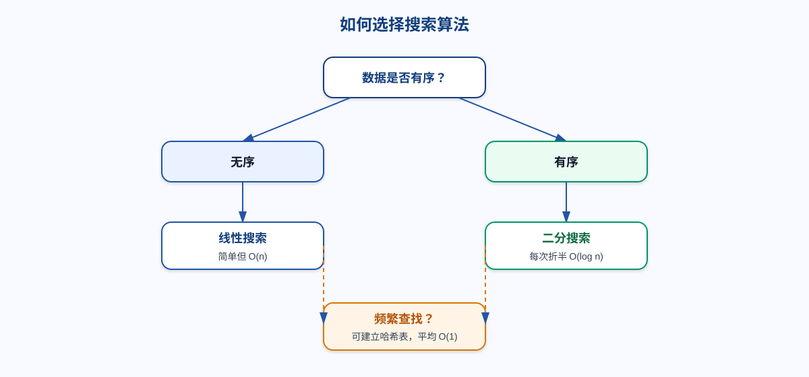


## 什么是搜索算法

搜索算法用于在数据结构中查找特定元素或满足特定条件的元素。搜索算法的效率直接影响程序的性能。

### 搜索算法的分类

1. **线性搜索**：逐个检查元素
2. **二分搜索**：在有序数据中高效搜索
3. **哈希搜索**：使用哈希表快速查找
4. **树搜索**：在树结构中搜索
5. **图搜索**：在图结构中搜索

## 线性搜索

### 基本原理

线性搜索是最简单的搜索算法，从数据结构的第一个元素开始，逐个检查直到找到目标元素或遍历完所有元素。

### 线性搜索实现

```python
def linear_search(arr, target):
    """线性搜索"""
    for i, element in enumerate(arr):
        if element == target:
            return i  # 返回索引
    return -1  # 未找到

# 使用示例
arr = [64, 34, 25, 12, 22, 11, 90]
target = 22
result = linear_search(arr, target)
print(f"元素 {target} 的索引是: {result}")  # 元素 22 的索引是: 4
```

### 线性搜索的复杂度

- **时间复杂度**：O(n)
- **空间复杂度**：O(1)
- **适用场景**：无序数据、小规模数据

### 线性搜索的优化

#### 哨兵线性搜索

```python
def linear_search_sentinel(arr, target):
    """哨兵线性搜索"""
    n = len(arr)
    last = arr[n - 1]  # 保存最后一个元素
    arr[n - 1] = target  # 设置哨兵
    
    i = 0
    while arr[i] != target:
        i += 1
    
    arr[n - 1] = last  # 恢复最后一个元素
    
    if i < n - 1 or arr[n - 1] == target:
        return i
    return -1
```

## 二分搜索

### 基本原理

二分搜索只能在有序数组中使用。它通过比较中间元素与目标值，每次将搜索范围减半，直到找到目标或确定不存在。

### 二分搜索实现

#### 迭代版本

```python
def binary_search(arr, target):
    """二分搜索迭代版本"""
    left, right = 0, len(arr) - 1
    
    while left <= right:
        mid = (left + right) // 2
        
        if arr[mid] == target:
            return mid
        elif arr[mid] < target:
            left = mid + 1
        else:
            right = mid - 1
    
    return -1  # 未找到

# 使用示例
arr = [2, 5, 8, 12, 16, 23, 38, 56, 72, 91]
target = 23
result = binary_search(arr, target)
print(f"元素 {target} 的索引是: {result}")  # 元素 23 的索引是: 5
```

#### 递归版本

```python
def binary_search_recursive(arr, target, left, right):
    """二分搜索递归版本"""
    if left > right:
        return -1
    
    mid = (left + right) // 2
    
    if arr[mid] == target:
        return mid
    elif arr[mid] < target:
        return binary_search_recursive(arr, target, mid + 1, right)
    else:
        return binary_search_recursive(arr, target, left, mid - 1)

# 使用示例
arr = [2, 5, 8, 12, 16, 23, 38, 56, 72, 91]
target = 23
result = binary_search_recursive(arr, target, 0, len(arr) - 1)
print(f"元素 {target} 的索引是: {result}")
```

### 二分搜索的复杂度

- **时间复杂度**：O(log n)
- **空间复杂度**：O(1) 迭代版本，O(log n) 递归版本
- **适用场景**：有序数组、大规模数据

### 二分搜索的变种

#### 查找第一个出现的元素

```python
def binary_search_first(arr, target):
    """查找第一个出现的元素"""
    left, right = 0, len(arr) - 1
    result = -1
    
    while left <= right:
        mid = (left + right) // 2
        
        if arr[mid] == target:
            result = mid
            right = mid - 1  # 继续在左半部分搜索
        elif arr[mid] < target:
            left = mid + 1
        else:
            right = mid - 1
    
    return result
```

#### 查找最后一个出现的元素

```python
def binary_search_last(arr, target):
    """查找最后一个出现的元素"""
    left, right = 0, len(arr) - 1
    result = -1
    
    while left <= right:
        mid = (left + right) // 2
        
        if arr[mid] == target:
            result = mid
            left = mid + 1  # 继续在右半部分搜索
        elif arr[mid] < target:
            left = mid + 1
        else:
            right = mid - 1
    
    return result
```

#### 查找插入位置

```python
def binary_search_insert_position(arr, target):
    """查找插入位置"""
    left, right = 0, len(arr)
    
    while left < right:
        mid = (left + right) // 2
        
        if arr[mid] < target:
            left = mid + 1
        else:
            right = mid
    
    return left
```

## 插值搜索

### 基本原理

插值搜索是二分搜索的改进版本，根据目标值在数据分布中的位置来预测其可能的位置。

### 插值搜索实现

```python
def interpolation_search(arr, target):
    """插值搜索"""
    left, right = 0, len(arr) - 1
    
    while left <= right and target >= arr[left] and target <= arr[right]:
        if left == right:
            if arr[left] == target:
                return left
            return -1
        
        # 插值公式
        pos = left + ((target - arr[left]) * (right - left)) // (arr[right] - arr[left])
        
        if arr[pos] == target:
            return pos
        elif arr[pos] < target:
            left = pos + 1
        else:
            right = pos - 1
    
    return -1

# 使用示例
arr = [1, 2, 4, 8, 16, 32, 64, 128, 256, 512]
target = 64
result = interpolation_search(arr, target)
print(f"元素 {target} 的索引是: {result}")
```

### 插值搜索的复杂度

- **时间复杂度**：平均 O(log log n)，最坏 O(n)
- **空间复杂度**：O(1)
- **适用场景**：均匀分布的有序数据

## 哈希搜索

### 基本原理

哈希搜索使用哈希函数将键映射到存储位置，实现 O(1) 时间复杂度的查找。

### 哈希搜索实现

```python
class HashSearch:
    def __init__(self, size=10):
        self.size = size
        self.table = [[] for _ in range(size)]
    
    def _hash(self, key):
        return hash(key) % self.size
    
    def insert(self, key, value):
        """插入键值对"""
        index = self._hash(key)
        
        for i, (k, v) in enumerate(self.table[index]):
            if k == key:
                self.table[index][i] = (key, value)
                return
        
        self.table[index].append((key, value))
    
    def search(self, key):
        """搜索键"""
        index = self._hash(key)
        
        for k, v in self.table[index]:
            if k == key:
                return v
        
        return None

# 使用示例
hs = HashSearch()
hs.insert("name", "Alice")
hs.insert("age", 25)
hs.insert("city", "Beijing")

print(hs.search("name"))  # Alice
print(hs.search("age"))   # 25
```

### 哈希搜索的复杂度

- **时间复杂度**：平均 O(1)，最坏 O(n)
- **空间复杂度**：O(n)
- **适用场景**：需要快速查找的场景

## 树搜索

### 二叉搜索树搜索

```python
def bst_search(root, target):
    """二叉搜索树搜索"""
    if not root or root.val == target:
        return root
    
    if target < root.val:
        return bst_search(root.left, target)
    else:
        return bst_search(root.right, target)

# 迭代版本
def bst_search_iterative(root, target):
    """二叉搜索树搜索迭代版本"""
    while root and root.val != target:
        if target < root.val:
            root = root.left
        else:
            root = root.right
    return root
```

### 树搜索的复杂度

- **时间复杂度**：平均 O(log n)，最坏 O(n)
- **空间复杂度**：O(1) 迭代版本，O(log n) 递归版本
- **适用场景**：动态数据、需要频繁插入删除

## 搜索算法比较

| 算法 | 时间复杂度 | 空间复杂度 | 数据要求 | 适用场景 |
|------|------------|------------|----------|----------|
| 线性搜索 | O(n) | O(1) | 无 | 无序数据、小规模 |
| 二分搜索 | O(log n) | O(1) | 有序 | 有序数据、大规模 |
| 插值搜索 | O(log log n) | O(1) | 有序均匀 | 均匀分布数据 |
| 哈希搜索 | O(1) | O(n) | 无 | 需要快速查找 |
| 树搜索 | O(log n) | O(log n) | 无 | 动态数据 |

## 搜索算法的应用

### 应用1：查找重复元素

```python
def find_duplicates(arr):
    """查找重复元素"""
    seen = set()
    duplicates = set()
    
    for element in arr:
        if element in seen:
            duplicates.add(element)
        else:
            seen.add(element)
    
    return list(duplicates)

# 使用示例
arr = [1, 2, 3, 4, 2, 5, 6, 3, 7]
print(find_duplicates(arr))  # [2, 3]
```

### 应用2：查找缺失元素

```python
def find_missing_number(arr, n):
    """查找缺失的数字"""
    # 使用数学公式
    expected_sum = n * (n + 1) // 2
    actual_sum = sum(arr)
    return expected_sum - actual_sum

# 使用示例
arr = [1, 2, 3, 5, 6, 7, 8]
n = 8
print(find_missing_number(arr, n))  # 4
```

### 应用3：查找峰值元素

```python
def find_peak_element(arr):
    """查找峰值元素"""
    left, right = 0, len(arr) - 1
    
    while left < right:
        mid = (left + right) // 2
        
        if arr[mid] > arr[mid + 1]:
            right = mid
        else:
            left = mid + 1
    
    return left

# 使用示例
arr = [1, 3, 20, 4, 1, 0]
peak_index = find_peak_element(arr)
print(f"峰值元素的索引是: {peak_index}, 值是: {arr[peak_index]}")
```

### 应用4：搜索旋转排序数组

```python
def search_rotated_array(arr, target):
    """在旋转排序数组中搜索"""
    left, right = 0, len(arr) - 1
    
    while left <= right:
        mid = (left + right) // 2
        
        if arr[mid] == target:
            return mid
        
        # 判断哪一半是有序的
        if arr[left] <= arr[mid]:
            # 左半部分有序
            if arr[left] <= target < arr[mid]:
                right = mid - 1
            else:
                left = mid + 1
        else:
            # 右半部分有序
            if arr[mid] < target <= arr[right]:
                left = mid + 1
            else:
                right = mid - 1
    
    return -1

# 使用示例
arr = [4, 5, 6, 7, 0, 1, 2]
target = 0
result = search_rotated_array(arr, target)
print(f"元素 {target} 的索引是: {result}")
```

### 应用5：搜索二维矩阵

```python
def search_2d_matrix(matrix, target):
    """在二维矩阵中搜索（每行每列都有序）"""
    if not matrix or not matrix[0]:
        return False
    
    rows, cols = len(matrix), len(matrix[0])
    row, col = 0, cols - 1
    
    while row < rows and col >= 0:
        if matrix[row][col] == target:
            return True
        elif matrix[row][col] > target:
            col -= 1
        else:
            row += 1
    
    return False

# 使用示例
matrix = [
    [1, 4, 7, 11],
    [2, 5, 8, 12],
    [3, 6, 9, 16],
    [10, 13, 14, 17]
]
target = 5
print(search_2d_matrix(matrix, target))  # True
```

## 搜索算法的优化策略

### 1. 预处理

对数据进行预处理（如排序）以支持更高效的搜索算法。

```python
def search_with_preprocessing(arr, targets):
    """预处理后搜索"""
    arr_sorted = sorted(arr)
    results = []
    
    for target in targets:
        result = binary_search(arr_sorted, target)
        results.append(result != -1)
    
    return results
```

### 2. 索引

为数据建立索引以加速搜索。

```python
class IndexedSearch:
    def __init__(self, data):
        self.data = data
        self.index = self._build_index()
    
    def _build_index(self):
        """构建索引"""
        index = {}
        for i, item in enumerate(self.data):
            if item not in index:
                index[item] = []
            index[item].append(i)
        return index
    
    def search(self, target):
        """使用索引搜索"""
        return self.index.get(target, [])
```

### 3. 并行搜索

将搜索任务分配到多个处理器上并行执行。

```python
from concurrent.futures import ThreadPoolExecutor

def parallel_search(arr, targets, num_threads=4):
    """并行搜索"""
    def search_single(target):
        return linear_search(arr, target)
    
    with ThreadPoolExecutor(max_workers=num_threads) as executor:
        results = list(executor.map(search_single, targets))
    
    return results
```

## 练习题

1. 实现一个函数，在有序数组中查找目标值的起始和结束位置。
2. 设计一个算法，在旋转排序数组中查找最小值。
3. 实现一个函数，判断一个数是否为两个数的平方和。
4. 设计一个算法，在二维矩阵中搜索目标值（矩阵行有序，列无序）。

## 总结

搜索算法是查找数据的重要方法：

- **线性搜索**：简单通用，适用于无序数据
- **二分搜索**：高效搜索，要求数据有序
- **插值搜索**：改进的二分搜索，适用于均匀分布数据
- **哈希搜索**：最快搜索，需要额外空间
- **树搜索**：平衡搜索，适用于动态数据

选择合适的搜索算法需要考虑数据特性、搜索频率和性能要求。


---


# 第11章 排序算法

> **本章图解**：排序算法选型速览图

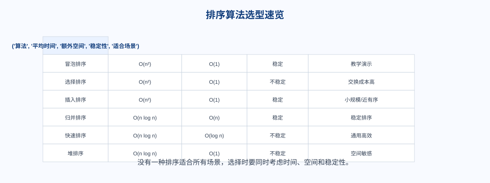


## 什么是排序算法

排序算法是将一组数据按照特定顺序（升序或降序）重新排列的算法。排序是计算机科学中最基本也是最重要的操作之一。

### 排序算法的分类

1. **比较排序**：通过比较元素大小进行排序
2. **非比较排序**：不通过比较元素大小进行排序
3. **内部排序**：所有数据都在内存中
4. **外部排序**：数据量太大，需要使用外部存储

### 排序算法的评估标准

- **时间复杂度**：算法执行时间
- **空间复杂度**：算法所需额外空间
- **稳定性**：相等元素的相对位置是否保持不变
- **适应性**：对部分有序数据的处理能力

## 简单排序算法

### 冒泡排序

#### 基本原理

冒泡排序通过重复遍历数组，比较相邻元素并交换位置，使较大的元素逐渐"冒泡"到数组末尾。

#### 冒泡排序实现

```python
def bubble_sort(arr):
    """冒泡排序"""
    n = len(arr)
    
    for i in range(n):
        # 标记本轮是否发生交换
        swapped = False
        
        for j in range(0, n - i - 1):
            if arr[j] > arr[j + 1]:
                arr[j], arr[j + 1] = arr[j + 1], arr[j]
                swapped = True
        
        # 如果没有发生交换，说明已经有序
        if not swapped:
            break
    
    return arr

# 使用示例
arr = [64, 34, 25, 12, 22, 11, 90]
print("排序前:", arr)
bubble_sort(arr)
print("排序后:", arr)
```

#### 冒泡排序的复杂度

- **时间复杂度**：O(n²)
- **空间复杂度**：O(1)
- **稳定性**：稳定
- **适用场景**：小规模数据、教学演示

### 选择排序

#### 基本原理

选择排序每次从未排序部分选择最小元素，放到已排序部分的末尾。

#### 选择排序实现

```python
def selection_sort(arr):
    """选择排序"""
    n = len(arr)
    
    for i in range(n):
        # 找到未排序部分的最小元素
        min_idx = i
        for j in range(i + 1, n):
            if arr[j] < arr[min_idx]:
                min_idx = j
        
        # 交换最小元素到当前位置
        arr[i], arr[min_idx] = arr[min_idx], arr[i]
    
    return arr

# 使用示例
arr = [64, 34, 25, 12, 22, 11, 90]
print("排序前:", arr)
selection_sort(arr)
print("排序后:", arr)
```

#### 选择排序的复杂度

- **时间复杂度**：O(n²)
- **空间复杂度**：O(1)
- **稳定性**：不稳定
- **适用场景**：小规模数据、交换成本高的情况

### 插入排序

#### 基本原理

插入排序将数组分为已排序和未排序两部分，每次将未排序部分的第一个元素插入到已排序部分的正确位置。

#### 插入排序实现

```python
def insertion_sort(arr):
    """插入排序"""
    for i in range(1, len(arr)):
        key = arr[i]
        j = i - 1
        
        # 将大于key的元素向后移动
        while j >= 0 and arr[j] > key:
            arr[j + 1] = arr[j]
            j -= 1
        
        arr[j + 1] = key
    
    return arr

# 使用示例
arr = [64, 34, 25, 12, 22, 11, 90]
print("排序前:", arr)
insertion_sort(arr)
print("排序后:", arr)
```

#### 插入排序的复杂度

- **时间复杂度**：O(n²)
- **空间复杂度**：O(1)
- **稳定性**：稳定
- **适用场景**：小规模数据、部分有序数据

## 高级排序算法

### 归并排序

#### 基本原理

归并排序采用分治策略，将数组分成两半，分别排序后合并。

#### 归并排序实现

```python
def merge_sort(arr):
    """归并排序"""
    if len(arr) <= 1:
        return arr
    
    mid = len(arr) // 2
    left = merge_sort(arr[:mid])
    right = merge_sort(arr[mid:])
    
    return merge(left, right)

def merge(left, right):
    """合并两个有序数组"""
    result = []
    i = j = 0
    
    while i < len(left) and j < len(right):
        if left[i] <= right[j]:
            result.append(left[i])
            i += 1
        else:
            result.append(right[j])
            j += 1
    
    result.extend(left[i:])
    result.extend(right[j:])
    
    return result

# 使用示例
arr = [64, 34, 25, 12, 22, 11, 90]
print("排序前:", arr)
sorted_arr = merge_sort(arr)
print("排序后:", sorted_arr)
```

#### 归并排序的复杂度

- **时间复杂度**：O(n log n)
- **空间复杂度**：O(n)
- **稳定性**：稳定
- **适用场景**：大规模数据、需要稳定排序

### 快速排序

#### 基本原理

快速排序选择一个基准元素，将数组分为小于基准和大于基准的两部分，递归排序。

#### 快速排序实现

```python
def quick_sort(arr):
    """快速排序"""
    if len(arr) <= 1:
        return arr
    
    pivot = arr[len(arr) // 2]  # 选择中间元素作为基准
    left = [x for x in arr if x < pivot]
    middle = [x for x in arr if x == pivot]
    right = [x for x in arr if x > pivot]
    
    return quick_sort(left) + middle + quick_sort(right)

# 原地版本
def quick_sort_inplace(arr, low, high):
    """快速排序原地版本"""
    if low < high:
        pi = partition(arr, low, high)
        quick_sort_inplace(arr, low, pi - 1)
        quick_sort_inplace(arr, pi + 1, high)

def partition(arr, low, high):
    """分区函数"""
    pivot = arr[high]
    i = low - 1
    
    for j in range(low, high):
        if arr[j] <= pivot:
            i += 1
            arr[i], arr[j] = arr[j], arr[i]
    
    arr[i + 1], arr[high] = arr[high], arr[i + 1]
    return i + 1

# 使用示例
arr = [64, 34, 25, 12, 22, 11, 90]
print("排序前:", arr)
sorted_arr = quick_sort(arr)
print("排序后:", sorted_arr)
```

#### 快速排序的复杂度

- **时间复杂度**：平均 O(n log n)，最坏 O(n²)
- **空间复杂度**：O(log n) 递归栈
- **稳定性**：不稳定
- **适用场景**：大规模数据、平均性能最优

### 堆排序

#### 基本原理

堆排序利用堆的性质，先构建最大堆，然后逐个提取最大元素。

#### 堆排序实现

```python
def heap_sort(arr):
    """堆排序"""
    n = len(arr)
    
    # 构建最大堆
    for i in range(n // 2 - 1, -1, -1):
        heapify(arr, n, i)
    
    # 逐个提取元素
    for i in range(n - 1, 0, -1):
        arr[0], arr[i] = arr[i], arr[0]
        heapify(arr, i, 0)
    
    return arr

def heapify(arr, n, i):
    """堆化操作"""
    largest = i
    left = 2 * i + 1
    right = 2 * i + 2
    
    if left < n and arr[left] > arr[largest]:
        largest = left
    
    if right < n and arr[right] > arr[largest]:
        largest = right
    
    if largest != i:
        arr[i], arr[largest] = arr[largest], arr[i]
        heapify(arr, n, largest)

# 使用示例
arr = [64, 34, 25, 12, 22, 11, 90]
print("排序前:", arr)
heap_sort(arr)
print("排序后:", arr)
```

#### 堆排序的复杂度

- **时间复杂度**：O(n log n)
- **空间复杂度**：O(1)
- **稳定性**：不稳定
- **适用场景**：需要原地排序、空间受限

## 非比较排序算法

### 计数排序

#### 基本原理

计数排序统计每个元素出现的次数，根据统计结果重新排列元素。

#### 计数排序实现

```python
def counting_sort(arr):
    """计数排序"""
    if not arr:
        return []
    
    max_val = max(arr)
    min_val = min(arr)
    range_of_elements = max_val - min_val + 1
    
    # 创建计数数组
    count = [0] * range_of_elements
    
    # 统计每个元素出现的次数
    for num in arr:
        count[num - min_val] += 1
    
    # 重建排序后的数组
    sorted_arr = []
    for i in range(range_of_elements):
        sorted_arr.extend([i + min_val] * count[i])
    
    return sorted_arr

# 使用示例
arr = [64, 34, 25, 12, 22, 11, 90]
print("排序前:", arr)
sorted_arr = counting_sort(arr)
print("排序后:", sorted_arr)
```

#### 计数排序的复杂度

- **时间复杂度**：O(n + k)，k 是数据范围
- **空间复杂度**：O(k)
- **稳定性**：稳定
- **适用场景**：整数排序、数据范围有限

### 桶排序

#### 基本原理

桶排序将数据分到有限数量的桶中，每个桶单独排序，最后合并。

#### 桶排序实现

```python
def bucket_sort(arr):
    """桶排序"""
    if not arr:
        return []
    
    # 确定桶的数量
    num_buckets = len(arr)
    max_val = max(arr)
    min_val = min(arr)
    
    # 创建桶
    buckets = [[] for _ in range(num_buckets)]
    
    # 将元素分配到桶中
    for num in arr:
        index = int((num - min_val) / (max_val - min_val + 1) * num_buckets)
        buckets[index].append(num)
    
    # 对每个桶进行排序
    for bucket in buckets:
        bucket.sort()
    
    # 合并桶
    sorted_arr = []
    for bucket in buckets:
        sorted_arr.extend(bucket)
    
    return sorted_arr

# 使用示例
arr = [64, 34, 25, 12, 22, 11, 90]
print("排序前:", arr)
sorted_arr = bucket_sort(arr)
print("排序后:", sorted_arr)
```

#### 桶排序的复杂度

- **时间复杂度**：平均 O(n + k)，最坏 O(n²)
- **空间复杂度**：O(n + k)
- **稳定性**：稳定
- **适用场景**：数据均匀分布

### 基数排序

#### 基本原理

基数排序按照数的位数进行排序，从最低位到最高位逐位排序。

#### 基数排序实现

```python
def radix_sort(arr):
    """基数排序"""
    if not arr:
        return []
    
    # 找到最大数以确定位数
    max_val = max(arr)
    exp = 1
    
    while max_val // exp > 0:
        counting_sort_by_digit(arr, exp)
        exp *= 10
    
    return arr

def counting_sort_by_digit(arr, exp):
    """按位数进行计数排序"""
    n = len(arr)
    output = [0] * n
    count = [0] * 10
    
    # 统计当前位数的出现次数
    for i in range(n):
        index = (arr[i] // exp) % 10
        count[index] += 1
    
    # 计算累积计数
    for i in range(1, 10):
        count[i] += count[i - 1]
    
    # 构建输出数组
    for i in range(n - 1, -1, -1):
        index = (arr[i] // exp) % 10
        output[count[index] - 1] = arr[i]
        count[index] -= 1
    
    # 复制到原数组
    for i in range(n):
        arr[i] = output[i]

# 使用示例
arr = [170, 45, 75, 90, 802, 24, 2, 66]
print("排序前:", arr)
radix_sort(arr)
print("排序后:", arr)
```

#### 基数排序的复杂度

- **时间复杂度**：O(d × (n + k))，d 是位数，k 是基数
- **空间复杂度**：O(n + k)
- **稳定性**：稳定
- **适用场景**：整数排序、固定长度数据

## 排序算法比较

| 算法 | 时间复杂度 | 空间复杂度 | 稳定性 | 适用场景 |
|------|------------|------------|--------|----------|
| 冒泡排序 | O(n²) | O(1) | 稳定 | 小规模数据 |
| 选择排序 | O(n²) | O(1) | 不稳定 | 小规模数据 |
| 插入排序 | O(n²) | O(1) | 稳定 | 小规模、部分有序 |
| 归并排序 | O(n log n) | O(n) | 稳定 | 大规模数据 |
| 快速排序 | O(n log n) | O(log n) | 不稳定 | 大规模数据 |
| 堆排序 | O(n log n) | O(1) | 不稳定 | 空间受限 |
| 计数排序 | O(n + k) | O(k) | 稳定 | 整数、范围有限 |
| 桶排序 | O(n + k) | O(n + k) | 稳定 | 均匀分布 |
| 基数排序 | O(d × (n + k)) | O(n + k) | 稳定 | 固定长度整数 |

## 排序算法的应用

### 应用1：查找中位数

```python
def find_median(arr):
    """查找中位数"""
    sorted_arr = sorted(arr)
    n = len(sorted_arr)
    
    if n % 2 == 1:
        return sorted_arr[n // 2]
    else:
        return (sorted_arr[n // 2 - 1] + sorted_arr[n // 2]) / 2

# 使用示例
arr = [3, 1, 4, 1, 5, 9, 2, 6]
print(f"中位数是: {find_median(arr)}")
```

### 应用2：查找第K大元素

```python
def find_kth_largest(arr, k):
    """查找第K大元素"""
    # 使用快速选择算法
    def quick_select(left, right, k_smallest):
        if left == right:
            return arr[left]
        
        pivot_index = partition(left, right)
        
        if k_smallest == pivot_index:
            return arr[k_smallest]
        elif k_smallest < pivot_index:
            return quick_select(left, pivot_index - 1, k_smallest)
        else:
            return quick_select(pivot_index + 1, right, k_smallest)
    
    def partition(left, right):
        pivot = arr[right]
        i = left
        
        for j in range(left, right):
            if arr[j] <= pivot:
                arr[i], arr[j] = arr[j], arr[i]
                i += 1
        
        arr[i], arr[right] = arr[right], arr[i]
        return i
    
    return quick_select(0, len(arr) - 1, len(arr) - k)

# 使用示例
arr = [3, 2, 1, 5, 6, 4]
k = 2
print(f"第 {k} 大的元素是: {find_kth_largest(arr, k)}")
```

### 应用3：合并有序数组

```python
def merge_sorted_arrays(arr1, arr2):
    """合并两个有序数组"""
    result = []
    i = j = 0
    
    while i < len(arr1) and j < len(arr2):
        if arr1[i] <= arr2[j]:
            result.append(arr1[i])
            i += 1
        else:
            result.append(arr2[j])
            j += 1
    
    result.extend(arr1[i:])
    result.extend(arr2[j:])
    
    return result

# 使用示例
arr1 = [1, 3, 5, 7]
arr2 = [2, 4, 6, 8]
print(merge_sorted_arrays(arr1, arr2))  # [1, 2, 3, 4, 5, 6, 7, 8]
```

### 应用4：检测重复元素

```python
def has_duplicates(arr):
    """检测是否有重复元素"""
    sorted_arr = sorted(arr)
    
    for i in range(1, len(sorted_arr)):
        if sorted_arr[i] == sorted_arr[i - 1]:
            return True
    
    return False

# 使用示例
arr1 = [1, 2, 3, 4, 5]
arr2 = [1, 2, 3, 4, 4]
print(has_duplicates(arr1))  # False
print(has_duplicates(arr2))  # True
```

### 应用5：区间重叠检测

```python
def merge_intervals(intervals):
    """合并重叠区间"""
    if not intervals:
        return []
    
    # 按起始时间排序
    intervals.sort(key=lambda x: x[0])
    
    merged = [intervals[0]]
    
    for interval in intervals[1:]:
        if interval[0] <= merged[-1][1]:
            # 有重叠，合并区间
            merged[-1][1] = max(merged[-1][1], interval[1])
        else:
            # 无重叠，添加新区间
            merged.append(interval)
    
    return merged

# 使用示例
intervals = [[1, 3], [2, 6], [8, 10], [15, 18]]
print(merge_intervals(intervals))  # [[1, 6], [8, 10], [15, 18]]
```

## 排序算法的优化

### 1. 混合排序

结合多种排序算法的优点，根据数据特征选择合适的算法。

```python
def hybrid_sort(arr):
    """混合排序：小数组用插入排序，大数组用快速排序"""
    if len(arr) <= 10:
        return insertion_sort(arr)
    else:
        return quick_sort(arr)
```

### 2. 自适应排序

根据数据的有序程度调整算法行为。

```python
def adaptive_insertion_sort(arr):
    """自适应插入排序"""
    for i in range(1, len(arr)):
        key = arr[i]
        j = i - 1
        
        # 如果已经有序，提前终止
        if arr[j] <= key:
            continue
        
        while j >= 0 and arr[j] > key:
            arr[j + 1] = arr[j]
            j -= 1
        
        arr[j + 1] = key
    
    return arr
```

### 3. 并行排序

利用多核处理器并行执行排序。

```python
from concurrent.futures import ThreadPoolExecutor

def parallel_merge_sort(arr):
    """并行归并排序"""
    if len(arr) <= 1:
        return arr
    
    mid = len(arr) // 2
    
    with ThreadPoolExecutor(max_workers=2) as executor:
        left_future = executor.submit(parallel_merge_sort, arr[:mid])
        right_future = executor.submit(parallel_merge_sort, arr[mid:])
        
        left = left_future.result()
        right = right_future.result()
    
    return merge(left, right)
```

## 练习题

1. 实现一个函数，对链表进行排序。
2. 设计一个算法，对颜色数组进行排序（红、白、蓝）。
3. 实现一个函数，在O(n)时间内对包含0、1、2的数组进行排序。
4. 设计一个算法，对字符串数组按照字典序排序。

## 总结

排序算法是数据处理的重要工具：

- **简单排序**：冒泡、选择、插入，适合小规模数据
- **高级排序**：归并、快速、堆排序，适合大规模数据
- **非比较排序**：计数、桶、基数排序，适合特定数据类型
- **选择依据**：数据规模、数据特性、稳定性要求
- **实际应用**：数据处理、统计分析、算法优化

掌握各种排序算法的原理和特点，能够根据实际场景选择最合适的排序方法。


---


# 第12章 高级算法

> **本章图解**：动态规划状态转移思路图

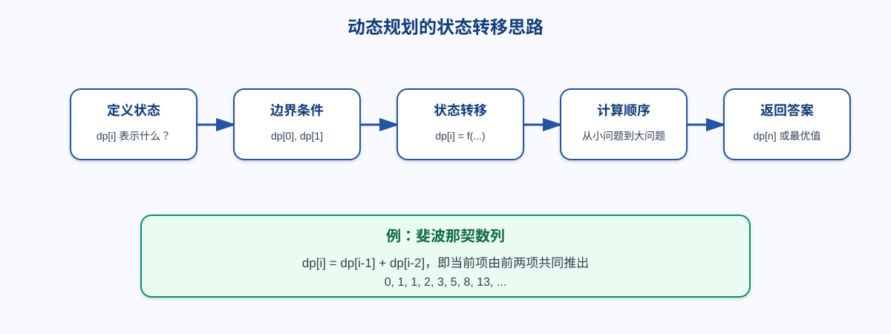


## 动态规划

### 什么是动态规划

动态规划是一种通过将复杂问题分解为更简单的子问题来解决问题的方法。它存储子问题的解，避免重复计算，从而提高效率。

### 动态规划的核心思想

1. **最优子结构**：问题的最优解包含子问题的最优解
2. **重叠子问题**：子问题会被重复计算
3. **状态转移方程**：定义如何从子问题的解构造原问题的解
4. **边界条件**：定义问题的基本情况

### 动态规划的基本步骤

1. **定义状态**：确定需要存储的子问题解
2. **建立状态转移方程**：描述状态之间的关系
3. **确定边界条件**：定义初始状态
4. **计算顺序**：确定计算状态的顺序
5. **返回结果**：从存储的状态中获取答案

### 斐波那契数列

#### 递归版本（低效）

```python
def fibonacci_recursive(n):
    """递归计算斐波那契数列"""
    if n <= 1:
        return n
    return fibonacci_recursive(n - 1) + fibonacci_recursive(n - 2)
```

#### 动态规划版本（高效）

```python
def fibonacci_dp(n):
    """动态规划计算斐波那契数列"""
    if n <= 1:
        return n
    
    dp = [0] * (n + 1)
    dp[1] = 1
    
    for i in range(2, n + 1):
        dp[i] = dp[i - 1] + dp[i - 2]
    
    return dp[n]

# 空间优化版本
def fibonacci_optimized(n):
    """空间优化的斐波那契数列"""
    if n <= 1:
        return n
    
    prev, curr = 0, 1
    for _ in range(2, n + 1):
        prev, curr = curr, prev + curr
    
    return curr

# 使用示例
print(fibonacci_dp(10))  # 55
print(fibonacci_optimized(10))  # 55
```

### 背包问题

#### 0-1背包问题

```python
def knapsack_01(weights, values, capacity):
    """0-1背包问题"""
    n = len(weights)
    dp = [[0] * (capacity + 1) for _ in range(n + 1)]
    
    for i in range(1, n + 1):
        for w in range(1, capacity + 1):
            if weights[i - 1] <= w:
                dp[i][w] = max(
                    dp[i - 1][w],
                    dp[i - 1][w - weights[i - 1]] + values[i - 1]
                )
            else:
                dp[i][w] = dp[i - 1][w]
    
    return dp[n][capacity]

# 空间优化版本
def knapsack_01_optimized(weights, values, capacity):
    """空间优化的0-1背包问题"""
    n = len(weights)
    dp = [0] * (capacity + 1)
    
    for i in range(n):
        for w in range(capacity, weights[i] - 1, -1):
            dp[w] = max(dp[w], dp[w - weights[i]] + values[i])
    
    return dp[capacity]

# 使用示例
weights = [2, 3, 4, 5]
values = [3, 4, 5, 6]
capacity = 5
print(knapsack_01(weights, values, capacity))  # 7
print(knapsack_01_optimized(weights, values, capacity))  # 7
```

### 最长公共子序列

```python
def longest_common_subsequence(text1, text2):
    """最长公共子序列"""
    m, n = len(text1), len(text2)
    dp = [[0] * (n + 1) for _ in range(m + 1)]
    
    for i in range(1, m + 1):
        for j in range(1, n + 1):
            if text1[i - 1] == text2[j - 1]:
                dp[i][j] = dp[i - 1][j - 1] + 1
            else:
                dp[i][j] = max(dp[i - 1][j], dp[i][j - 1])
    
    return dp[m][n]

# 使用示例
text1 = "abcde"
text2 = "ace"
print(longest_common_subsequence(text1, text2))  # 3
```

### 最长递增子序列

```python
def longest_increasing_subsequence(nums):
    """最长递增子序列"""
    if not nums:
        return 0
    
    n = len(nums)
    dp = [1] * n
    
    for i in range(1, n):
        for j in range(i):
            if nums[i] > nums[j]:
                dp[i] = max(dp[i], dp[j] + 1)
    
    return max(dp)

# 使用示例
nums = [10, 9, 2, 5, 3, 7, 101, 18]
print(longest_increasing_subsequence(nums))  # 4
```

### 动态规划的复杂度

- **时间复杂度**：取决于状态数量和状态转移的计算量
- **空间复杂度**：取决于需要存储的状态数量
- **适用场景**：具有最优子结构和重叠子问题的问题

## 贪心算法

### 什么是贪心算法

贪心算法在每一步选择中都采取当前状态下最优（局部最优）的选择，希望通过局部最优选择达到全局最优。

### 贪心算法的特点

1. **贪心选择性质**：每一步选择局部最优解
2. **最优子结构**：问题的最优解包含子问题的最优解
3. **无后效性**：当前选择不影响后续选择

### 活动选择问题

```python
def activity_selection(activities):
    """活动选择问题"""
    # 按结束时间排序
    activities.sort(key=lambda x: x[1])
    
    selected = []
    last_end = -float('inf')
    
    for activity in activities:
        start, end = activity
        if start >= last_end:
            selected.append(activity)
            last_end = end
    
    return selected

# 使用示例
activities = [(1, 4), (3, 5), (0, 6), (5, 7), (3, 9), (5, 9), (6, 10), (8, 11), (8, 12), (2, 14), (12, 16)]
selected = activity_selection(activities)
print("选择的活动:", selected)
```

### 零钱兑换

```python
def coin_change_greedy(coins, amount):
    """贪心算法解决零钱兑换"""
    coins.sort(reverse=True)
    count = 0
    remaining = amount
    
    for coin in coins:
        if remaining >= coin:
            num_coins = remaining // coin
            count += num_coins
            remaining -= num_coins * coin
    
    return count if remaining == 0 else -1

# 使用示例
coins = [1, 5, 10, 25]
amount = 63
print(coin_change_greedy(coins, amount))  # 6
```

### 分数背包问题

```python
def fractional_knapsack(weights, values, capacity):
    """分数背包问题"""
    n = len(weights)
    items = [(values[i] / weights[i], weights[i], values[i]) for i in range(n)]
    items.sort(reverse=True, key=lambda x: x[0])
    
    total_value = 0
    remaining_capacity = capacity
    
    for ratio, weight, value in items:
        if remaining_capacity >= weight:
            total_value += value
            remaining_capacity -= weight
        else:
            fraction = remaining_capacity / weight
            total_value += fraction * value
            remaining_capacity = 0
            break
    
    return total_value

# 使用示例
weights = [10, 20, 30]
values = [60, 100, 120]
capacity = 50
print(fractional_knapsack(weights, values, capacity))  # 240.0
```

### 哈夫曼编码

```python
import heapq

class HuffmanNode:
    def __init__(self, char=None, freq=0, left=None, right=None):
        self.char = char
        self.freq = freq
        self.left = left
        self.right = right
    
    def __lt__(self, other):
        return self.freq < other.freq

def huffman_encoding(text):
    """哈夫曼编码"""
    if not text:
        return {}, ""
    
    # 统计字符频率
    freq = {}
    for char in text:
        freq[char] = freq.get(char, 0) + 1
    
    # 创建优先队列
    heap = [HuffmanNode(char, f) for char, f in freq.items()]
    heapq.heapify(heap)
    
    # 构建哈夫曼树
    while len(heap) > 1:
        left = heapq.heappop(heap)
        right = heapq.heappop(heap)
        merged = HuffmanNode(freq=left.freq + right.freq, left=left, right=right)
        heapq.heappush(heap, merged)
    
    # 生成编码
    codes = {}
    
    def generate_codes(node, current_code=""):
        if node is None:
            return
        
        if node.char is not None:
            codes[node.char] = current_code
            return
        
        generate_codes(node.left, current_code + "0")
        generate_codes(node.right, current_code + "1")
    
    generate_codes(heap[0])
    
    # 编码文本
    encoded_text = "".join(codes[char] for char in text)
    
    return codes, encoded_text

# 使用示例
text = "hello world"
codes, encoded = huffman_encoding(text)
print("哈夫曼编码:", codes)
print("编码结果:", encoded)
```

### 贪心算法的局限性

贪心算法并不总是能得到全局最优解，需要满足特定条件才能保证正确性。

## 回溯算法

### 什么是回溯算法

回溯算法是一种通过探索所有可能的候选解来找出所有解的算法。当候选解被确认不是一个解（或者至少不是最后一个解）时，回溯算法会通过在上一步进行一些变化丢弃该解，即"回溯"并再次尝试。

### 回溯算法的特点

1. **系统性搜索**：系统地搜索解空间
2. **深度优先搜索**：通常使用DFS实现
3. **剪枝优化**：及时放弃不可能的解
4. **递归实现**：通常使用递归来实现

### N皇后问题

```python
def solve_n_queens(n):
    """N皇后问题"""
    def is_safe(board, row, col):
        # 检查列
        for i in range(row):
            if board[i] == col:
                return False
        
        # 检查对角线
        for i in range(row):
            if abs(board[i] - col) == abs(i - row):
                return False
        
        return True
    
    def backtrack(board, row):
        if row == n:
            solutions.append(board.copy())
            return
        
        for col in range(n):
            if is_safe(board, row, col):
                board[row] = col
                backtrack(board, row + 1)
                board[row] = -1
    
    solutions = []
    board = [-1] * n
    backtrack(board, 0)
    
    return solutions

# 使用示例
solutions = solve_n_queens(4)
print(f"4皇后问题的解的数量: {len(solutions)}")
```

### 全排列

```python
def permute(nums):
    """全排列"""
    def backtrack(start):
        if start == len(nums):
            result.append(nums.copy())
            return
        
        for i in range(start, len(nums)):
            nums[start], nums[i] = nums[i], nums[start]
            backtrack(start + 1)
            nums[start], nums[i] = nums[i], nums[start]
    
    result = []
    backtrack(0)
    return result

# 使用示例
nums = [1, 2, 3]
print(permute(nums))
# [[1, 2, 3], [1, 3, 2], [2, 1, 3], [2, 3, 1], [3, 2, 1], [3, 1, 2]]
```

### 组合

```python
def combine(n, k):
    """组合"""
    def backtrack(start, current):
        if len(current) == k:
            result.append(current.copy())
            return
        
        for i in range(start, n + 1):
            current.append(i)
            backtrack(i + 1, current)
            current.pop()
    
    result = []
    backtrack(1, [])
    return result

# 使用示例
print(combine(4, 2))  # [[1, 2], [1, 3], [1, 4], [2, 3], [2, 4], [3, 4]]
```

### 子集

```python
def subsets(nums):
    """子集"""
    def backtrack(start, current):
        result.append(current.copy())
        
        for i in range(start, len(nums)):
            current.append(nums[i])
            backtrack(i + 1, current)
            current.pop()
    
    result = []
    backtrack(0, [])
    return result

# 使用示例
print(subsets([1, 2, 3]))
# [[], [1], [1, 2], [1, 2, 3], [1, 3], [2], [2, 3], [3]]
```

### 数独求解

```python
def solve_sudoku(board):
    """数独求解"""
    def is_valid(row, col, num):
        # 检查行
        for i in range(9):
            if board[row][i] == num:
                return False
        
        # 检查列
        for i in range(9):
            if board[i][col] == num:
                return False
        
        # 检查3x3宫格
        box_row, box_col = 3 * (row // 3), 3 * (col // 3)
        for i in range(3):
            for j in range(3):
                if board[box_row + i][box_col + j] == num:
                    return False
        
        return True
    
    def solve():
        for row in range(9):
            for col in range(9):
                if board[row][col] == 0:
                    for num in range(1, 10):
                        if is_valid(row, col, num):
                            board[row][col] = num
                            if solve():
                                return True
                            board[row][col] = 0
                    return False
        return True
    
    solve()
    return board

# 使用示例
board = [
    [5, 3, 0, 0, 7, 0, 0, 0, 0],
    [6, 0, 0, 1, 9, 5, 0, 0, 0],
    [0, 9, 8, 0, 0, 0, 0, 6, 0],
    [8, 0, 0, 0, 6, 0, 0, 0, 3],
    [4, 0, 0, 8, 0, 3, 0, 0, 1],
    [7, 0, 0, 0, 2, 0, 0, 0, 6],
    [0, 6, 0, 0, 0, 0, 2, 8, 0],
    [0, 0, 0, 4, 1, 9, 0, 0, 5],
    [0, 0, 0, 0, 8, 0, 0, 7, 9]
]

solved = solve_sudoku([row[:] for row in board])
for row in solved:
    print(row)
```

### 回溯算法的优化

#### 剪枝

```python
def combination_sum(candidates, target):
    """组合总和（带剪枝）"""
    def backtrack(start, current, remaining):
        if remaining == 0:
            result.append(current.copy())
            return
        elif remaining < 0:
            return
        
        for i in range(start, len(candidates)):
            # 剪枝：如果当前数字已经超过剩余目标，后续数字更大，无需尝试
            if candidates[i] > remaining:
                break
            
            current.append(candidates[i])
            backtrack(i, current, remaining - candidates[i])
            current.pop()
    
    candidates.sort()  # 排序以便剪枝
    result = []
    backtrack(0, [], target)
    return result

# 使用示例
print(combination_sum([2, 3, 6, 7], 7))  # [[2, 2, 3], [7]]
```

## 算法选择策略

### 何时使用动态规划

- 问题具有最优子结构
- 子问题重叠
- 需要最优解而非任意解
- 可以定义清晰的状态转移方程

### 何时使用贪心算法

- 问题具有贪心选择性质
- 局部最优选择能导致全局最优
- 对解的精度要求不高
- 需要快速得到近似解

### 何时使用回溯算法

- 需要找出所有解
- 解空间可以通过系统搜索找到
- 问题规模适中
- 可以通过剪枝优化搜索

## 高级算法的应用

### 应用1：编辑距离

```python
def edit_distance(word1, word2):
    """编辑距离（动态规划）"""
    m, n = len(word1), len(word2)
    dp = [[0] * (n + 1) for _ in range(m + 1)]
    
    # 初始化边界条件
    for i in range(m + 1):
        dp[i][0] = i
    for j in range(n + 1):
        dp[0][j] = j
    
    # 填充DP表
    for i in range(1, m + 1):
        for j in range(1, n + 1):
            if word1[i - 1] == word2[j - 1]:
                dp[i][j] = dp[i - 1][j - 1]
            else:
                dp[i][j] = min(
                    dp[i - 1][j] + 1,      # 删除
                    dp[i][j - 1] + 1,      # 插入
                    dp[i - 1][j - 1] + 1   # 替换
                )
    
    return dp[m][n]

# 使用示例
print(edit_distance("horse", "ros"))  # 3
print(edit_distance("intention", "execution"))  # 5
```

### 应用2：任务调度

```python
def task_scheduling(tasks, cooldown):
    """任务调度（贪心算法）"""
    from collections import Counter
    
    # 统计任务频率
    freq = Counter(tasks)
    # 按频率排序
    sorted_tasks = sorted(freq.keys(), key=lambda x: -freq[x])
    
    # 计算最短时间
    max_freq = freq[sorted_tasks[0]]
    idle_slots = (max_freq - 1) * cooldown
    
    for task in sorted_tasks[1:]:
        idle_slots -= min(max_freq - 1, freq[task])
    
    idle_slots = max(0, idle_slots)
    return len(tasks) + idle_slots

# 使用示例
tasks = ["A", "A", "A", "B", "B", "B"]
cooldown = 2
print(task_scheduling(tasks, cooldown))  # 8
```

### 应用3：图的着色

```python
def graph_coloring(graph, colors):
    """图着色（回溯算法）"""
    def is_safe(vertex, color):
        for neighbor in graph[vertex]:
            if color_assignment[neighbor] == color:
                return False
        return True
    
    def backtrack(vertex):
        if vertex == len(graph):
            return True
        
        for color in range(1, colors + 1):
            if is_safe(vertex, color):
                color_assignment[vertex] = color
                if backtrack(vertex + 1):
                    return True
                color_assignment[vertex] = 0
        
        return False
    
    color_assignment = {v: 0 for v in graph}
    if backtrack(0):
        return color_assignment
    return None

# 使用示例
graph = {
    0: [1, 2, 3],
    1: [0, 2],
    2: [0, 1, 3],
    3: [0, 2]
}
colors = 3
result = graph_coloring(graph, colors)
print("着色方案:", result)
```

## 练习题

1. 使用动态规划解决矩阵链乘问题。
2. 设计贪心算法解决区间调度问题。
3. 使用回溯算法解决骑士巡游问题。
4. 实现一个函数，判断是否可以用给定的硬币面额凑出指定金额（动态规划）。

## 总结

高级算法提供了解决复杂问题的强大工具：

- **动态规划**：通过存储子问题解避免重复计算，适用于最优子结构问题
- **贪心算法**：通过局部最优选择达到全局最优，适用于贪心选择性质问题
- **回溯算法**：通过系统搜索解空间找到所有解，适用于组合优化问题

掌握这些高级算法的设计思想和实现技巧，能够有效解决许多复杂的实际问题。

---

# 结语

到这里，《算法入门教程》的主体内容已经完成。全书从算法的基本概念出发，依次介绍了复杂度分析、基础数据结构、常见搜索与排序方法，并进一步扩展到动态规划、贪心算法和回溯算法。

学习算法不应只停留在“看懂代码”，更重要的是形成三种能力：

1. **分析问题的能力**：判断问题适合用哪类数据结构或算法思想解决。
2. **评估效率的能力**：能够从时间复杂度和空间复杂度角度比较方案优劣。
3. **动手实现的能力**：能够把抽象思想转化为可运行、可调试的代码。

建议读者在学完本书后，按照以下顺序继续练习：

1. 先熟练掌握数组、链表、栈、队列、哈希表等基础结构；
2. 再重点练习二分搜索、深度优先搜索、广度优先搜索和常见排序算法；
3. 最后集中突破动态规划、贪心算法、回溯算法和图算法。

算法学习是一个长期积累的过程。只要坚持“理解思想—手写代码—调试错误—总结模板”的循环，就能逐步建立自己的算法能力。

本书由一名在校大学生所著，如有欠缺可以联系邮箱：guchen060211@163.com或通过微信公众号：墨柒的小窝取得联系，欢迎大家纠错以及补充


---

# 附录A：本书使用说明

## 1. 阅读方式

本书采用 Markdown 格式编写，可以使用 Typora、Obsidian、VS Code、MarkText、有道云笔记等工具打开。若需要发布到网页，也可以使用 GitHub、Gitee、Docsify、VuePress 或 MkDocs 进行展示。

## 2. 图片说明

本书配套图片位于 `figures/` 文件夹中，主要用于解释算法结构、数据组织方式和核心流程。普通 Markdown 版需要与 `figures/` 文件夹放在同一目录下，图片才能正常显示；单文件 Markdown 版已经将图片内嵌，适合直接分享。

## 3. 代码运行环境

本书代码示例主要使用 Python 编写，建议使用 Python 3.8 及以上版本运行。大多数示例不依赖第三方库，可以直接复制到 `.py` 文件中运行。

## 4. 后续扩展建议

后续可以继续补充以下内容，使本书更接近完整教材：

- 每章增加“常见面试题”与“易错点总结”；
- 为每个算法补充可视化执行过程；
- 增加 LeetCode、洛谷、牛客等平台的对应练习题编号；
- 添加完整代码仓库，将每章代码单独保存为可运行文件；
- 增加测试用例，帮助读者验证自己的实现是否正确。

---

# 第四部分：强化扩展篇

# 第13章 重要算法执行过程图示

本章把核心算法的执行过程拆成“状态变化图”。学习算法时，不要只背代码，更要观察变量、指针、区间、队列、栈和表格如何变化。

## 13.1 复杂度增长趋势

复杂度分析的关键不是计算某台电脑上的具体运行时间，而是观察输入规模变大后，算法成本的增长趋势。原书已经介绍了常见时间复杂度，本强化版建议读者重点记住：`O(log n)` 通常来自“每次缩小一半”，`O(n)` 通常来自“一次遍历”，`O(n²)` 通常来自“两层嵌套遍历”。


## 13.2 二分查找执行过程

二分查找适用于有序数组。它每次取中间位置 `mid`，通过比较 `arr[mid]` 与目标值，把搜索区间缩小到左半区或右半区。

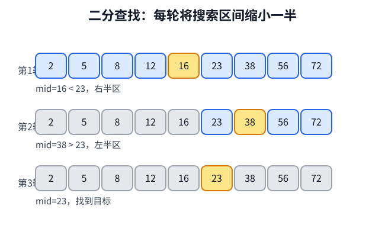

核心变量：

- `left`：当前搜索区间左边界。
- `right`：当前搜索区间右边界。
- `mid`：当前比较位置。
- 循环条件：`left <= right`。

容易出错的地方：

1. `mid = (left + right) // 2` 在部分语言中可能溢出，可写成 `left + (right - left) // 2`。
2. 更新区间时，若已经比较过 `mid`，下一轮应排除它，即 `right = mid - 1` 或 `left = mid + 1`。
3. 二分查找要求数据有序，否则结果没有意义。

## 13.3 冒泡排序执行过程

冒泡排序每一轮都比较相邻元素，如果前一个比后一个大，就交换。每轮结束后，当前未排序区间中的最大值会移动到右侧。

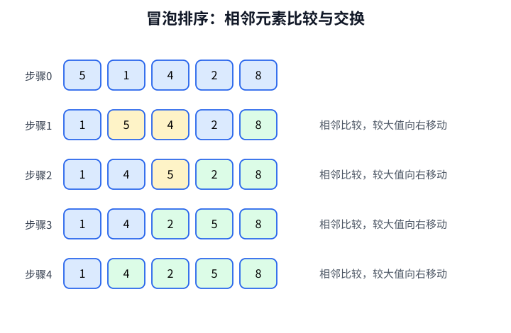

优化点：如果某一轮没有发生任何交换，说明数组已经有序，可以提前结束。

## 13.4 快速排序分区过程

快速排序的关键在于“分区”：选取一个基准值 `pivot`，把小于它的元素放到一侧，大于它的元素放到另一侧。分区完成后，`pivot` 所在位置就是它最终排序后的位置。

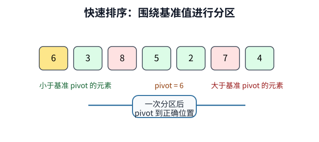

学习重点：

- 快速排序不是简单交换，而是在不断“确定一个元素的最终位置”。
- 分区质量决定效率。如果每次都极不均衡，会退化到 `O(n²)`。
- 实战中常用随机化基准、三数取中、三路快排来降低退化风险。

## 13.5 归并排序执行过程

归并排序采用分治思想：先把大问题不断拆成小问题，再把有序小数组合并成大数组。

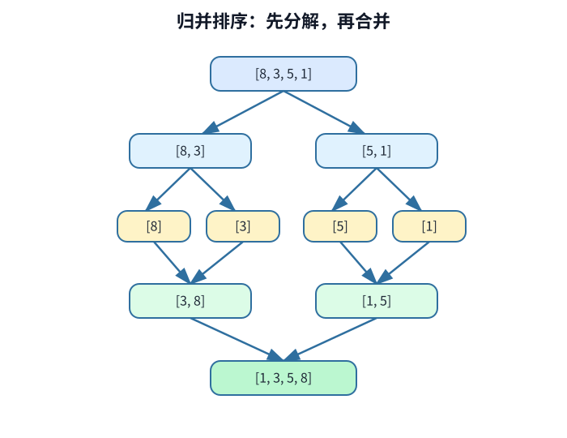

它的优势是时间复杂度稳定为 `O(n log n)`，并且是稳定排序；缺点是需要额外空间。

## 13.6 栈与队列执行过程

栈和队列都是线性结构，但它们限制了元素进出的方式。栈是后进先出，队列是先进先出。

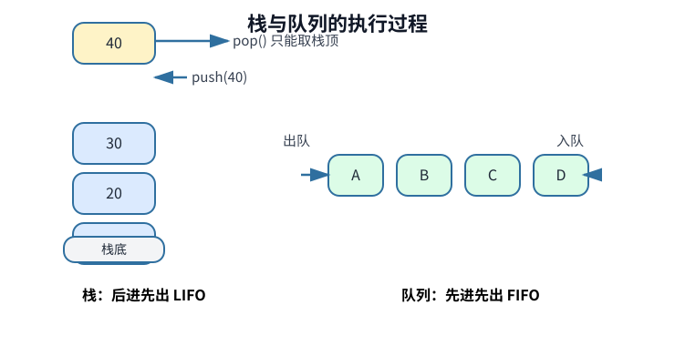

常见应用：

- 栈：函数调用、括号匹配、表达式求值、回溯。
- 队列：广度优先搜索、任务调度、消息队列、打印队列。

## 13.7 单链表反转过程

链表反转是面试高频题。核心思路是用 `prev`、`cur`、`next` 三个指针逐步改变指向。

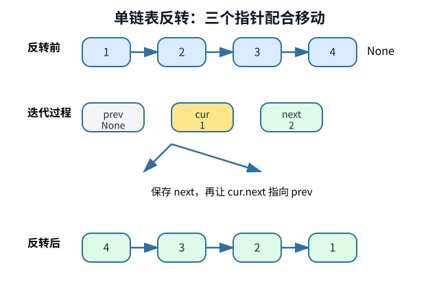

核心模板：

```python
def reverse_list(head):
    prev = None
    cur = head
    while cur:
        nxt = cur.next
        cur.next = prev
        prev = cur
        cur = nxt
    return prev
```

## 13.8 哈希表冲突处理过程

哈希表通过哈希函数把 key 映射为数组下标。不同 key 可能映射到相同下标，这就是哈希冲突。

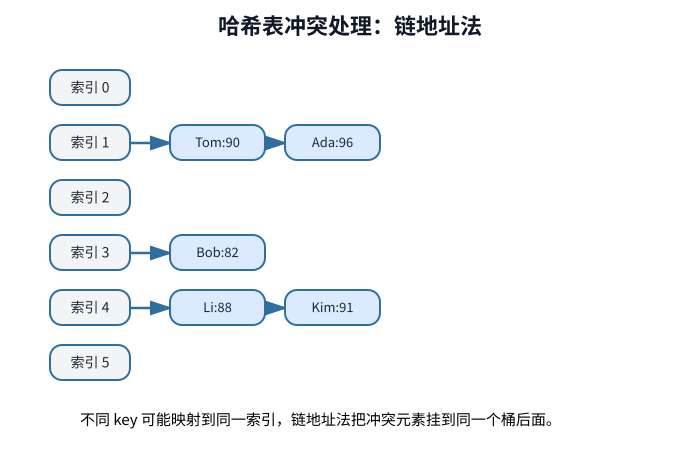

链地址法把冲突元素放在同一个桶的链表中；开放寻址法则在数组中寻找下一个可用位置。

## 13.9 二叉树遍历过程

二叉树遍历的区别在于“访问根节点”的时机：

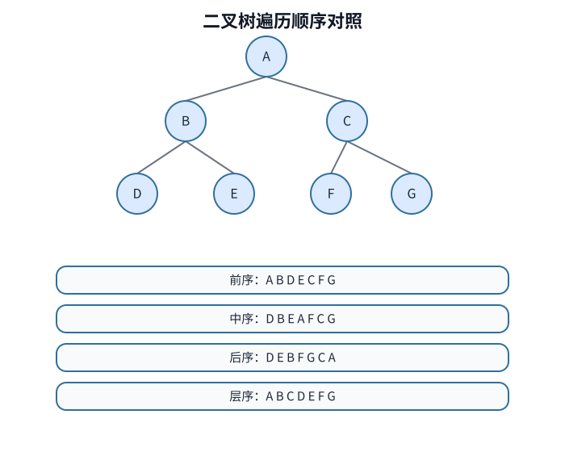

- 前序：根 → 左 → 右，常用于复制树、输出目录结构。
- 中序：左 → 根 → 右，二叉搜索树中序遍历可得到有序序列。
- 后序：左 → 右 → 根，常用于释放树、计算表达式树。
- 层序：按层访问，常用于最短层数、宽度统计。

## 13.10 堆的上浮与下沉

堆的核心操作是调整节点位置，使其重新满足堆性质。

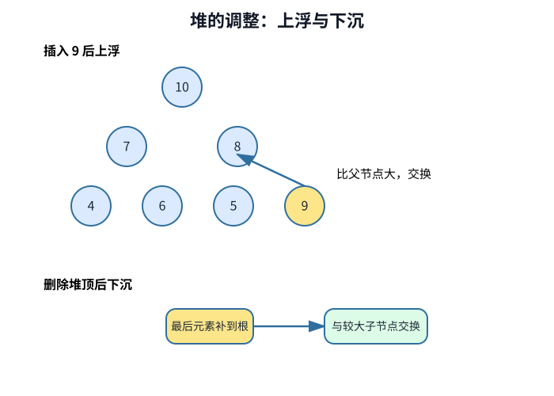

- 插入元素：先放到数组末尾，再向上比较并交换，称为上浮。
- 删除堆顶：用最后一个元素补到根，再向下比较并交换，称为下沉。

## 13.11 图搜索：BFS 与 DFS

BFS 使用队列，按层推进；DFS 使用递归或栈，一路深入。

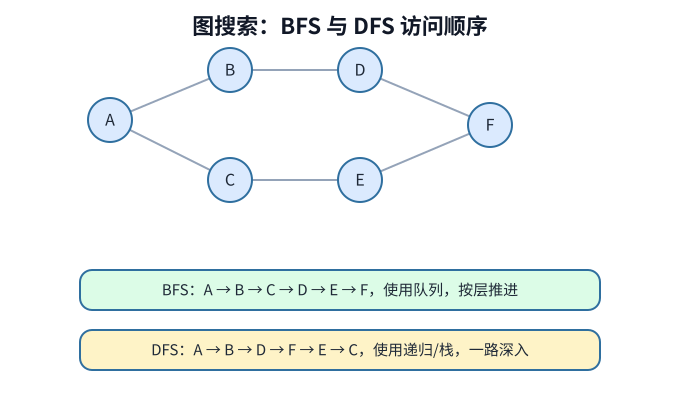

应用对比：

| 算法 | 数据结构 | 典型用途 |
|---|---|---|
| BFS | 队列 | 无权图最短路径、层序遍历 |
| DFS | 栈/递归 | 连通性、拓扑排序、回溯搜索 |

## 13.12 Dijkstra 最短路径松弛过程

Dijkstra 算法适用于边权非负的最短路径问题。它的核心操作是“松弛”。

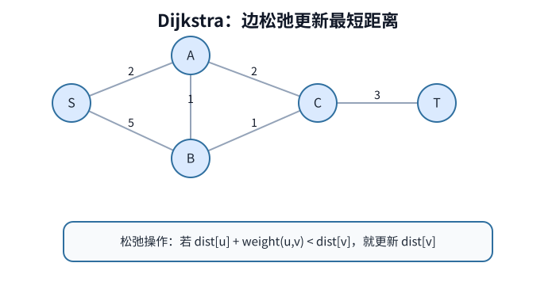

松弛公式：

```text
if dist[u] + weight(u, v) < dist[v]:
    dist[v] = dist[u] + weight(u, v)
```

## 13.13 0-1背包动态规划表

动态规划最重要的是定义状态。0-1背包中，`dp[i][w]` 表示只考虑前 `i` 个物品、容量为 `w` 时能获得的最大价值。

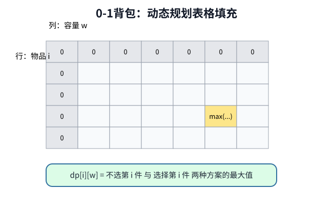

状态转移：

```text
不选第 i 件：dp[i-1][w]
选择第 i 件：dp[i-1][w-weight[i]] + value[i]
取二者最大值
```

## 13.14 回溯搜索树

回溯算法可以理解为“在解空间树上做深度优先搜索”。

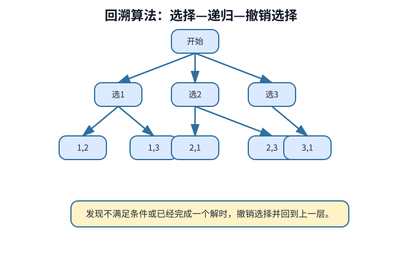

通用模板：

```python
def backtrack(path, choices):
    if 满足结束条件:
        保存结果
        return
    for choice in choices:
        if 不合法:
            continue
        做选择
        backtrack(path, 新选择列表)
        撤销选择
```

## 13.15 贪心区间调度过程

区间调度问题中，如果目标是选择尽可能多的不重叠区间，可以按结束时间排序，每次选择最早结束且不冲突的区间。

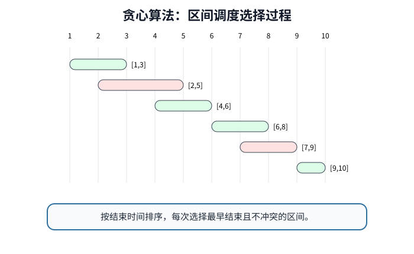

## 13.16 Trie树插入过程

Trie 树按字符逐层存储字符串，适合前缀匹配、自动补全、词典查询。

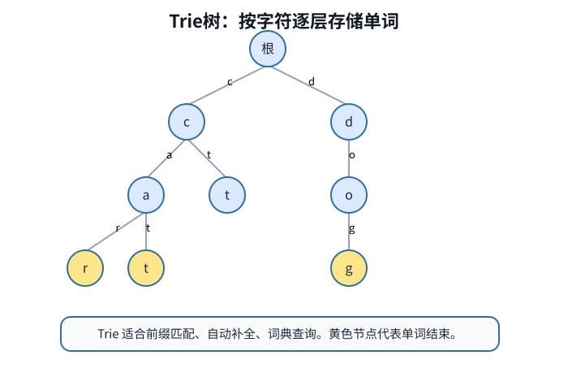

## 13.17 并查集执行过程

并查集用于维护元素之间的连通关系，常见于图的连通性判断、Kruskal 最小生成树算法。

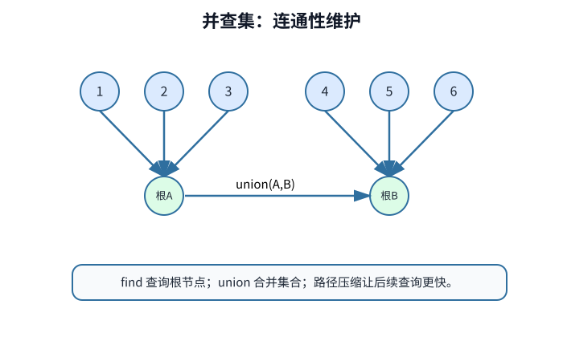

## 13.18 LRU缓存结构

LRU 缓存常用“哈希表 + 双向链表”实现。哈希表保证查找快，双向链表保证移动和删除快。

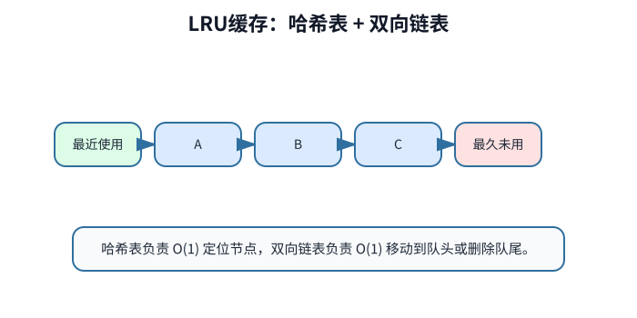

## 13.19 递归调用栈

递归不是魔法，本质是系统调用栈保存每一层未完成的函数调用。

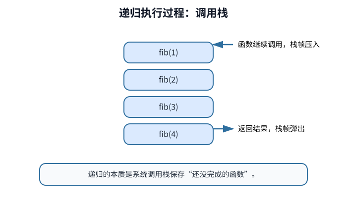


# 第14章 多语言实现对照

本章给出常见算法的 Python、C、C++、Java、JavaScript 实现。学习多语言版本时，不要机械背代码，而要观察同一算法在不同语言中的共同结构：变量初始化、循环条件、边界判断、返回值。

## 14.1 线性搜索

### Python

```python
def linear_search(arr, target):
    for i, x in enumerate(arr):
        if x == target:
            return i
    return -1
```

### C

```c
int linear_search(int arr[], int n, int target) {
    for (int i = 0; i < n; i++) {
        if (arr[i] == target) return i;
    }
    return -1;
}
```

### C++

```cpp
int linearSearch(const vector<int>& arr, int target) {
    for (int i = 0; i < arr.size(); ++i) {
        if (arr[i] == target) return i;
    }
    return -1;
}
```

### Java

```java
public static int linearSearch(int[] arr, int target) {
    for (int i = 0; i < arr.length; i++) {
        if (arr[i] == target) return i;
    }
    return -1;
}
```

### JavaScript

```javascript
function linearSearch(arr, target) {
  for (let i = 0; i < arr.length; i++) {
    if (arr[i] === target) return i;
  }
  return -1;
}
```

## 14.2 二分查找

### Python

```python
def binary_search(arr, target):
    left, right = 0, len(arr) - 1
    while left <= right:
        mid = left + (right - left) // 2
        if arr[mid] == target:
            return mid
        elif arr[mid] < target:
            left = mid + 1
        else:
            right = mid - 1
    return -1
```

### C

```c
int binary_search(int arr[], int n, int target) {
    int left = 0, right = n - 1;
    while (left <= right) {
        int mid = left + (right - left) / 2;
        if (arr[mid] == target) return mid;
        else if (arr[mid] < target) left = mid + 1;
        else right = mid - 1;
    }
    return -1;
}
```

### C++

```cpp
int binarySearch(const vector<int>& arr, int target) {
    int left = 0, right = (int)arr.size() - 1;
    while (left <= right) {
        int mid = left + (right - left) / 2;
        if (arr[mid] == target) return mid;
        if (arr[mid] < target) left = mid + 1;
        else right = mid - 1;
    }
    return -1;
}
```

### Java

```java
public static int binarySearch(int[] arr, int target) {
    int left = 0, right = arr.length - 1;
    while (left <= right) {
        int mid = left + (right - left) / 2;
        if (arr[mid] == target) return mid;
        if (arr[mid] < target) left = mid + 1;
        else right = mid - 1;
    }
    return -1;
}
```

### JavaScript

```javascript
function binarySearch(arr, target) {
  let left = 0, right = arr.length - 1;
  while (left <= right) {
    const mid = left + Math.floor((right - left) / 2);
    if (arr[mid] === target) return mid;
    if (arr[mid] < target) left = mid + 1;
    else right = mid - 1;
  }
  return -1;
}
```

## 14.3 链表反转

### Python

```python
class ListNode:
    def __init__(self, val=0, next=None):
        self.val = val
        self.next = next

def reverse_list(head):
    prev = None
    cur = head
    while cur:
        nxt = cur.next
        cur.next = prev
        prev = cur
        cur = nxt
    return prev
```

### C++

```cpp
struct ListNode {
    int val;
    ListNode* next;
    ListNode(int x) : val(x), next(nullptr) {}
};

ListNode* reverseList(ListNode* head) {
    ListNode* prev = nullptr;
    ListNode* cur = head;
    while (cur != nullptr) {
        ListNode* nxt = cur->next;
        cur->next = prev;
        prev = cur;
        cur = nxt;
    }
    return prev;
}
```

### Java

```java
class ListNode {
    int val;
    ListNode next;
    ListNode(int val) { this.val = val; }
}

public static ListNode reverseList(ListNode head) {
    ListNode prev = null;
    ListNode cur = head;
    while (cur != null) {
        ListNode next = cur.next;
        cur.next = prev;
        prev = cur;
        cur = next;
    }
    return prev;
}
```

### JavaScript

```javascript
function reverseList(head) {
  let prev = null;
  let cur = head;
  while (cur !== null) {
    const next = cur.next;
    cur.next = prev;
    prev = cur;
    cur = next;
  }
  return prev;
}
```

## 14.4 括号匹配

### Python

```python
def is_valid_parentheses(s):
    stack = []
    match = {')': '(', ']': '[', '}': '{'}
    for ch in s:
        if ch in '([{':
            stack.append(ch)
        elif ch in match:
            if not stack or stack.pop() != match[ch]:
                return False
    return not stack
```

### C++

```cpp
bool isValid(string s) {
    stack<char> st;
    unordered_map<char, char> mp = {{')','('}, {']','['}, {'}','{'}};
    for (char c : s) {
        if (c == '(' || c == '[' || c == '{') st.push(c);
        else if (mp.count(c)) {
            if (st.empty() || st.top() != mp[c]) return false;
            st.pop();
        }
    }
    return st.empty();
}
```

## 14.5 BFS 图搜索

### Python

```python
from collections import deque

def bfs(graph, start):
    visited = set([start])
    q = deque([start])
    order = []
    while q:
        node = q.popleft()
        order.append(node)
        for nxt in graph[node]:
            if nxt not in visited:
                visited.add(nxt)
                q.append(nxt)
    return order
```

### C++

```cpp
vector<int> bfs(vector<vector<int>>& graph, int start) {
    vector<int> order;
    vector<bool> visited(graph.size(), false);
    queue<int> q;
    visited[start] = true;
    q.push(start);
    while (!q.empty()) {
        int u = q.front(); q.pop();
        order.push_back(u);
        for (int v : graph[u]) {
            if (!visited[v]) {
                visited[v] = true;
                q.push(v);
            }
        }
    }
    return order;
}
```

### Java

```java
public static List<Integer> bfs(List<List<Integer>> graph, int start) {
    List<Integer> order = new ArrayList<>();
    boolean[] visited = new boolean[graph.size()];
    Queue<Integer> queue = new LinkedList<>();
    visited[start] = true;
    queue.offer(start);
    while (!queue.isEmpty()) {
        int u = queue.poll();
        order.add(u);
        for (int v : graph.get(u)) {
            if (!visited[v]) {
                visited[v] = true;
                queue.offer(v);
            }
        }
    }
    return order;
}
```

## 14.6 快速排序

### Python

```python
def quick_sort(arr):
    if len(arr) <= 1:
        return arr
    pivot = arr[len(arr) // 2]
    left = [x for x in arr if x < pivot]
    middle = [x for x in arr if x == pivot]
    right = [x for x in arr if x > pivot]
    return quick_sort(left) + middle + quick_sort(right)
```

### C

```c
void quick_sort(int a[], int left, int right) {
    if (left >= right) return;
    int i = left, j = right, pivot = a[left + (right - left) / 2];
    while (i <= j) {
        while (a[i] < pivot) i++;
        while (a[j] > pivot) j--;
        if (i <= j) {
            int tmp = a[i]; a[i] = a[j]; a[j] = tmp;
            i++; j--;
        }
    }
    quick_sort(a, left, j);
    quick_sort(a, i, right);
}
```

### C++

```cpp
void quickSort(vector<int>& a, int left, int right) {
    if (left >= right) return;
    int i = left, j = right;
    int pivot = a[left + (right - left) / 2];
    while (i <= j) {
        while (a[i] < pivot) i++;
        while (a[j] > pivot) j--;
        if (i <= j) {
            swap(a[i], a[j]);
            i++; j--;
        }
    }
    quickSort(a, left, j);
    quickSort(a, i, right);
}
```

### Java

```java
public static void quickSort(int[] a, int left, int right) {
    if (left >= right) return;
    int i = left, j = right;
    int pivot = a[left + (right - left) / 2];
    while (i <= j) {
        while (a[i] < pivot) i++;
        while (a[j] > pivot) j--;
        if (i <= j) {
            int tmp = a[i]; a[i] = a[j]; a[j] = tmp;
            i++; j--;
        }
    }
    quickSort(a, left, j);
    quickSort(a, i, right);
}
```

### JavaScript

```javascript
function quickSort(arr) {
  if (arr.length <= 1) return arr;
  const pivot = arr[Math.floor(arr.length / 2)];
  const left = arr.filter(x => x < pivot);
  const mid = arr.filter(x => x === pivot);
  const right = arr.filter(x => x > pivot);
  return [...quickSort(left), ...mid, ...quickSort(right)];
}
```

## 14.7 归并排序

### Python

```python
def merge_sort(arr):
    if len(arr) <= 1:
        return arr
    mid = len(arr) // 2
    left = merge_sort(arr[:mid])
    right = merge_sort(arr[mid:])
    return merge(left, right)

def merge(left, right):
    i = j = 0
    result = []
    while i < len(left) and j < len(right):
        if left[i] <= right[j]:
            result.append(left[i]); i += 1
        else:
            result.append(right[j]); j += 1
    result.extend(left[i:])
    result.extend(right[j:])
    return result
```

### C++

```cpp
void mergeSort(vector<int>& a, int l, int r) {
    if (l >= r) return;
    int m = l + (r - l) / 2;
    mergeSort(a, l, m);
    mergeSort(a, m + 1, r);
    vector<int> tmp;
    int i = l, j = m + 1;
    while (i <= m && j <= r) {
        if (a[i] <= a[j]) tmp.push_back(a[i++]);
        else tmp.push_back(a[j++]);
    }
    while (i <= m) tmp.push_back(a[i++]);
    while (j <= r) tmp.push_back(a[j++]);
    for (int k = 0; k < tmp.size(); ++k) a[l + k] = tmp[k];
}
```

## 14.8 0-1背包

### Python

```python
def knapsack_01(weights, values, capacity):
    dp = [0] * (capacity + 1)
    for wgt, val in zip(weights, values):
        for c in range(capacity, wgt - 1, -1):
            dp[c] = max(dp[c], dp[c - wgt] + val)
    return dp[capacity]
```

### C++

```cpp
int knapsack01(vector<int>& weights, vector<int>& values, int capacity) {
    vector<int> dp(capacity + 1, 0);
    for (int i = 0; i < weights.size(); ++i) {
        for (int c = capacity; c >= weights[i]; --c) {
            dp[c] = max(dp[c], dp[c - weights[i]] + values[i]);
        }
    }
    return dp[capacity];
}
```

## 14.9 并查集

### Python

```python
class UnionFind:
    def __init__(self, n):
        self.parent = list(range(n))
        self.rank = [0] * n

    def find(self, x):
        if self.parent[x] != x:
            self.parent[x] = self.find(self.parent[x])
        return self.parent[x]

    def union(self, a, b):
        ra, rb = self.find(a), self.find(b)
        if ra == rb:
            return False
        if self.rank[ra] < self.rank[rb]:
            ra, rb = rb, ra
        self.parent[rb] = ra
        if self.rank[ra] == self.rank[rb]:
            self.rank[ra] += 1
        return True
```

### C++

```cpp
class UnionFind {
private:
    vector<int> parent, rankv;
public:
    UnionFind(int n) : parent(n), rankv(n, 0) {
        for (int i = 0; i < n; ++i) parent[i] = i;
    }
    int find(int x) {
        if (parent[x] != x) parent[x] = find(parent[x]);
        return parent[x];
    }
    bool unite(int a, int b) {
        int ra = find(a), rb = find(b);
        if (ra == rb) return false;
        if (rankv[ra] < rankv[rb]) swap(ra, rb);
        parent[rb] = ra;
        if (rankv[ra] == rankv[rb]) rankv[ra]++;
        return true;
    }
};
```


# 第15章 实际应用案例库

算法真正有价值的地方，不是“题目里让你写”，而是它能把现实问题转化为可计算、可优化、可复用的程序结构。

## 15.1 数组与矩阵应用

| 场景 | 使用结构 | 原因 |
|---|---|---|
| 学生成绩表 | 数组/列表 | 需要按下标快速访问 |
| 图像像素处理 | 二维数组 | 图像天然是矩阵结构 |
| 传感器时间序列 | 数组 | 数据按时间顺序连续存储 |
| 动态规划表 | 二维数组 | 保存子问题状态 |

案例：统计一周温度平均值。

```python
temperatures = [21, 23, 20, 25, 26, 24, 22]
avg = sum(temperatures) / len(temperatures)
print(avg)
```

## 15.2 链表应用

链表适合频繁插入和删除的场景。

| 场景 | 链表作用 |
|---|---|
| 音乐播放列表 | 插入、删除歌曲方便 |
| 浏览器前进后退 | 双向链表记录页面顺序 |
| LRU缓存 | 双向链表维护最近使用顺序 |
| 操作系统内存管理 | 管理空闲内存块 |

## 15.3 栈应用

| 场景 | 原理 |
|---|---|
| 函数调用 | 调用栈保存局部变量和返回地址 |
| 括号匹配 | 左括号入栈，右括号匹配栈顶 |
| 表达式求值 | 操作数栈和运算符栈 |
| 撤销操作 | 最近操作最先撤销 |
| 深度优先搜索 | 栈保存待访问节点 |

## 15.4 队列应用

| 场景 | 原理 |
|---|---|
| 打印任务 | 先提交的任务先执行 |
| 消息队列 | 生产者和消费者解耦 |
| BFS | 按距离或层数扩展 |
| 操作系统调度 | 等待任务排队执行 |
| 网络请求限流 | 请求排队处理 |

## 15.5 哈希表应用

哈希表的核心优势是平均 `O(1)` 查询。

| 场景 | 例子 |
|---|---|
| 去重 | 判断元素是否出现过 |
| 计数 | 统计词频、访问次数 |
| 缓存 | 根据 key 快速取 value |
| 两数之和 | 快速查找目标差值 |
| 数据库索引 | 将字段值映射到记录位置 |

经典案例：词频统计。

```python
def word_count(words):
    counter = {}
    for word in words:
        counter[word] = counter.get(word, 0) + 1
    return counter
```

## 15.6 树应用

| 场景 | 树类型 |
|---|---|
| 文件系统 | 普通树 |
| 数据库索引 | B树 / B+树 |
| 编译器语法分析 | 语法树 |
| 搜索提示 | Trie树 |
| 决策过程 | 决策树 |
| 优先级队列 | 堆 |

## 15.7 图应用

图适合表示“对象之间的关系”。

| 场景 | 顶点 | 边 |
|---|---|---|
| 社交网络 | 用户 | 好友关系 |
| 地图导航 | 城市/路口 | 道路 |
| 网络路由 | 路由器 | 网络连接 |
| 推荐系统 | 用户/商品 | 点击、购买、评分 |
| 课程依赖 | 课程 | 前置课程关系 |

## 15.8 搜索算法应用

| 算法 | 应用 |
|---|---|
| 线性搜索 | 小数据或无序数据查找 |
| 二分查找 | 有序数组查找、答案空间搜索 |
| BFS | 无权图最短路径、层序遍历 |
| DFS | 连通分量、拓扑排序、回溯 |
| 哈希搜索 | 字典、缓存、去重 |

## 15.9 排序算法应用

| 场景 | 常用排序 |
|---|---|
| 小规模数据 | 插入排序 |
| 稳定排序需求 | 归并排序 |
| 一般高效排序 | 快速排序 |
| Top K | 堆排序 / 优先队列 |
| 整数范围较小 | 计数排序 |

## 15.10 动态规划应用

动态规划适合“当前决策依赖过去状态”的问题。

| 场景 | 对应问题 |
|---|---|
| 资源分配 | 背包问题 |
| 文本比较 | 最长公共子序列 |
| 输入纠错 | 编辑距离 |
| 路径规划 | 最短路径/最小路径和 |
| 金融决策 | 股票买卖问题 |

## 15.11 贪心算法应用

贪心算法每一步选择当前看起来最优的方案，但它并不总是正确。使用前需要证明贪心选择性质。

| 场景 | 贪心策略 |
|---|---|
| 区间调度 | 优先选择结束时间最早的区间 |
| 找零钱 | 每次选择最大面额，前提是币制满足条件 |
| 霍夫曼编码 | 每次合并频率最小的两个节点 |
| Kruskal算法 | 每次选择最小且不成环的边 |

## 15.12 回溯算法应用

| 场景 | 搜索对象 |
|---|---|
| 全排列 | 每一位选择一个未使用元素 |
| 组合 | 选择或不选择当前元素 |
| N皇后 | 每一行放一个皇后 |
| 数独 | 尝试填入 1 到 9 |
| 路径搜索 | 尝试下一步可走方向 |


# 第16章 算法优化与变种专题

本章讨论常见算法的优化方式和变种。掌握这些内容后，读者不仅能写出基础版本，还能处理边界情况、性能退化和复杂需求。

## 16.1 二分查找的四种常见变种

### 查找第一个等于 target 的位置

```python
def lower_equal_first(arr, target):
    left, right = 0, len(arr) - 1
    ans = -1
    while left <= right:
        mid = left + (right - left) // 2
        if arr[mid] >= target:
            if arr[mid] == target:
                ans = mid
            right = mid - 1
        else:
            left = mid + 1
    return ans
```

### 查找最后一个等于 target 的位置

```python
def upper_equal_last(arr, target):
    left, right = 0, len(arr) - 1
    ans = -1
    while left <= right:
        mid = left + (right - left) // 2
        if arr[mid] <= target:
            if arr[mid] == target:
                ans = mid
            left = mid + 1
        else:
            right = mid - 1
    return ans
```

### 查找第一个大于等于 target 的位置

```python
def lower_bound(arr, target):
    left, right = 0, len(arr)
    while left < right:
        mid = left + (right - left) // 2
        if arr[mid] < target:
            left = mid + 1
        else:
            right = mid
    return left
```

### 查找最后一个小于等于 target 的位置

```python
def upper_bound_le(arr, target):
    left, right = 0, len(arr)
    while left < right:
        mid = left + (right - left) // 2
        if arr[mid] <= target:
            left = mid + 1
        else:
            right = mid
    return left - 1
```

## 16.2 冒泡排序优化

基础冒泡排序即使数组已经有序，也会继续比较。可以使用 `swapped` 标志提前结束。

```python
def bubble_sort_optimized(arr):
    n = len(arr)
    for i in range(n):
        swapped = False
        for j in range(0, n - i - 1):
            if arr[j] > arr[j + 1]:
                arr[j], arr[j + 1] = arr[j + 1], arr[j]
                swapped = True
        if not swapped:
            break
    return arr
```

## 16.3 快速排序优化

快速排序常见退化原因是每次分区都极不均衡。优化方法包括：

1. 随机选择基准。
2. 三数取中。
3. 小数组切换为插入排序。
4. 三路快排处理大量重复元素。

### 三路快排

```python
def quick_sort_3way(arr):
    if len(arr) <= 1:
        return arr
    pivot = arr[len(arr) // 2]
    less, equal, greater = [], [], []
    for x in arr:
        if x < pivot:
            less.append(x)
        elif x > pivot:
            greater.append(x)
        else:
            equal.append(x)
    return quick_sort_3way(less) + equal + quick_sort_3way(greater)
```

## 16.4 哈希表优化

哈希表性能取决于哈希函数、负载因子和冲突处理。

| 优化点 | 含义 |
|---|---|
| 好的哈希函数 | 尽量让 key 均匀分布 |
| 控制负载因子 | 元素数量 / 桶数量不能过高 |
| 自动扩容 | 负载因子过高时扩容并重新哈希 |
| 合理冲突处理 | 链地址法、开放寻址法、再哈希 |

## 16.5 树的优化与变种

### 二叉搜索树的问题

如果插入序列已经有序，二叉搜索树会退化成链表，查找复杂度从 `O(log n)` 退化为 `O(n)`。

### 平衡树思想

AVL树和红黑树通过旋转保持树的高度较低，从而保证查找、插入、删除效率。

### Trie树

适合字符串前缀搜索。典型应用包括搜索联想、敏感词匹配、词典查询。

## 16.6 堆的优化与变种

| 结构 | 特点 |
|---|---|
| 最大堆 | 堆顶是最大值 |
| 最小堆 | 堆顶是最小值 |
| 二叉堆 | 最常见，数组实现简单 |
| 多叉堆 | 降低树高度，常用于优先队列 |
| 双端堆 | 可同时取最大和最小 |

Top K 问题常用堆解决：

- 找前 K 大：维护大小为 K 的最小堆。
- 找前 K 小：维护大小为 K 的最大堆。

## 16.7 图算法变种

| 问题 | 推荐算法 |
|---|---|
| 无权图最短路径 | BFS |
| 非负权图最短路径 | Dijkstra |
| 含负权边最短路径 | Bellman-Ford |
| 多源最短路径 | Floyd |
| 最小生成树 | Prim / Kruskal |
| 有向无环图依赖顺序 | 拓扑排序 |
| 连通性维护 | 并查集 |

## 16.8 动态规划优化

### 记忆化搜索

从递归出发，遇到重复子问题时直接返回缓存结果。

```python
from functools import lru_cache

@lru_cache(None)
def fib(n):
    if n <= 1:
        return n
    return fib(n - 1) + fib(n - 2)
```

### 滚动数组

当状态只依赖上一行或前几个状态时，可以减少空间。

```python
def climb_stairs(n):
    if n <= 2:
        return n
    a, b = 1, 2
    for _ in range(3, n + 1):
        a, b = b, a + b
    return b
```

## 16.9 回溯优化

回溯容易超时，常见优化包括：

1. 剪枝：提前排除不可能的分支。
2. 排序：让重复元素相邻，方便去重。
3. 约束检查：每一步都判断是否合法。
4. 位运算：在 N 皇后等问题中压缩状态。

## 16.10 贪心与动态规划的区别

| 对比项 | 贪心算法 | 动态规划 |
|---|---|---|
| 决策方式 | 每一步选择当前最优 | 综合比较多个状态 |
| 是否回看 | 通常不回退 | 保存历史状态 |
| 正确性要求 | 需要贪心选择性质 | 需要最优子结构和重叠子问题 |
| 常见问题 | 区间调度、最小生成树 | 背包、路径、子序列 |


# 第17章 练习题与参考答案

本章练习题分为基础题、提高题和进阶题。建议先独立完成，再查看参考答案。

## 17.1 复杂度分析练习

### 题1：判断复杂度

```python
def f(n):
    i = 1
    while i < n:
        i *= 2
```

问：时间复杂度是多少？

**答案：** `O(log n)`。因为 `i` 每次乘 2，循环次数约为 `log₂n`。

### 题2：嵌套循环复杂度

```python
def g(n):
    count = 0
    for i in range(n):
        for j in range(i):
            count += 1
```

**答案：** `O(n²)`。总次数为 `0 + 1 + 2 + ... + (n-1) = n(n-1)/2`。

### 题3：递归复杂度

```python
def h(n):
    if n <= 1:
        return 1
    return h(n - 1) + h(n - 1)
```

**答案：** `O(2^n)`。每层递归分裂成两个子问题。

## 17.2 数组与链表练习

### 题1：删除数组中的指定值

给定数组 `arr` 和值 `val`，原地删除所有等于 `val` 的元素，并返回新长度。

**答案：**

```python
def remove_value(arr, val):
    k = 0
    for x in arr:
        if x != val:
            arr[k] = x
            k += 1
    return k
```

### 题2：反转链表

实现单链表反转。

**答案：**

```python
def reverse_list(head):
    prev = None
    cur = head
    while cur:
        nxt = cur.next
        cur.next = prev
        prev = cur
        cur = nxt
    return prev
```

### 题3：判断链表是否有环

**答案：** 使用快慢指针。

```python
def has_cycle(head):
    slow = fast = head
    while fast and fast.next:
        slow = slow.next
        fast = fast.next.next
        if slow == fast:
            return True
    return False
```

## 17.3 栈与队列练习

### 题1：括号匹配

判断字符串中的括号是否有效。

**答案：**

```python
def is_valid(s):
    stack = []
    mp = {')': '(', ']': '[', '}': '{'}
    for ch in s:
        if ch in mp.values():
            stack.append(ch)
        elif ch in mp:
            if not stack or stack.pop() != mp[ch]:
                return False
    return not stack
```

### 题2：用两个栈实现队列

**答案：**

```python
class MyQueue:
    def __init__(self):
        self.in_stack = []
        self.out_stack = []

    def push(self, x):
        self.in_stack.append(x)

    def pop(self):
        if not self.out_stack:
            while self.in_stack:
                self.out_stack.append(self.in_stack.pop())
        return self.out_stack.pop()
```

## 17.4 哈希表练习

### 题1：两数之和

给定数组和目标值，返回两个数的下标。

**答案：**

```python
def two_sum(nums, target):
    seen = {}
    for i, x in enumerate(nums):
        need = target - x
        if need in seen:
            return [seen[need], i]
        seen[x] = i
    return []
```

### 题2：统计出现次数最多的元素

**答案：**

```python
def most_common(nums):
    count = {}
    for x in nums:
        count[x] = count.get(x, 0) + 1
    return max(count, key=count.get)
```

## 17.5 树练习

### 题1：求二叉树高度

**答案：**

```python
def tree_height(root):
    if not root:
        return 0
    return max(tree_height(root.left), tree_height(root.right)) + 1
```

### 题2：判断是否为相同二叉树

**答案：**

```python
def is_same_tree(p, q):
    if not p and not q:
        return True
    if not p or not q:
        return False
    return p.val == q.val and is_same_tree(p.left, q.left) and is_same_tree(p.right, q.right)
```

### 题3：二叉搜索树查找

**答案：**

```python
def search_bst(root, target):
    while root:
        if root.val == target:
            return root
        elif target < root.val:
            root = root.left
        else:
            root = root.right
    return None
```

## 17.6 堆练习

### 题1：找数组中第 K 大元素

**答案：** 使用大小为 K 的最小堆。

```python
import heapq

def kth_largest(nums, k):
    heap = []
    for x in nums:
        heapq.heappush(heap, x)
        if len(heap) > k:
            heapq.heappop(heap)
    return heap[0]
```

### 题2：合并 K 个有序列表

**思路：** 把每个列表的第一个元素放入最小堆，每次取出最小值，再放入该列表的下一个元素。

## 17.7 图练习

### 题1：判断无向图是否连通

**答案：** 从任意点 BFS/DFS，如果访问节点数量等于总节点数，则连通。

```python
from collections import deque

def is_connected(graph):
    if not graph:
        return True
    start = next(iter(graph))
    visited = set([start])
    q = deque([start])
    while q:
        u = q.popleft()
        for v in graph[u]:
            if v not in visited:
                visited.add(v)
                q.append(v)
    return len(visited) == len(graph)
```

### 题2：无权图最短路径

**答案：** 使用 BFS。

```python
def shortest_path_unweighted(graph, start, target):
    from collections import deque
    q = deque([(start, 0)])
    visited = {start}
    while q:
        node, dist = q.popleft()
        if node == target:
            return dist
        for nxt in graph[node]:
            if nxt not in visited:
                visited.add(nxt)
                q.append((nxt, dist + 1))
    return -1
```

## 17.8 搜索算法练习

### 题1：二分查找插入位置

**答案：**

```python
def search_insert(nums, target):
    left, right = 0, len(nums)
    while left < right:
        mid = left + (right - left) // 2
        if nums[mid] < target:
            left = mid + 1
        else:
            right = mid
    return left
```

### 题2：寻找峰值

**答案：**

```python
def find_peak(nums):
    left, right = 0, len(nums) - 1
    while left < right:
        mid = left + (right - left) // 2
        if nums[mid] < nums[mid + 1]:
            left = mid + 1
        else:
            right = mid
    return left
```

## 17.9 排序算法练习

### 题1：实现插入排序

**答案：**

```python
def insertion_sort(arr):
    for i in range(1, len(arr)):
        key = arr[i]
        j = i - 1
        while j >= 0 and arr[j] > key:
            arr[j + 1] = arr[j]
            j -= 1
        arr[j + 1] = key
    return arr
```

### 题2：合并两个有序数组

**答案：**

```python
def merge_sorted(a, b):
    i = j = 0
    res = []
    while i < len(a) and j < len(b):
        if a[i] <= b[j]:
            res.append(a[i]); i += 1
        else:
            res.append(b[j]); j += 1
    res.extend(a[i:])
    res.extend(b[j:])
    return res
```

### 题3：数组去重后排序

**答案：**

```python
def unique_sorted(nums):
    return sorted(set(nums))
```

## 17.10 动态规划练习

### 题1：爬楼梯

每次可以爬 1 或 2 级，问爬到第 n 级有多少种方法。

**答案：**

```python
def climb_stairs(n):
    if n <= 2:
        return n
    a, b = 1, 2
    for _ in range(3, n + 1):
        a, b = b, a + b
    return b
```

### 题2：打家劫舍

不能偷相邻房屋，求最大金额。

**答案：**

```python
def rob(nums):
    prev2 = 0
    prev1 = 0
    for x in nums:
        prev2, prev1 = prev1, max(prev1, prev2 + x)
    return prev1
```

### 题3：最长公共子序列

**答案：**

```python
def lcs(a, b):
    m, n = len(a), len(b)
    dp = [[0] * (n + 1) for _ in range(m + 1)]
    for i in range(1, m + 1):
        for j in range(1, n + 1):
            if a[i - 1] == b[j - 1]:
                dp[i][j] = dp[i - 1][j - 1] + 1
            else:
                dp[i][j] = max(dp[i - 1][j], dp[i][j - 1])
    return dp[m][n]
```

## 17.11 贪心算法练习

### 题1：分发饼干

每个孩子有胃口值，每块饼干有大小，最多满足多少孩子？

**答案：**

```python
def find_content_children(g, s):
    g.sort()
    s.sort()
    i = j = 0
    while i < len(g) and j < len(s):
        if s[j] >= g[i]:
            i += 1
        j += 1
    return i
```

### 题2：区间调度

选择最多不重叠区间。

**答案：**

```python
def max_non_overlap(intervals):
    intervals.sort(key=lambda x: x[1])
    count = 0
    end = float('-inf')
    for s, e in intervals:
        if s >= end:
            count += 1
            end = e
    return count
```

## 17.12 回溯算法练习

### 题1：全排列

**答案：**

```python
def permute(nums):
    res = []
    used = [False] * len(nums)

    def backtrack(path):
        if len(path) == len(nums):
            res.append(path[:])
            return
        for i, x in enumerate(nums):
            if used[i]:
                continue
            used[i] = True
            path.append(x)
            backtrack(path)
            path.pop()
            used[i] = False

    backtrack([])
    return res
```

### 题2：组合

从 1 到 n 中选择 k 个数。

**答案：**

```python
def combine(n, k):
    res = []
    def backtrack(start, path):
        if len(path) == k:
            res.append(path[:])
            return
        for x in range(start, n + 1):
            path.append(x)
            backtrack(x + 1, path)
            path.pop()
    backtrack(1, [])
    return res
```

### 题3：子集

**答案：**

```python
def subsets(nums):
    res = []
    def backtrack(start, path):
        res.append(path[:])
        for i in range(start, len(nums)):
            path.append(nums[i])
            backtrack(i + 1, path)
            path.pop()
    backtrack(0, [])
    return res
```


# 第18章 常用算法模板速查

本章适合考试或面试前快速复习。

## 18.1 双指针模板

```python
left, right = 0, len(arr) - 1
while left < right:
    if 满足条件:
        left += 1
    else:
        right -= 1
```

适用：有序数组、两数之和、反转数组、回文判断。

## 18.2 滑动窗口模板

```python
left = 0
window = {}
for right, x in enumerate(arr):
    加入 arr[right]
    while 窗口不满足条件:
        移除 arr[left]
        left += 1
    更新答案
```

适用：最长无重复子串、最小覆盖子串、固定长度窗口统计。

## 18.3 BFS模板

```python
from collections import deque

q = deque([start])
visited = {start}
while q:
    node = q.popleft()
    for nxt in neighbors(node):
        if nxt not in visited:
            visited.add(nxt)
            q.append(nxt)
```

## 18.4 DFS模板

```python
def dfs(node):
    if node in visited:
        return
    visited.add(node)
    for nxt in neighbors(node):
        dfs(nxt)
```

## 18.5 回溯模板

```python
def backtrack(path, choices):
    if 结束条件:
        res.append(path[:])
        return
    for choice in choices:
        if 不合法:
            continue
        path.append(choice)
        backtrack(path, 新choices)
        path.pop()
```

## 18.6 动态规划模板

```python
# 1. 定义状态 dp
# 2. 初始化边界
# 3. 状态转移
# 4. 返回答案
```

## 18.7 并查集模板

```python
class UnionFind:
    def __init__(self, n):
        self.parent = list(range(n))

    def find(self, x):
        if self.parent[x] != x:
            self.parent[x] = self.find(self.parent[x])
        return self.parent[x]

    def union(self, a, b):
        self.parent[self.find(a)] = self.find(b)
```

## 18.8 堆模板

```python
import heapq

heap = []
heapq.heappush(heap, item)
smallest = heapq.heappop(heap)
```

## 18.9 二分答案模板

```python
left, right = 最小可能答案, 最大可能答案
while left < right:
    mid = (left + right) // 2
    if check(mid):
        right = mid
    else:
        left = mid + 1
return left
```

适用：最小最大值、最大最小值、满足条件的边界答案。

---

# 结语

到这里，本书已经从基础概念、数据结构、经典算法，扩展到执行过程图示、多语言实现、实际应用案例、优化变种和练习题解析。算法学习不是一次性背完所有代码，而是在不断解决问题的过程中形成“结构化思维”：

1. 先判断问题属于哪类结构。
2. 再选择合适的数据结构。
3. 接着写出基础算法。
4. 最后分析复杂度并优化边界情况。

真正掌握算法后，你会发现：算法不是孤立的题目，而是一种把复杂问题拆解、抽象、求解和优化的能力。

